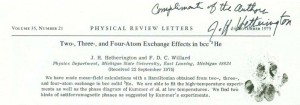
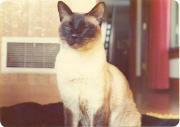
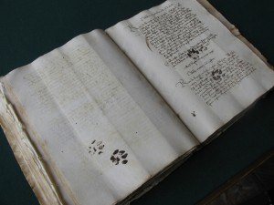
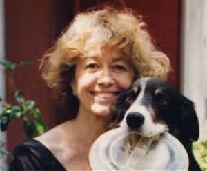
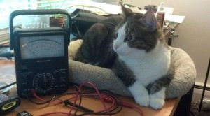

Animals are all over academia, from the long suffering lab rats to [levitating frogs](https://www.youtube.com/watch?v=bOtT0gB-FLE). But one wouldn't expect our furry and feathered friends to be appearing as authors on published peer-reviewed papers. Take, for example, this fascinating paper entitled 'Detection of earth rotation with a diamagnetically levitating gyroscope'. All looks quite normal, until you see that the second author is H.A.M.S. ter Tisha. I.e. A hamster named Tisha. Author one, Dr. Geim, is the only academic to win both an Ig Nobel Prize and a real Nobel Prize, and author two is his pet hamster. No explanation has been advanced for this, but Dr. Geim, responsible for the aforementioned levitating frogs, is clearly quite a character.

In a similar vein, one F.D.C. Willard has published as both a co-author and, unbelievably, as sole author, on low temperature physics. F.D.C. Willard is the 'pen name' of Chester, the companion of Jack H. Hetherington, an American physicist and mathematician. The [story goes](../assets/img/posts/140721_quot_Who_039_s_a_clever_boy_quot_Animals_in_academ_04.pdf) that a colleague of Hetherington's reviewed a paper for him and said that all was good, except for the fact he was using a lot of the 'royal we', a bugbear of the targeted journal. Rather than correct his grammar, Hetherington decided to add a second author instead. Concerned that his colleagues would recognise the name, a pen name was conjured: F.D. for *Felis domestics*, C for Chester, and Willard after the cat that sired him. The joint paper was published in *Physical Review Letters *in 1973.

> _Shortly thereafter a visitor to (the university) asked to talk to me, and since I was unavailable asked to talk with Willard. Everyone laughed and soon the cat was out of the bag. _

When the article reprints arrived, Hetherington inked Chester's paw and sent a few [signed copies](../assets/img/posts/140721_quot_Who_039_s_a_clever_boy_quot_Animals_in_academ_07.pdf) to friends, and,

> _after most interest had died down, one to an (at the time) unknown physicist at Grenoble. He later told me that at a meeting to decide who to invite to a conference someone said "why don't we invite Willard, he never gets invited anywhere." He showed the reprint and everyone agreed that it seemed to be a cat paw signature. Willard never got invited and neither did I._

Some years later, Willard had learned French and was now publishing on his own, as evidenced by his paper 'L’hélium 3 solide : un antiferromagnétisme nucléaire' in _La Recherche_. In fact the real authors were bickering about how to present the ideas in the paper, such that not one of them was willing to sign the finished product. Instead they put F.D.C. Willard as the sole author, thus cementing this cats place in academia history.

Willard was [considered for a position](../assets/img/posts/140721_quot_Who_039_s_a_clever_boy_quot_Animals_in_academ_08.pdf) at the University, and in honour of his contribution to physics, *APS Journals* announced this year[1. April 1st, of course.] that all feline-authored publications would be made open access, noting that "not since Schrödinger has there been an opportunity like this for cats in physics".

Willard is not the only cat to have unwittingly signed another's work. [Emir Filipović](https://unsa.academia.edu/EmirOFilipovic) from the University of Sarajevo was trawling through the Dubrovnik State Archives when he stumbled upon a medieval Italian manuscript (dated 11 March 1445) marked with four very clear cat paw prints.

If you are more of a dog person, [which you should be](https://www.youtube.com/watch?v=eiEPb36mSq0), you may be more interested in the tale of Galadriel Mirkwood, co-author of a 1978 biology paper. You may notice that Galadriel Mirkwood is the name of an Elf in Lord of the Rings, but it is also the nickname of an Afghan Hound belonging to Polly Matzinger (quite a character herself).

While partly also a tool for grammatical convenience,[2. Anton, Ted. *Bold Science: Seven Scientists Who Are Changing Our World *(W.H. Freeman, New York 2000).] it seems that Matzinger's inclusion of a canine author isn't completely without merit. While working on her well-known danger model of immunology she suddenly realised that dendritic cells behave in the same way as a sheepdog. When being considered for tenure, the canine co-author question arose. Fortunately, Matzinger's superiors, could take a joke:[3. 'Scientific Sins', *The Scientist* (May 5, 2003) [).]

> _They decided it wasn't really fraud. It was a real dog, a frequent lab visitor, and they said it had done no less research than some other coauthors had._

Despite not including any dogs as co-authors for some time, Polly remains an avid sheepdog trainer and along with her two Border Collies, Charlie and Lily, was part of the US team at the 2005 World Sheepdog Finals.[4. As described in the documentary *Death by Design: Where Parallel Worlds Meet* (1997) [).]

To finish off, I shall leave you with Rosco, the super cute PhD cat.[10. My favourite comment on that post: "seriously? you're getting a PhD in engineering and you have time to take pictures of your cat?".]

