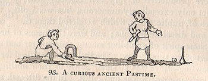
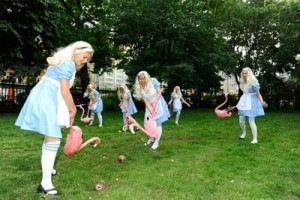
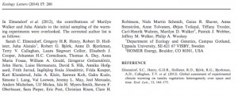

Co-authoring papers can be an enriching and enlightening academic experience. It can also be a complete nightmare. This post is your complete guide for navigating the process.[1. Not really complete, nor a guide.]

**Step One: finding a co-author**
First things first, ensure that you are authoring your paper with a living, human academic. Living human academics are more responsive than dead humans and non-human animals, albeit only marginally.

**Step Two: write a paper**
[Easy as ABC.](https://www.youtube.com/watch?v=i9hQIrsHaS4)

**Step Three: \*\***agreeing on author order
\*\*Once you have written your collaborative masterpiece, you will face the biggest challenge of the process: determining author order. If you have a borderline personality disorder, you can probably get away with taking all the credit for yourself, but for the rest of us some well-established procedures apply. A comprehensive review of all papers published between 1974-1998 which openly disclose the method used to determine author order (2 papers) reveals that there are 2 established methods for determining author order:

    - Croquet.
    - Proximity to tenure decisions.

**Determination of author order, method #1: Croquet**
The traditional method, as described by Hassell & May (1974),[1. Hassell, M.P. & May, R.M., 'Aggregation of predators and insect parasites and its effect on stability' (1974) 43 *Journal of Animal Ecology* 567-594.] is a croquet tournament, described as follows:
_\*\*The order of authorship was determined from a twenty-five-game croquet series held at Imperial College Field Station during summer 1973._
Not described in the paper are the somewhat underhand methods used by Hassell & May to ensure their victory in such tournaments:[2. Godfray, C., 'Hassell, M. P. & May, R. M. (1973)' (British Ecology Society, 100 Influential Papers series no. 13, 2013) [).]

> _Croquet was played every lunch time during May’s summer visits on a pitch customised by a large population of rabbits. Visitors were invited to play though inevitably lost due to the huge home-team advantage knowledge of the pitch’s precise topography afforded. Visitors also frequently declared themselves disadvantaged by the alleged tactic of being asked complex ecological questions mid-stroke. This was a different game from the traditional English vicarage-lawn contest! _

If you are not *au fait *with croquet,[2. I'm a poet, and I didn't even realise] you can learn all about this "curious ancient pastime" from Joseph Strutt's seminal 1801 book,[3. Strutt, J., *The Sports And Pastimes Of The People Of England From The Earliest Period (*London Methuen, London, 1801) [https://archive.org/details/sportspastimesof00struuoft](https://archive.org/details/sportspastimesof00struuoft).] concisely titled:

> _The Sports And Pastimes Of The People Of England From The Earliest Period, Including The Rural And Domestic Recreations, May Games, \*\*Mummeries, Pageants, Processions And Pompous Spectacles, Illustrated By Reproductions From Ancient Paintings In Which Are Represented Most Of The Popular Diversions_

Or you can just read the Wikipedia article.3. For those interested in further study, the *Journal of Sport History *kindly provides access to some further reading, including: Sterngass, J., 'Cheating, Gender Roles, and the Nineteenth-Century Croquet Craze' (1998) 25(3)* Journal of Sport History *398-418 (pdf); and Lewis, R. M., 'American Croquet in the 1860s: Playing the Game and Winning' (1991) 18(3) *Journal of Sport History *365-386 ([pdf).]

If your university happens to have a field station, your task is made much easier. Likewise, if you live in the UK, you may find that your university already has a croquet club - Oxford, Cambridge and Nottingham seem to be leading the way. Wherever you go, make sure that you do not play next to a cricket field for health and safety reasons.

[caption id="attachment_11" align="aligncenter" width="313"][*](../assets/img/posts/140722_Co-authoring_Now_with_60_more_croquet_03.jpg) Early example of the Croquet Method in use. The scholars pictured are using a croquet tournament to settle the order of authorship on their latest collaborative paper discussing postmodernism in feminist theory.[4. Probably.] *Harper's Weekly* 10 (September 10, 1866) p.568.[/caption]If you live do not live somewhere sufficiently civilised to have a croquet club you should consider moving. Otherwise you can fashion your own croquet set. This is very easy and you can customise your kit to represent the [game of croquet played in Alice in Wonderland](https://www.youtube.com/watch?v=PQBBMtWyMNk). To further the effect, it is a good idea to dress as Alice during the tournament.

It is difficult to estimate the prevalence of the croquet method. However, studies show that "croquet players are on the whole wealthy people",[4. Carter, K., 'A Survey of Croquet Players' (Profundus Consulting, April 2007) [https://www.croquet.org.uk/?d=386](https://www.croquet.org.uk/?d=386).] which is at odds with the remuneration generally provided to academics. At least one participant in the aforementioned study noted the presence of academics, lending some credence to the method. Just don't take it too seriously as[5. Sterngass, J., 'Cheating, Gender Roles, and the Nineteenth-Century Croquet Craze' (1998) 25(3) *Journal of Sport History* 398-418

> Croquet is usually stereotyped as a genteel game, less a sport than a social function, and more suited to genial conversation and unfettered flirtation than strident competition \*

Determination of author order, method #2: Proximity to tenure decisions**
Winning the award for academic honesty are Roderick and Gillespie (2002),[6. Roderick, G. K. & Gillespie, R. G., 'Speciation and phylogeography of Hawaiian terrestrial arthropods' (1998) _Molecular Ecology_ 7(4) 519–531 [).] who admit that: \***Order of authorship was determined by proximity to tenure decisions.*
Perhaps less sophisticated than croquet, but hey, everybody wants to be loved tenured. Perhaps unsurprisingly, this approach is substantiated by the literature. In one survey of 127 papers, 4 determined author order by proximity to tenure decisions, i.e. about 3%.[6. Hart, R., 'Co-authorship in the academic library literature: A survey of attitudes and behaviors' (2000) 26(5) *The Journal of Academic Librarianship\* 339–345 [).] I'd like to bet the true figure is much higher.

Step Three: remember to credit all authors and don't spell their names wrong\** So you've found some human co-authors, written your masterpiece and completed your croquet odyssey. Now all you have to do is credit all your authors. Sounds easy, but sometimes you might have 4 or 5 authors. Or 90.[7.  Keith R Bradnam, Joseph N Fass, Anton Alexandrov, Paul Baranay, Michael Bechner, Inanç Birol, Sébastien Boisvert, Jarrod A Chapman, Guillaume Chapuis, Rayan Chikhi, Hamidreza Chitsaz, Wen-Chi Chou, Jacques Corbeil,Cristian Del Fabbro, T Roderick Docking, Richard Durbin, Dent Earl, Scott Emrich,Pavel Fedotov, Nuno A Fonseca, Ganeshkumar Ganapathy, Richard A Gibbs,Sante Gnerre, Élénie Godzaridis, Steve Goldstein, Matthias Haimel, Giles Hall,David Haussler, Joseph B Hiatt, Isaac Y Ho, Jason Howard, Martin Hunt, Shaun D Jackman, David B Jaffe, Erich D Jarvis, Huaiyang Jiang, Sergey Kazakov, Paul J Kersey, Jacob O Kitzman, James R Knight, Sergey Koren, Tak-Wah Lam,Dominique Lavenier, François Laviolette, Yingrui Li, Zhenyu Li, Binghang Liu, Yue Liu, Ruibang Luo, Iain MacCallum, Matthew D MacManes, Nicolas Maillet, Sergey Melnikov, Delphine Naquin, Zemin Ning, Thomas D Otto,Benedict Paten, Octávio S Paulo, Adam M Phillippy, Francisco Pina-Martins,Michael Place, Dariusz Przybylski, Xiang Qin, Carson Qu, Filipe J Ribeiro,Stephen Richards, Daniel S Rokhsar, J Graham Ruby, Simone Scalabrin,Michael C Schatz, David C Schwartz, Alexey Sergushichev, Ted Sharpe, Timothy I Shaw, Jay Shendure, Yujian Shi, Jared T Simpson, Henry Song, Fedor Tsarev, Francesco Vezzi, Riccardo Vicedomini, Bruno M Vieira, Jun Wang, Kim C Worley, Shuangye Yin, Siu-Ming Yiu, Jianying Yuan, Guojie Zhang, Hao Zhang, Shiguo Zhou and Ian F Korf, 'Assemblathon 2: evaluating de novo methods of genome assembly in three vertebrate species' (2013) 2(1) *GigaScience *[).] Or 2924.[8. Obviously not going to reproduce 24 pages of author names. But you can count them for yourself: Aad, G. et al. et al. et al al al., 'The ATLAS Experiment at the CERN Large Hadron Collider' (2008) *Journal of the Institute of Physics Publishing* [).] "But I would never forget an author, and I am so careful with spelling!", I hear you protest across the ether. I am sure that Ms. L.L. Chen and Mr. C. Hui would have said exactly the same. That is until they completely forgot about their poor third co-author, one, Z.S. Lin. In the same fashion, this bunch managed to overlook no fewer than 5 authors in their *Nature *paper on 'The zebrafish reference genome sequence and its relationship to the human genome'. They also spelt a number of names wrong and mixed up their funding sources! They at least realised their error reasonably quickly. Presumably one or more of the 'forgotten five'[7. 'The Forgotten Five' also happens to be the name of a piece of One Direction fan fiction in which the "band named one direction go down in a plane crash and wind up back at their flat as ghost and realize someone buys the house they do whatever they can to get them out" (sic - the whole blurb) [).] opened up their latest issue of *Nature *with all the urgency and anticipation of a child unwrapping presents at Christmas, ready to see their name in the leading journal of their field, a recognition of their fantastic contributions to science… only to find they were not credited. Not sure what happened then with this paper in *Ecology Letters\*, where it took 2 years to notice that a couple of co-authors were missing.

Finally, if you are given the opportunity to transliterate author names to Chinese, make sure you don't inadvertently write a co-author's name as 韦小宝. Unless of course that co-author is, in fact, a demi-Emperor, son of a prostitute, with 8 wives.

 for the translation!](../assets/img/posts/140722_Co-authoring_Now_with_60_more_croquet_05.jpg)

So there you have it. Happy collaborating!
