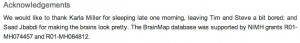
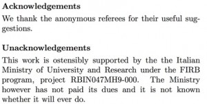
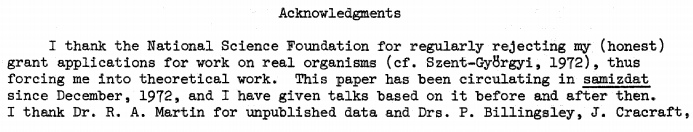
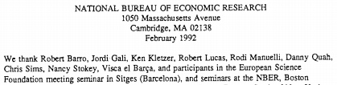

Almost every academic paper in any discipline will feature some variation on the following in a footnote:

> _I gratefully acknowledge [so and so] for their assistance/comments/support. _

Yawn. But hang on, very occasionally these rarely-read footnotes contain something a little more interesting.

Perhaps the boldest of all comes from a group of French researchers, who "do not gratefully thank" a reviewer of their paper for his "useless and very mean comments".

Academics are not generally an aggressive bunch, and many of these hidden acknowledgments are a little more light-hearted. One Kara Miller at Oxford is called out for [sleeping in late](www.sciencedirect.com/science/article/pii/S136466131200246X), selfishly leaving a couple of the authors bored. Biyu J., a Chinese researcher based in the US thanked:

> _the U.S. Immigration Service under the Bush administration, whose visa background security check forced her to spend two months (followi[
> ](../assets/img/posts/140728_Amazing_Acknowledgements_in_Academic_Papers_06.jpg)ng an international conference) in a third country, free of routine obligations—it was during this time that the hypothesis presented herein was initially conjectured._

Understandably, the subject of research funding often raises the ire of academics. An Italian researcher gave the Italian Ministry of University and Research its own 'Unacknowledgements' section to call them out on their failure to hand over the cash they promised. One British author took it even further, wishing the British Arts and Humanities Research Board "a plague on their house".

.](../assets/img/posts/140728_Amazing_Acknowledgements_in_Academic_Papers_03.jpg)

Some researchers claim divine inspiration for their work, such as in this paper in the _Proceedings of the National Academy of Sciences_, where the authors thank John Frum, while others get their inspiration from the heavy metal band Slayer and Italian pornstar R. Siffredi.

American evolutionary biologist Leigh Van Valen, who was "considered unconventional even by eccentrics",[1. 'Leigh Van Valen, evolutionary theorist and paleobiology pioneer, 1935-2010' [)] thanked the National Science Foundation for "_regularly rejecting my (honest) grant applications for work on real organisms, thus forcing me into theoretical work"._

Meanwhile a couple of Barcelona fans working in the US managed to sneak a football chant into their paper:

Are there any that I've missed?
