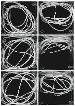
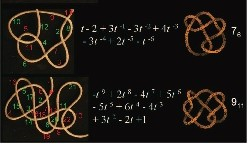

A great number of published papers seems to evidence boredom and/or illicit substance use in the academe.[1. Nothing here should be taken as implying that I accuse particular academics of using drugs. Please don't sue me, I have no money.] This should come as no surprise. Academia can be tedious: hours spent in front of a computer screen/in the lab, endless bureaucracy, and a never-ending teaching schedule could all contribute to a general sense of boredom and/or a drive to beat it with mind-altering chemicals beyond the standard caffeine and alcohol. Indeed, the famous Penguin diagrams in physics resulted from a combination of beer, bravado and recreational drugs.

So, are these academics bored or high? You decide! 
****

**#1: String theory**

No no, not *the* string theory, but a theory, about string. Actual string. A couple of academics put some string in a box and shook it up to see how it knots. Why, exactly? Well, because while

> *it is well known that a jostled string tends to become knotted... the factors governing the “spontaneous” formation of various knots are unclear.*

They found that "complex knots often form within seconds". Like this:

The researchers then analyzed the knots using mathematical knot theory.

The full paper, 'Spontaneous knotting of an agitated string' can be downloaded here.