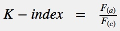
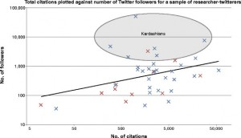
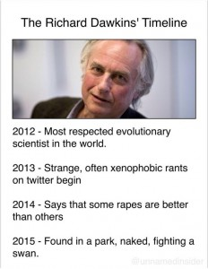

The Twittersphere has been all a flutter with this week with academics writing in with proposed methods for measuring the impact of publications ([#AlternateScienceMetrics](https://twitter.com/hashtag/AlternateScienceMetrics)). This was all kicked off by Neil Hall's paper in _Genome Biology_. That and 7 more of our favourites follow.[1. Why eight? It was late and I got tired.] Enjoy!

**1. The Kardashian Index
**Neil Hall's paper, 'The Kardashian index: a measure of discrepant social media profile for scientists', is full of great lines and it is a good idea to go and read the whole thing. In perhaps the most honest description of Kim Kardashian ever written, Hall says

> _she comes from a privileged background and, despite having not achieved anything consequential in science, politics or the arts... she is one of the most followed people on twitter and among the most searched-for on Google"_

Hall is concerned that Kim Kardashian academics walk amongst us: individuals who are "renowned for being renowned", who command a strong following on social media but do not match it with significant scientific output. Realising this, Hall wanted _"develop a metric that will clearly indicate if a scientist has an overblown public profile so that we can adjust our expectations of them accordingly"_. His rather neat solution is to compare the number of followers an academic has on Twitter with the number of citations to their peer-reviewed work.

The outliers, those with a high ratio of followers to citations (a K-index greater than 5), are labelled 'Kardashians'. A high K-index is a "warning to the community that researcher X may have built their public profile on shaky foundations, while a very low K-index suggests that a scientist is being undervalued."

It is worth noting however that Hall's paper, while obviously intended as a joke, is not without its own problems, and not everyone finds it amusing.

**2. The Kanye Index**
It didn't take long for academic tweeters to catch on to the potential here, and of course Kanye West was quickly in the line of fire.

> The Kanye Index = number of self-citations / number of citations [#AlternateScienceMetrics](https://twitter.com/hashtag/AlternateScienceMetrics?src=hash) (this one could actually work)   — Jason McDermott (@BioDataGanache) [July 30, 2014](https://twitter.com/BioDataGanache/statuses/494572419857010688)

We've all read a Kanye West paper or two, where the author seems to take great delight in citing themselves multiple times in one paper, so this metric comes in at number two.

**3. The Counterfactual Index**

> The Counterfactual Index: the degree to which the world would change had the paper never been published. — Matthew Hankins (@mc_hankins) [July 30, 2014](https://twitter.com/mc_hankins/statuses/494609474662174720)

We academics love the idea that we are leaving our mark on the world in some way, contributing positively to society. Yet the reality of the publication mill is that a lot of stuff gets written that is only ever read by a very small number of people. The Counterfactual Index may therefore be both illuminating, and depressing.

**4. The Priorities Index**

> Priorities index: # of dead house plants / (# of total house plants + # papers published) [#AlternateScienceMetrics](https://twitter.com/hashtag/AlternateScienceMetrics?src=hash)pic.twitter.com/Kx5OcqhJns — Nick Wan (@nickwan) [July 30, 2014](https://twitter.com/nickwan/statuses/494612693915947009)

I particularly like this one as I have a terrible record with house/office plants. I once bought a plant called 'Thrives on Neglect', but I managed to kill it after only a couple of weeks. The sad nugget of truth behind this one is that academics are often working so hard on so many different projects that they neglect everything else, from plants to relationships. Calculating your Priorities Index might just help you get a little perspective!

**5. The Minion Index**

> The Minion index, measuring the number of papers you do all the work for, but end up as nth author, where n is > 1 [#AlternateScienceMetrics](https://twitter.com/hashtag/AlternateScienceMetrics?src=hash) — Jon Tennant (@Protohedgehog) [July 30, 2014](https://twitter.com/Protohedgehog/statuses/494572671644876800)

The Minion Index will likely appeal most to PhD students and postdocs, who are frequently required to slog away on papers only to be the 2nd, 3rd, or 4th author. This is often the case even though most disciplines have established rules about the order of authors.

**6. The Bechdel Index**

> [#AlternateScienceMetrics](https://twitter.com/hashtag/AlternateScienceMetrics?src=hash) the Bechdel index: how many papers have 2 or more women coauthors — Blake Stacey (@blakestacey) [July 30, 2014](https://twitter.com/blakestacey/statuses/494576011598503937)

The Bechdel Test is a test originally proposed, albeit as a bit of sarcasm in a [cartoon strip](../assets/img/posts/140801_Top_8_AlternateScienceMetrics_04.jpg), to identify feminist-friendly films. The test could feasibly be used in academia to highlight the yawning inequality gap, already being explored by a number of researchers.

**7. The Adam Sandler Index**

> The Adam Sandler index, measuring the number of identical papers you publish but with different titles [#AlternateScienceMetrics](https://twitter.com/hashtag/AlternateScienceMetrics?src=hash) — Jon Tennant (@Protohedgehog) [July 30, 2014](https://twitter.com/Protohedgehog/statuses/494566772440174592)

Another classic technique in academia: repackaging something you already wrote as something all new and shiny for submission to another journal. Slightly different, but basically the same: much like the never ending stream of [tediously unfunny](../assets/img/posts/140801_Top_8_AlternateScienceMetrics_01.jpg) Adam Sandler films.

**8. The Dawkins Index**

> The Dawkins Index: (no. of times a scientist is quoted in internet arguments) / (no. Of original papers published) [#AlternateScienceMetrics](https://twitter.com/hashtag/AlternateScienceMetrics?src=hash) — Diana Crow (@CatalyticRxn) [July 31, 2014](https://twitter.com/CatalyticRxn/statuses/494829661814128640)

Poor old Richard Dawkins has experienced something of a fall from grace this week, having yet again put his foot in his mouth. Only natural then that a Dawkins Index was quickly proposed, lambasting his overactive internet presence. The latest research predicts the following timeline for Dawkins: 
For some more #AlternateScienceMetrics you can check out [this lovely collection](https://storify.com/mcdawg/alternatesciencemetrics). Thanks again to Neil for kicking it all off (no need to retire just yet).

> Wow, I spawned a hashtag, I should retire ... It's all downhill from here [#AlternateScienceMetrics](https://twitter.com/hashtag/AlternateScienceMetrics?src=hash) — Neil Hall (@neilhall_uk) [July 30, 2014](https://twitter.com/neilhall_uk/statuses/494621094658461699)

Update: Another good roundup here.
