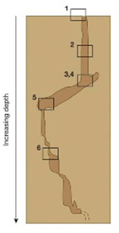
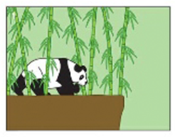
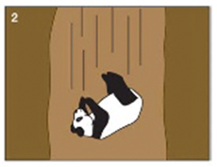
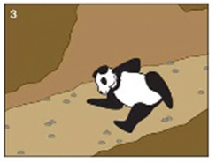
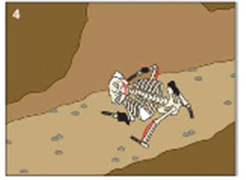
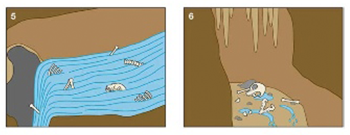
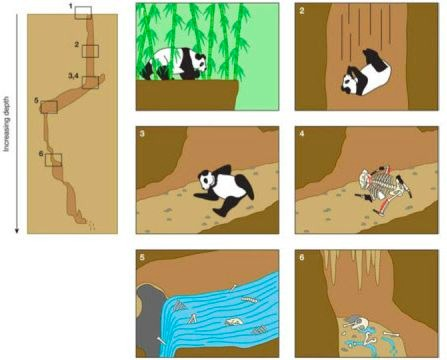

One of my favourite diagrams of all time comes from a paper in *Historical Biology: An International Journal of Paleobiology*. \* \*The title of the paper does little to warn of the horrors within:

> _Remains of Holocene giant pandas from Jiangdong Mountain (Yunnan, China) and their relevance to the evolution of quaternary environments in south-western China_

Peek into the abstract however and you may begin to see where this is going:

> _Two subfossil partial skeletons of male giant pandas were recovered, along with remains of 16 other mammalian species, from a natural sinkhole on Jiangdong Mountain... The bones represent a natural accumulation of mostly large mammals (>30 kg), which had **fallen accidentally into the sinkhole**._

The authors illustrate this accidental falling through the medium of cartoon, providing 7 beautifully illustrated panels. I reproduce the panels separately below; the full diagram is a lot to take in all at once.

The diagram starts out by setting the scene for you. Note the depth gauge.

Panel 1 depicts this lovely Panda having the time of its life in some yummy, dense bamboo. But oh no! Look out Mr. Panda!

Panels 2 and 3 show our poor Panda falling to its untimely death. I can't help but wonder, [what was it thinking](https://www.youtube.com/watch?v=MsK6aRuSBIc) as it fell?

In panel 4, nature takes its gruesome course...

...and in panels 5 & 6 our cute, cuddly, and very much dead panda reaches its final resting place.

Let's just let that sink in for a moment...

