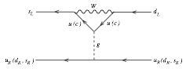
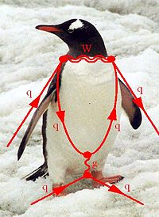
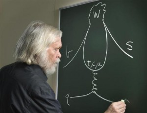
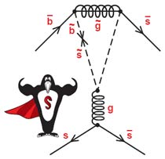
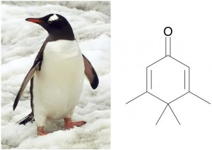
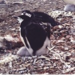
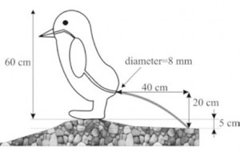
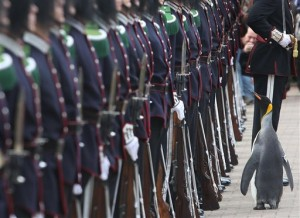

Penguins are adorable. On this we can all agree. Perhaps it is through their sheer cuteness that they have managed to [waddle their way into](../assets/img/posts/140807_Penguins_09.jpeg) some rather obscure corners of academia. Here we give you our favourite Penguin papers and other tidbits. Please do let us know if you find Penguins turning up elsewhere.

**1. Particle Physics Penguins
**Perhaps the most famous use of the Penguins likeness comes from particle physics, where it is used to represent "[something very complicated in high energy physics that I don't understand at all]".

What is perhaps less well-known is how these diagrams came about. Originally, the Penguin diagrams looked nothing like Penguins. That all changed when John Ellis, now Professor of Theoretical Physics at King's College London, went for a drink with [Melissa Franklin](https://www.physics.harvard.edu/people/facpages/franklin) and [Serge Rudaz](https://www.physics.umn.edu/people/rudaz.html). As he recalls:[1. Ellis passed on his recollections to Mikhail Shifman, who subsequently reproduced them in the foreword to his book, *ITEP Lectures in Particle Physics*, [)]

> _Melissa and I started a game of darts. We made a bet that if I lost I had to put the word penguin into my next paper. She actually left the darts game before the end, and was replaced by Serge, who beat me. Nevertheless, I felt obligated to carry out the conditions of the bet._

It is worth noting that this loss was in itself rather improbable. Rudaz later admitted that for him to beat Ellis at a game of darts was a _"miraculous event"_: "John was a very strong player and had his own set of darts which he brought to the pub".[2. Vainshtein, A., 'How Penguins Started to Fly' (Sakurai Prize Lecture, 1999) [).] Nonetheless, Ellis now had to find some way to work Penguins into his next paper, no easy task.

> _For some time, it was not clear to me how to get the word into this b quark paper that we were writing at the time. Then, one evening, after working at CERN, I stopped on my way back to my apartment to visit some friends living in Meyrin where I smoked some illegal substance. Later, when I got back to my apartment and continued working on our paper, I had a sudden flash that the famous diagrams look like penguins. So we put the name into our paper, and the rest, as they say, is history._

Of course, the scientists were not happy with just one type of Penguin, so a new *Super Penguin *was subsequently spawned.[3. Dujmic, D., 'BaBar Searches for Super-Penguins' (September 14, 2006) *SLAC Today* [).]

**2. Chemistry Penguins**
Not to be outdone by the physicists, the chemists decided to get in on the joke. Said chemists decided that *3,4,4,5-tetramethylcyclohexa-2,5-dien-1-one w*as rather a dull name for a chemical. Noting that its skeletal formula looked quite like a Penguin, they decided to give it the common name *Penguinone.*4. The lovely people over at *[i can has science* did a bit of digging and found that *Penguinone *is mentioned in the literature around 10 times, but that searches of a chemistry database produced no results. It is therefore not clear whether a chemist actually named this molecule, or whether the internet has worked its magic and nobody has the heart to dispel the myth.]

**3. Penguin Poo
**You may or may not be aware that Penguins, in particular Chinstrap and Adelie Penguins, defecate rather forcefully. This fact evidently proved worthy of further study to Dr. Victor Benno Meyer-Rochow and Jozsef Gal, who published a dedicated paper in *Polar Biology*: 'Pressures produced when penguins pooh—calculations on avian defaecation'. Dr. Meyer-Rochow describes how this unusual paper came to be:[5. Personal website: [)]

> _Our project started in Antarctica during the first (and only) Jamaican Antarctic Expedition in 1993... Many photographs of penguins and their "decorated" nests were taken. Later at a slide show... I was asked by a student during question time to explain how the penguins decorated their nests. I answered: They get up, move to the edge of the nest, turn around, bend over- and shoot... she blushed, the audience chuckled, and we got the idea to calculate the pressures produces when penguins poo._

As with many of the more unusual papers that we have found lurking in the backwaters of academia, *Penguin Poo* elicited a number of genuine scientific research questions.[6. Personal website: [)] A palaeontologist studying dinosaur biology thought that the calculations could be applied to similar streaks found near fossil dinosaur nests, zoo-operators inquired about 'safe' distances for visitors, and a medical researcher was inspired to recalculate the same measures for humans, as that data was now quite old![7. It is not immediately clear exactly what the practical application of such measurements is.]

Penguin poo, as it turns out, can serve another useful purpose: locating Penguin colonies from space. In a paper entitled 'Penguins from space: faecal stains reveal the location of emperor penguin colonies', researchers used satellite imagery to spot distinctive brown stains on the ice, left by Emperor Penguin colonies. Using this technique, they were able to locate 10 new colony locations, reposition six known locations by over 10 km, and rule out 6 old locations.
...

If you are not already tired of Penguins, there is of course a huge body of research concerning these beautiful birds that can keep you amused for hours. Recent finds include decoding of a 'language' used by Jackass Penguins and discovery of fossils of a giant, 2m tall, Penguin. Or you can just leave it here, happy in the knowledge that Norway once knighted a Penguin :-).

