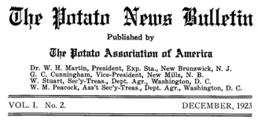
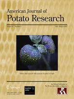
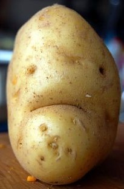
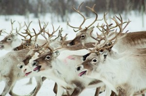
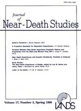

Academia is known for its ever-increasing specificity and specialisation, and, in the internet era, quantity. There are approximately *47,845* academic periodicals currently in circulation, churning out research papers on a mind-bogglingly wide range of subjects.[1. Calculation from [)] Inevitably there are some rather odd publications out there. Here we present our top five.

**1.  American Journal of Potato Research (AJPR)**

There are about 196 countries in the world, depending on how you count them. The best estimate we have of the number of known plant species is around 400,000,[2. According to Botanic Gardens Conservation: though we probably really don't have the foggiest. 20,000 of these are edible,[3. According to Plants for a Future: yet somehow we humans have managed to whittle this down to just 20 species that provide 90% of our food.[3. Ibid.] Apply this tendency to academic publishing and you get the _American Journal of Potato Research_.

Highlights:

    - In addition to the usual full-length articles, AJPR welcomes "short communications concisely describing poignant and timely research". *Poignant?! *As in "*[evoking a keen sense of sadness or regret](https://www.google.com/search?q=define%3A+poignant&oq=define%3A+poignant)*"?! How exactly one writes about potatoes with a keen sense of sadness or regret is beyond me.
    - Discovering that you too could become an *Honorary Life Member of the Potato Association of* America. Something to aim for.
    - Feeling genuinely sorry for the lack of love the Potato Journal is getting on social media: 85 likes on [Facebook](https://www.facebook.com/potatoresearch) and 50 followers on [Twitter](https://twitter.com/PotatoResearch). Can we help them out a bit?

**2. Rangifer: Research, Management and Husbandry of Reindeer and Other Northern Ungulates**

Proudly billing itself as _"the world's only scientific journal dealing exclusively with biology and management of arctic and northern ungulates, reindeer and caribou in particular"_ one has to wonder if we haven't stumbled upon a topic so specific that one volume would suffice. Yet Rangifer is still going strong after 34 volumes.

Highlights:

    - Description of an *"enigmatic group of arctic island caribou"* (PDF).
    - Reindeer. Lots and lots of Reindeer.

**3. Journal of Near-Death Studies (JNDS)**

Exploring near-death experiences, empirical effects and theoretical implications, out-of-body experiences, deathbed visions, after-death communication and the implications for an understanding of human consciousness. Despite the niche subject matter, the JNDS says it is _"committed to an unbiased exploration of these issues and specifically welcome a variety of theoretical perspective and interpretations that are grounded in empirical observation or research"_.

Highlights:

    - Realising that all of that sounds quite a lot more interesting than your own research.

**4. Answers Research Journal (ARJ)**

In contrast to JNDS' commitment to allowing challenges to its niche, the ARJ is perhaps the only journal in the world that openly declares that it will only publish articles that accord with a pre-established hypothesis. The Journal, titled as if to deliberately obfuscate the content, [publishes](https://answersingenesis.org/answers/research-journal/call-for-papers/):

> _research that **demonstrates the validity of** the young-earth model, the global Flood, the non-evolutionary origin of “created kinds,” and **other evidences that are consistent with** the biblical account of origins_

Still, at least they are telling you up front what you need to say to get published.

Highlights:

    - The series of articles attempting to estimate the number of various species types aboard Noah's Ark: [Crocodiles & Turtles](https://answersingenesis.org/creation-science/baraminology/an-initial-estimate-toward-identifying-and-numbering-the-ark-turtle-and-crocodile-kinds/), [Snakes](https://answersingenesis.org/creation-science/baraminology/an-initial-estimate-toward-identifying-and-numbering-extant-tuatara-amphisbaena-and-snake-kinds/), [Amphibians](https://answersingenesis.org/creation-science/baraminology/identifying-and-numbering-amphibian-kinds-results/), [Frogs](https://answersingenesis.org/creation-science/baraminology/an-initial-estimate-toward-identifying-and-numbering-the-frog-kinds-on-the-ark-order-anura/), [Mammals](https://answersingenesis.org/creation-science/baraminology/mammalian-ark-kinds/), [Dinosaurs](../assets/img/posts/140811_5_Super_Specific_Academic_Journals_01.jpeg)[3. just kidding, the dinosaurs [didn't make it to the boat on time.](../assets/img/posts/140811_5_Super_Specific_Academic_Journals_05.jpg)]... We're going to need a bigger boat.
    - Lots of sentences consisting of 50% science followed by 50% amusing nonsense. E.g., on the genus [*Acrochordus*](https://www.google.com/search?q=Acrochordus&es_sm=91&source=lnms&tbm=isch&sa=X&ei=oqTbU8nAIKnS0QW-oIEI&ved=0CAgQ_AUoAQ&biw=1280&bih=780&dpr=0.9#facrc=_&imgdii=_&imgrc=Nb-3nUZQ-Ug8OM%253A%3BCD2oQNlH6q2SlM%3Bhttp%253A%252F%252Fupload.wikimedia.org%252Fwikipedia%252Fcommons%252Fe%252Fe7%252FArafura_file_snake_(Acrochordus_arafurae)_in_captivity.jpg%3Bhttp%253A%252F%252Fen.wikipedia.org%252Fwiki%252FAcrochordus_arafurae%3B3042%3B2077): *"because of its fully aquatic existence and capability of osmoregulating in hypotonic and hypertonic aquatic environments, **it is potentially capable of surviving Flood conditions and are not included on the Ark**".*
    - Extensive author guidance on [how to reference the Bible](/academiaobscura.com../assets/img/posts/140811_5_Super_Specific_Academic_Journals_05.jpg). E.g.: *"Lowercase for divine dwelling places, including heaven, hell, and paradise."[1. The full guide is available here: https://legacy-cdn-assets.answersingenesis.org/assets/pdf/arj/instructions-to-authors.pdf] *

**5. Journal of Negative Results in BioMedicine (JNRBM)**

Lovingly called "the world’s most boring journal" by the Washington Post, the JNRBM actually serves a very important purpose:

> You might imagine that *JNRBM* is a place where losers gather to celebrate their failures, kind of like Best Buy or Division III football. But *JNRBM* meets two important needs in science reporting: the need to combat the positive spin known as publication bias and the need to make other scientists feel better about themselves.

Realising the growing tendency for scientists to publish only positive results, JNRBM instead encourages the _"publication and discussion of unexpected, controversial, provocative and/or negative results"_. The Journal is also pushing the envelope in the other ways, recently implementing an open peer review policy, whereby reviewers sign their reviews and their reports, and authors' responses, are made available. This Journal may just be a taste of things to come.

Highlights:

    - Lots of failed hypotheses, obviously.
    - 'The female menstrual cycle does not influence testosterone concentrations in male partners' (PDF).
    - 'False rumours of disease outbreaks caused by infectious myonecrosis virus (IMNV) in the whiteleg shrimp in Asia' (PDF).

Anybody managing to publish in all 5 of these journals will be handsomely rewarded.
