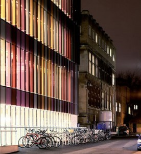
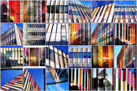
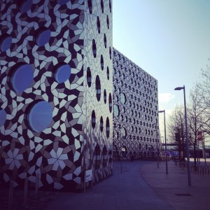
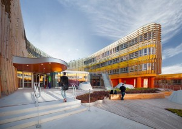
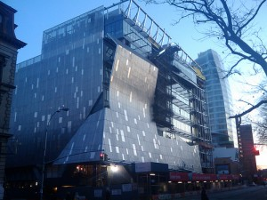
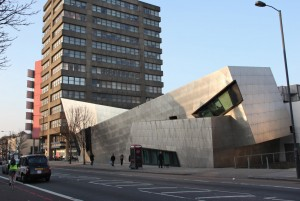

**Biochemistry Building, University of Oxford
**The transparent glass exterior means that you can see straight into the laboratories inside and watch the researchers at work.

**Ravensborne (London)**

**Law and Central Administration Building, Vienna University**

**41 Cooper Square, Cooper Union (New York City)**

 

**Graduate Centre
***London Metropolitan University*

Facilities at the Graduate Centre include a state-of-the-art lecture theatre, three seminar rooms, IT facilities and a social space for students. We particularly love the sharp angles and steel are in complete contrast to almost everything nearby, particularly the neighbouring dull brown tower block.1. This opinion is far from universal. One comment on a [BBC article about the building says: "the structure in no way complements the 60s tower block on to which it is grafted... in fact it's so ugly it fits in rather well with the rest of the frankly minging Holloway Road!! Vile." Another says: "It looks awful if you ask me. You half expect it to blast off and start shooting laser guns."]

**Built: **2004**
Architect: **Daniel Libeskind**
Floor area: **930 m2 (10,000 sq.ft)**
Cost: **£3m (US$5m)
**Street view:**[2. Note the dog in the street view image, which timed its defecation to perfection!]** **

