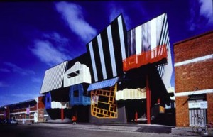
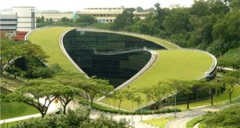
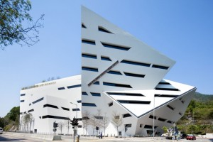
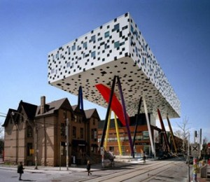
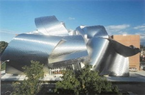

There is no doubt that your surroundings influence the way you think and feel, so it makes sense that our university buildings and campuses should be as inspiring as they are functional. In this post, we take a look at some of the coolest university buildings out there. These ultra modern havens of learning will surely leave you impressed, and perhaps also slightly jealous. Love them? Hate them? Leave a comment below or tweet at us ([@AcademiaObscura](https://twitter.com/AcademiaObscura)).

---

**10. School of Drama \***Victorian College of the Arts (Australia)\*

The Victorian College of the Arts has tacked this quirky little building on to the end of an otherwise ordinary row of terraces. The building, hosting the School of Drama, is indeed reminiscent of a theater set, and the unique and colorful design certainly distinguishes it as a creative space.

**Built: **2004**
Architect: **Peter Corrigan**
Floor area:** ???**
Cost:** ???
**Street view:\*\*** \*\*

---

**9. School of Art, Design, and Media \***Nanyang Technological University (Singapore)\*

In 1993, Nanyang Technological University decided to designate a valley at the heart of its 500-acre campus as open space. However, when it established its new School of Art, Design, and Media 11 years later it realised that, like Singapore itself, it was rather short on space. Not wanting to lose its green heart, the University instead commissioned this unique building. The 5-story building houses more than two dozen studios and laboratories, two galleries, lecture halls, classrooms, a soundstage, and a 450-seat auditorium.

**Built: **2006**
Architect: **CPG Consultants**
Floor area:** 10,000m² (108,000 sq. ft)**
Cost:** SG$38m (US$30.4m)

---

****

**8. Run Run Shaw Creative Media Centre (邵逸夫創意媒體中心) \***City University of Hong Kong (香港城市大學)\*

This unusual crystal-shaped building houses the School of Creative Media at the City University of Hong Kong. The complex has image labs, classrooms, exhibition spaces, a café and a restaurant.

**Built: **2011**
Architect: **Daniel Libeskind,[1. The same architect in charge of the World Trade Center rebuild.] Leigh and Orange Ltd.**
Floor area: **13,400 m² (144,000 sq ft)**
Cost: **???
**Street view:\*\*** \*\*

---

**7. Mode Gakuen Cocoon Tower (モード学園コクーンタワー) \***(Japan)\*

!Credit: [Chad Dao](../assets/img/posts/140820_10_Offbeat_University_Buildings_11.jpg)

The Cocoon, which looks a bit like the Gherkin crossed with the Birds Nest,houses three different Japanese institutions: Tokyo Mode Gakuen (fashion school), [HAL Tokyo](https://www.hal.ac.jp/english/) (technology & design college), and Shuto Ikō (medical school). It is the second tallest university building in the world, with its 50 floors standing at 204 metres (669 ft). The architect, who beat off 150 other proposals to win the commission, says that the cocoon shape symbolises the nurturing of students inside.[2. Wikipedia, Yes, yes, I'm know, I'm citing Wikipedia. But only because the link to the source on the Wikipedia page doesn't work. Which sort of proves why you shouldn't cite Wikipedia.] Aww, isn't that nice :)

**Built: **2008**
Architect: **Tange Associates**
Floor area:** 80,865m² (870,000 sq. ft)**
Cost:** ???
**Street view:\*\*** \*\*

---

](../assets/img/posts/140820_10_Offbeat_University_Buildings_12.jpg)

**6. City Campus \***Royal Melbourne Institute of Technology (Australia)\*

Originally founded in 1887 as the Working Men's College, RMITs subsequent success and rapid growth caused it's city campus to develop in an unsystematic fashion. Land or buildings as they became available, and as a result the University's 68 buildings are strewn over a six block section of the city.

RMIT has built a number of impressive and modern buildings over recent decades, mixing this with their more traditional offerings. Check out their campus architecture webpage for a rundown, including many very interesting, but unbuilt, proposals.

---

!Credit: [Architecture Lab](../assets/img/posts/140820_10_Offbeat_University_Buildings_03.jpeg)

**5. Emerson College, Hollywood \***(USA)\*

The brand new Emerson College building is a futuristic cube of aluminum and glass that boasts editing and mixing labs, performance studios and dressing rooms as well as the usual lecture halls, a cafe, and dorm space for 217 students. Overlooking the LA sprawl and the Hollywood Hills, the building takes up only a one acre footprint, but manages to be incredibly imposing (just check out the street view!).

**Built: **2014**
Architect: **Thom Mayne**
Floor area:** 10,000m² (108,000 sq. ft)**
Cost:** US$85m
**Street view:\*\*** \*\*

---

**4. Sharp Centre for Design \***Ontario College of Art and Design (Ontario)\*

The Sharp Centre is a 80 x 30m, two-storey box, resting on steel 'legs' about four stories off the ground. The old main campus building sits directly below. Fun facts: the red tube houses an emergency exit stairwell, and the steel legs, themselves 10 storeys long, were originally intended to be natural gas pipeline

**Built: **2004**
Architect: **Will Alsop**
Floor area:**  2,600m² (28,000 sq. ft)**
Cost: **CA$42.5m (US$38.9m)
**Street view:\*\*** \*\*

---

**3. Peter B. Lewis Building \***Case Western Reserve University (USA)\*

The Peter B. Lewis building houses the Weatherhead School of Management. It is named after the chief executive and president of Progressive Insurance, who gave US$37 towards its construction.

If you thought that this building looks quite like the Guggenheim Museum in Bilbao, you'd be right. The architect, Frank Gehry, and Peter Lewis were good friends. Lewis had previously asked Gehry to design a new house for him and, though the house was never built, the lengthy design process advanced many of the ideas that Gehry ultimately used for the Guggenheim.

The building is as beautiful inside as out; you can take an online tour here.

**Built: **2002**
Architect: **Frank Gehry**
Floor area: **14,000m² (152,000 sq. ft)**
Cost: **US$62m
**Street view:\*\*** \*\*

---

](../assets/img/posts/140820_10_Offbeat_University_Buildings_02.jpg)

**2. Jubilee Campus \***Nottingham University (UK)\*

This wonderfully futuristic set of buildings at the University of Nottingham's Jubilee Campus combines some surreally green telly-tubby landscape with modern architecture made for HDR photographs.

Built on an ex-industrial site, the project has regenerated the land with a series of lakes and green spaces. The campus boasts a range of other green credentials, including roofs covered by low-growing alpine plants which insulate and maintain temperatures, solar panels, and maximised use of passive ventilation. The 'Aspire' sculpture, added in 2008, was designed by Ken Shuttleworth, designer of the Gherkin in London.

**Built: **1996-present**
Architect:  **MAKE architects**
Floor area: **12,000m² (130,000 sq ft.)**
Cost: **???
**Street view:\*\*** \*\*

# 

---

](../assets/img/posts/140820_10_Offbeat_University_Buildings_10.jpg)

**1. Ray and Maria Stata Center \***Massachusetts Institute of Technology (USA)\*

The Stata Center (aka Building 32) was designed by Pritzker Prize–winning architect Frank Gehry. The building, notable for its topsy-turvy feel, was opened in 2004.

Robert Campbell, architecture columnist for the Boston Globe, wrote:[4. Robert Campbell (April 25, 2004). "Dizzying heights - In Frank Gehry's remarkable new Stata Center at MIT, crazy angles have a serious purpose". The Boston Globe.]

> _the Stata is always going to look unfinished. It also looks as if it's about to collapse. Columns tilt at scary angles. Walls teeter, swerve, and collide in random curves and angles. Materials change wherever you look: brick, mirror-surface steel, brushed aluminum, brightly colored paint, corrugated metal. Everything looks improvised, as if thrown up at the last moment. That's the point._

**Built: **2004**
Architect: **Frank Gehry**
Floor area: **67,000 m² (720,000 sq. ft)**
Cost: **US$300-420m
**Street view:\*\*** \*\*

