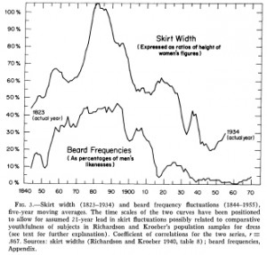
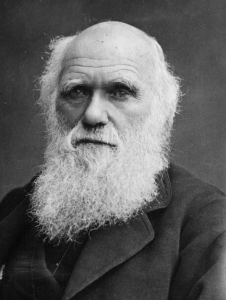
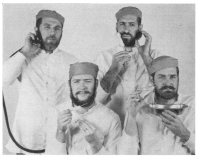
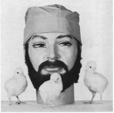
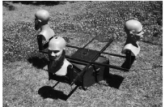
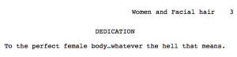

> _To sport a beard signifies something._

- Stories are not generally written about being clean shaven.\*
  Aristotle[1. OK, not really. Actually just the personal experiences of some bearded dude living in South Korea (). But it sounds much better with Aristotle.]

It seems like beards are everywhere these days, having made a bit of a hipster-fuelled comeback. Yet academics know that they have been the bastion of beards for many decades. In honour of World Beard Day (September 6), we are taking a look at the furry, fluffy world of academic beards.

**Peak Beard
**Like all good things, the beard craze must come to an end, and one recent study suggested that we will soon hit 'peak beard'. That is, the point at which having a beard is too common, and therefore undesirable from an evolutionary perspective. Thus leaving academics alone with their beards once again. The paper, published in *Biology Letters *and entitled *Negative frequency-dependent preferences and variation in male facial hair*, tested "whether frequency of beardedness modulates perceived attractiveness of men's facial hair, a secondary sexual trait subject to considerable cultural variation".

The authors showed study participants a range of faces, manipulating the frequency of bearded faces, and then measured preference for four 'levels of beardedness'. Both women and men reported heavy stubble and full beards to be more attractive when presented with a set of faces in which beards were rare. Similarly, clean-shaven faces were least attractive when such faces were most common, and more attractive when rare.

Such peaks are not uncommon. A previous review of facial hair styles in recent history found that sideburns peaked in 1853, moustaches in 1877, and beards in 1892. Moustaches subsequently had a renaissance, before peaking again from 1917 to 1919. The same study also noted a correlation between the prevalence of beards and skirt widths, as shown in the following graph:

**To Beard or not to Beard?
**Studies have come up with mixed results on whether beards make you more or less attractive. In one study00022-6/abstract), full beards rated highest for parenting ability and healthiness, while in another, bearded men with an aggressive facial expression were rated as significantly more aggressive than the same men when clean-shaven.[2. Presumably bearded men should simply refrain from pulling faces.] Another study even considered, in detail, the effect of the participants' menstrual cycles on their perceptions. The peak beard study itself concludes that beards "role in facial attractiveness is equivocal."

Indeed, in [_Beards: an archaeological and historical overview_](https://www.academia.edu/466184/Beards_an_archaeological_and_historical_overview), the author notes:

> _beards have been ascribed various symbolic attributes, such as sexual virility, wisdom and high social status, but conversely barbarism, eccentricity and Satanism_

Darwin himself posited that beards "evolved in human ancestors via female choice as a highly attractive masculine adornment". But then, he might have been a little biased:

**Beards and Biological Warfare
**Do you have a beard? Do you work in a lab containing dangerous microorganisms? Do you worry that your facial appendage may harbour microorganisms that will endanger your family and friends? Well, we've got just the study for you. *Microbiological Laboratory Hazard of Bearded Men, *published in *Applied Microbiology* all the way back in 1967, sought to "evaluate the hypothesis that a bearded man subjects his family and friends to risk of infection if his beard is contaminated by infectious microorganisms while he is working in a microbiological laboratory".

One wonders where exactly this concern came from. The authors kindly fill us in, noting that:

> _After many years of absence from the laboratory scene, beards are now being worn by some persons working with pathogenic microorganisms_

Heaven forbid! What ensues is a rather bizarre study and a series of amusing photographs. In short, the study involved spraying some pathogens on some bearded guys faces (specifically 73 day old beards), washing the faces using one of two methods (figure 1), and then collecting some beard dust to see if the pathogens were still there (figure 2).

Finally, the study tested the pathogen-infested beards on chicks using a creepy human-beard-mannequin, resulting in what is surely one of the strangest photos ever published in a scientific paper.

After much contamination, washing, and the needless death of a few chickens, the authors find that a beard would only pose a risk following a "recognizable microbiological accident with a persistent highly infectious microorganism" or if the wearer was "engaged in a repetitious operation that aerosolized a significant number of organisms". Or, presumably, in the event of biological warfare.

**Beards and the Sun
**So that lovely beard of yours may harbour a few pathogens, but could it protect your precious face from the harmful effects of the suns UV rays? Fortunately, a bunch of Australian researchers already conducted a *Dosimetric investigation of the solar erythemal UV radiation protection provided by beards and mustaches *to answer this pressing question. They even went as far to consider different beard lengths and the angle of the sun!

They conclude that some protection is provided, but not all that much. Probably best to stick to the sunscreen.

**This Incredible Academic Beard from 1973**

**Bearded Women
**Finally we bring you this thesis, on *How Facial Hair Influences Women's Everyday Experiences. *An unusual thesis topic though this may be, the work does raise some salient points about body image and gender. In this vein, the author starts of with a bold dedication, which we shall end this post on:

**Bonus reading**

    - PhD comics: beard migration
    - Beard Science
    - Will It Beard?
