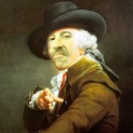

_This post originally appeared over at Dr Alun Withey's blog Follow him on twitter [@DrAlun](https://twitter.com/DrAlun)._

This week came the startling revelation that, in the past year, manufacturers of razors and related goods such as shaving foam, have seen a drop in sales of more than £72 million pounds. Market analysts IRI noted that men’s shopping habits were changing and, even though the total market still accounted for 2.2 billion pounds, this was a substantial dent. The cause of this change? Beards.

Nobody can have failed to notice in recent months the ubiquity of facial hair. Keep your eyes open as you walk down your local high street and you will probably notice a variety of styles, with the ‘Amish’ style seemingly especially popular. It is also interesting how newsworthy beards are. Just look at how often they have appeared as a topic for discussion in recent months. The furore caused by Jeremy Paxman’s beard for example. There were lengthy discussions about celebrity beards at the Baftas in 2013, and now the economic revelations about how much the beard is costing.

This current beard trend is actually very interesting. Over the past 10 years or so beards have been less in vogue. There have been ‘spikes’ of beardedness but these have tended to be of short duration – sometimes only a matter of months. But this latest outcrop of beards has already lasted the better part of eighteen months. By early summer 2013 the idea of ‘peak beard’ was already being put forward. Quoting the head of a major British barbering company, the Guardian suggested that “beards are more popular than ever…there’s a beard culture – people like talking about their beards, feeling their beards’. Now, in September 2014, passion for beards shows little sign of abating and, in many ways, appears to be going from strength to strength.

It is also interesting to note how economics have begun to intrude into the argument. By anyone’s yardstick £72 million is a large chunk of revenue to be lost to what some people see as an irrelevance – something everyday, quirky…even repulsive. In reality though beards have never been anything less than central to men’s conceptions of themselves. Faces, after all, are the most public part of us. The way we present ourselves to others involves all manner of things, from clothing to cosmetics, but the face is the ultimate index of character. The decision to shave, cover or adorn the face has implications for how we see ourselves and wish to be seen by others. Beards actually matter. Quite a lot. And they always have done.

Over the centuries beard trends tended to last for decades. It’s perfectly possible to identify an historical period by its beard hair. Think of sixteenth-century England. The Tudor ‘Spade beard’ was the order of the day. This was the long, oblong outgrowth of facial topiary sported by kings, princes and elites. Doubtless it made its way a lot further down the social scale too. This type of beard is evident in Holbein’s paintings. Not all Tudor men embraced the beard though. Men like Thomas More was a clean-shaven, perhaps in line with his austere lifestyle. Thomas Cranmer was clean-shaven but, it is said, grew a beard as a symbol of his grief upon the death of Henry and of his break with the past. In this sense the beard was a turning point in his life.

In the seventeenth century Stuart monarchs preferred small, pointed ‘Van Dyke’ beards. Charles I and Royalist ‘Cavaliers’ often sported this type of facial hair together with flowing locks. Masculinity here was remarkably feminine, with flowing, diaphanous gowns and silk breeches the order of the day. Contrast this with Puritans who generally went clean-shaven, believing beards to be a mere bauble. One argument about the origins of the term ‘roundhead’ is that it referred to the shape of the head after the beard and hair had been shaved – a popular parliamentarian style – rather than the shape of helmets.

Victorian men, after 1850, were characterised by their huge bushy beards. After nearly a century of being clean shaven British men were exalted by a range of new publications with names like Why Shave? which sought to convince them that shaving was little less than a crime against God and nature. The beard was the ultimate symbol of masculinity, and something used as a tool to prove to men that their position of superiority over women was justified. More than this, it was argued, beards had health benefits that simply couldn’t be ignored. They acted as filters to keep germs away from the nose and throat. (See my other post on Victorian beard health).

In the twentieth century, at least up until around 1950, moustaches were much more in vogue. Charlie Chaplin’s ‘toothbrush’ moustache was a cultural icon. Whether or not (as is sometimes suggested) Adolf Hitler grew his because of Chaplin, whose work he admired, is another matter, but the military moustache was a staple of the first decades of the century, from British Tommies to the emblematic RAF pilot’s moustache.

There are many other important aspects to beards. Growing a beard has been an important marker of life stage; the transition from adolescence to adulthood. The first shave is a virtual rite of passage for a teenage boy. On the other hand, in the past, the ‘beardless boy’ has been a symbol of immaturity or even of a lack of sexual prowess.

Indeed the ability to grow a beard has been central to conceptions of masculinity through time. In the early modern period the lack of a beard was viewed in humoural medical terms as the result of a lack of heat in the ‘reins’ and therefore a lack of sexual potency. Men who had a thin, scanty beard were open to suspicion of effeminacy (in the early modern sense literally meaning that they had feminine characteristics). In the nineteenth and even twentieth centuries, so central was the moustache to military regiments that men unable to grow one were expected to wear a false moustache made of goats hair.

The management of facial hair says much about how men view themselves. During the enlightenment the mark of a civilized man was a clean-shaven face. To be bearded signified loss of control over the self and a rugged masculinity that was not elegant or refined. After 1850, however, as I have noted, the fashion was for huge beards, which were seen then as the ultimate symbol of God-given male authority. In this sense it was the emblem of the Victorian man.

After 1900 with the burgeoning market for shaving apparel and cosmetics the situation became even more complex. It is also noteworthy that the pace of change has quickened. Where beard trends used to last decades, since the 80s they have become more fleeting – probably a result of internet-driven celebrity culture.

If all this is true, what does the current vogue for facial hair tell us about men today? What ideal of masculinity are men in 2014 aspiring to? It is difficult to say. Unlike in the past it is harder to track changes in masculine ideal as they are now much more transitory. Nonetheless, one of the constants has been emulation. In the early modern period monarchs provided a bearded (or indeed clean-shaven) ideal. By the Victorian period powerful and fashionable figures, and new types of industrial and military heroes, offered men something to aspire to. Now, with almost unlimited access to the lives of celebrities through the voracious media and internet, the opportunities to find fashion ‘heroes’ to emulate are almost limitless. The question now is how long this trend will last and, perhaps more interesting, will there be a backlash against the beard? History suggests so.

_This post originally appeared over at Dr Alun Withey's blog Follow him on twitter [@DrAlun](https://twitter.com/DrAlun)._
