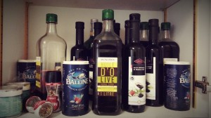
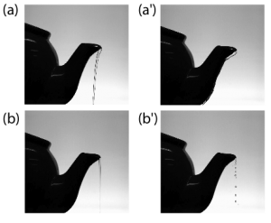
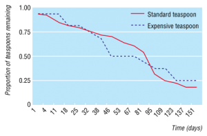
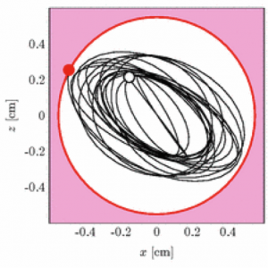

_This is a slightly edited version of a post that originally appeared on the Guardian Higher Education blog._

As a British researcher working in France, I have struggled with an existential crisis regarding my choice of hot beverage. I have always been a tea drinker, yet the social pressure to drink coffee here is almost as overpowering as the coffee itself. My boss thinks I only drink tea to impress female colleagues, though combined with a big red beard and the French language skills of a three year old, it probably only serves to further mark me out as the office oddball.

To make matters worse, there is no communal milk, only an endless supply of olive oil, salt, and balsamic vinegar.

Nonetheless, I patriotically persist, following the sage advice of the UK Ministry of Munitions (1916) that _“an opportunity for tea is regarded as beneficial both to health and output”_.

Fellow Guardian blogger, Dean Burnett, recently discussed the science on brewing the perfect cuppa, arguing that the premise of this age-old question is itself so subjective that it can never be definitely answered. Personally, I always start out with loose-leaf Assam, filtered water, milk and white sugar, as per the Royal Society of Chemistry guidelines. And I NEVER reboil the water, perish the thought. But though the science of brewing tea has been done to death, there is an emerging field of scientific inquiry regarding best post-brew practice.

For example, sometimes I really go for it and crack out the teapot. Unfortunately, when it comes to pouring I always get that pesky dribble down the underside of the spout (the ‘teapot effect’); it drives me mad (‘first world problems’). This effect has been helpfully modelled in a _Physics of Fluids_ paper, while a further paper, ironically written by four Frenchmen, identified a number of factors that affect dribbling. These include: _“curvature of teapot lip; speed of flow; and 'wettability' of teapot material”._ The main culprit, the 'hydro-capillary' effect, can easily be overcome by either thinning the spout, or by applying superhydrophobic materials to the lip.

Then comes the stirring. Or at least it would if I could ever find a teaspoon. I had often lamented the lack of information on the “*displacement of teaspoons in institutional settings” *in the scientific literature. Fortunately, some Aussie researchers (presumably with nothing better to do) launched a ‘longitudinal cohort study’ to figure out _“Where have all the bloody teaspoons gone?"_ They meticulously tracked 70 teaspoons for 5 months, observing a staggering loss of 80% and a teaspoon half-life of 81 days. The researchers were, however, stumped as to why this occurs, with “*escape to a spoonoid planet” *being one plausible explanation.

Finally, the fraught walk back to the desk, and the inevitable hand scalding as a third of the tea I just lovingly brewed sloshes onto the floor. Indeed, A paper in _Physical Review E_ is sympathetic: _"in our busy lives, almost all of us have to walk with a cup… often we spill the drink”._ Researchers conducted an experimental study on beverage spillage, controlling for various walking speeds and initial liquid levels*.* Thankfully, I now know all the best techniques for staying within the ‘critical spill radius’ (i.e. the edge of the mug).

Tea isn’t really tea unless you get the biscuits involved, and academics have even overthought this simple pleasure. 'Washburn's Equation’ describes [how liquid moves through the biscuit](https://home.iitm.ac.in/arunn/biscuit-dunking.html), while a team of mechanical engineers used a gold-plated digestive to figure out how best to dunk. You need a full cup and an angled entry, but the real trick is to flip the biscuit post-dunk so that the drier side supports the weaker side as you move from mug to mouth.

**The Best Thing I’ve Seen This Week**

Academics tweeting faux campus society announcements ([#UniSocieties](https://twitter.com/hashtag/unisocieties?f=realtime&src=hash)). My favourites include: [The Statistics Society](https://twitter.com/AcademiaObscura/status/521076719349166081) (“Stats Soc has taken delivery of large consignment of tea. There will be a student T-distribution next week.”); [The Short Attention Span Society](https://twitter.com/AcademiaObscura/status/521803524817293312) (“Will meet on... oops, I stepped in... are they serving burritos for... I forgot my...”); and [The Societies Society](https://twitter.com/AcademiaObscura/status/521802350722576384) (“promoting meta-analysis and academic overthinking”). I took this opportunity to [highlight](https://twitter.com/AcademiaObscura/status/520542760215273472) that that LSE Rugby Club will not meet at all this year, having been disbanded for their misogyny and homophobia.

**Overheard on Twitter**

> Just created the world's strongest cup of Early Grey tea when I went to play the guitar for a minute while it brewed…& forgot about it!

— Alun Withey (@DrAlun) [October 8, 2014](https://twitter.com/DrAlun/status/519779705931571201)

> Amazed that moan about no biscuits in tearoom has resulted in us being sent biscuits. We are also angry there are no Ferraris in car park...

— Orkney Library (@OrkneyLibrary) [October 3, 2014](https://twitter.com/OrkneyLibrary/status/517997782297497600)

So there you have it, the perfect cuppa from brew to biscuit, with a bit of academic humour on the side. Just don’t forget to do the washing up. Oh, and please do tweet me [@AcademiaObscura](https://twitter.com/AcademiaObscura) if you have any spare superhydrophobic materials lying around.
