This week is National Chemistry Week in the US, so I thought I'd take this opportunity to showcase some of the more unusual chemicals. To make it interesting, we also have Chemistry Cat giving his/her (?) thoughts on the comic compounds.

**1. C4H4AsH
**Any guesses as to the common name of this chemical? [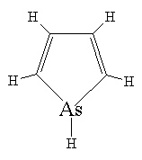](../assets/img/posts/141019_10_Comic_Chemicals_presented_by_Chemistry_Cat_13.jpeg)Yup, that is **Arsole**.

The chemists have really gone to town on this one, writing papers such as *Studies on the Chemistry of the Arsoles, *and sticking six of them together to get a '**sexiarsole**'. One study looks at whether arsoles smell. Due to the wonders of the academic publishing system, access to these fascinating insights will cost you $65. Other contributions to this expanding niche include *Unusual Substitution in an Arsole Ring *and _Arsole metal complexes._

[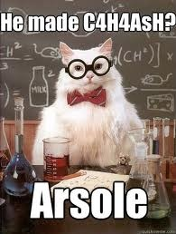](../assets/img/posts/141019_10_Comic_Chemicals_presented_by_Chemistry_Cat_02.jpeg)

**2. C20H30O4
3. C33H40O1
Vaginatin** and **Clitorin** [1. The closest that male chemists get to female anatomy?]. The name Vaginatin comes from *Selinum vaginatum*, the plant from which the chemical was extracted. It contains lots of oil and is used in Indian herbal medicine.

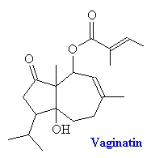[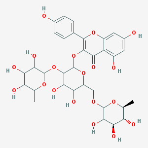]()   **4. Mg2Mg5Si8O22(OH)2** [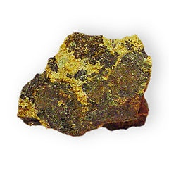](../assets/img/posts/141019_10_Comic_Chemicals_presented_by_Chemistry_Cat_11.jpeg)A long time favourite of geologists, chemists, and other sciency types, that little lump of rock there is called Cummingtonite. It got its name from the locality where it was first found, Cummington, Massachusetts.

[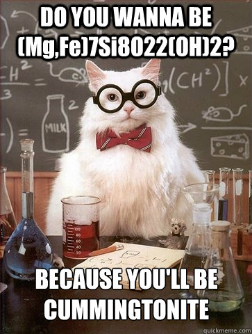](../assets/img/posts/141019_10_Comic_Chemicals_presented_by_Chemistry_Cat_08.jpg)
**5. Apolloane 6. Rocketene
**Apolloane was synthesised around the time of the Apollo 11 moon landings, and when drawn looks like a rocket. The OH is located at carbon 11, making the full name **apolloane-11-ol**. Legend has it that Neil Armstrong's has a copy of the paper which named it. [2. Neil has unfortunately not returned my request for comment.]

[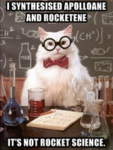](../assets/img/posts/141019_10_Comic_Chemicals_presented_by_Chemistry_Cat_14.jpeg)

**7. Arsenical Diphenylaminechlorarsine**
**Adamsite** is an organic compound used in riot control and chemical warfare. It was independently developed one Roger Adams in 1918. Within minutes of inhaling even the smallest amount, you will be vomiting and sneezing all over the place. Good work, Mr. Adams. It was used by the US in the Vietnam war, and is now being produced and stockpiled by North Korea.
[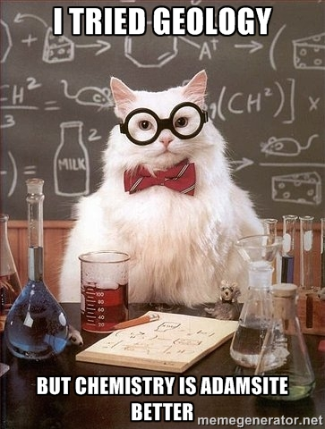
](../assets/img/posts/141019_10_Comic_Chemicals_presented_by_Chemistry_Cat_05.jpg)

**8. Ca4Si2O6(CO3)(OH,F) 2
Fukalite** gets its name from the Fuka mine in the Fuka region of southern Japan. It is very rare, and is a form of calcium silico-carbonate.

[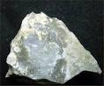](../assets/img/posts/141019_10_Comic_Chemicals_presented_by_Chemistry_Cat_04.jpeg)

**8. Ca2SbMg4FeBe2Si4O20**
**Welshite** is named after the American amateur mineralogist Wilfred R. Welsh.

**9. Diethyl azodicarboxylate
**This chemical is abbreviated to **DEADCAT**. It is toxic, shock and light sensitive, and can violently explode when heated above 100°C.

[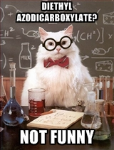](../assets/img/posts/141019_10_Comic_Chemicals_presented_by_Chemistry_Cat_17.jpeg)

**10. 3,4,4,5-tetramethylcyclohexa-2,5-dien-1-one/C10H14O**
Also known as **Penguinone** and probably the cutest molecule ever!

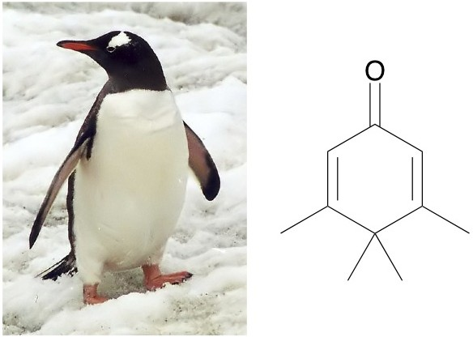

For more penguin-themed goodness in academia, see this previous post.

**Bonus: **The final two are more chemistry thought experiments, but they are pretty cool nonetheless.

**11. Chemistry: the human dimension
**The Nano Putian group of chemicals are proposed in a paper called *Synthesis of Anthropomorphic Molecules*. Standing at a diminutive 2-nm-tall, these tiny figures have nonetheless drawn 13 citations!\*\*
\*\*

[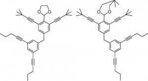](../assets/img/posts/141019_10_Comic_Chemicals_presented_by_Chemistry_Cat_03.jpeg)   [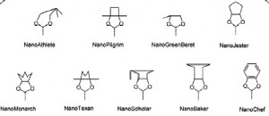](../assets/img/posts/141019_10_Comic_Chemicals_presented_by_Chemistry_Cat_15.jpeg)

**12. Old MacDonald (had a meth lab)
**Ever wondered what your childhood songs would have been like if the characters pursued alternative career paths? Well now you can get a sense of what would happen if Old MacDonald left his farm to become a professor of organic chemistry. The paper *Old MacDonald Named a Compound: Branched Enynenynols*, proposes some whimsical compounds as a method to teach students chemistry nomenclature rules.

[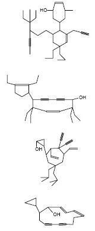](../assets/img/posts/141019_10_Comic_Chemicals_presented_by_Chemistry_Cat_06.jpeg) [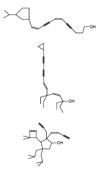](../assets/img/posts/141019_10_Comic_Chemicals_presented_by_Chemistry_Cat_16.jpeg)

_Many thanks to Paul May for his incredibly comprehensive page and book on funny molecules which inspired this post._
