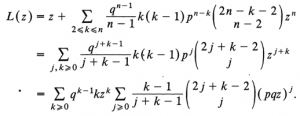
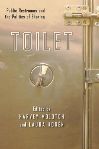
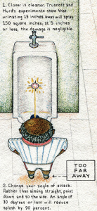

Next Wednesday is World Toilet Day. The humble toilet, “ecologically mindless” though it may be, is the subject of a surprisingly large body of research.

One of my favourite uses of the toilet, so to speak, is the ‘toilet paper problem’ in mathematics, which describes how people choose between two toilet rolls (are you a ‘big-chooser’ or a ‘little-chooser’?). The toilet has been used as a case study of ‘Multicriteria Decision Analysis’ (whatever that is), as a “specific empirical site“ to “unpack the paradoxical and ambivalent meaning and value of femininity”, and to study “French-English bilingual children's crosslinguistic transfer in compound nouns” (because there is big difference between ‘toilet paper’ and a ‘paper toilet’).

Public toilets have drawn much interest, including a whole edited volume. In an effort to ergonomically redesign the public toilet, one study tested out squat toilets with varying feet placement angles, measuring the participants’ heart rates and their subjective evaluation of comfort. 15 degrees is, apparently, the sweet spot.

And before you say that you don’t like squat toilets, consider this: a field survey in Taiwan found that almost half the population squat over public toilets anyway, believing it to be more sanitary. Amongst British women, that figure is a whopping 85%, with only 2% opting to plonk themselves directly on the seat. 12% cover the seat in toilet paper first. Apparently we are more trusting of friends: the ‘squat-rate’ drops to 38% when at someone’s house. All this is in vain of course, as no diseases are transmitted via the toilet seat. Indeed, you should be more concerned about vapourised toilet water getting on your toothbrush.

Now two papers for the male readers. The first showcases another novel use of mathematics to solve an everyday conundrum: which urinal provides the greatest protection of your personal privacy? (the ‘Urinal Problem’). If you are first to enter, the furthest urinal from the door is you best bet. After that it gets incredibly complicated!

The second paper, _Urinal Dynamics_, explores the “splash dynamics of a simulated human male urine stream”, providing some scientifically proven methods for reducing undesired splashing. The researchers wrote this “in response to harsh and repeated criticisms from our mothers and several failed relationships with women". The paper has even been tastefully illustrated by Eric Anderson (Wes Anderson’s brother).

Finally, something we can all relate to: a note on the most bottom-friendly toilet paper. One study tested regular, recycled and moist toilet paper, using “a chronic use test and a repeated rubbing test”. Sounds grueling indeed, but the tests were disappointingly performed on the forearm only, brining its legitimacy into question. The results surprisingly show that both moist and recycled toilet paper may have an irritant effect. On your forearm.

**The Best Sh\*t in Academia**

    - *An in-depth analysis of a piece of shit*, characterising ‘specimens’ into five ‘consistency categories’. Truly ridiculous methodology diagram included.
    - *Shit Happens** (to be Useful)! Use of Elephant Dung as Habitat by Amphibians*. The author was looking for seeds inside elephant dung, as you do, and found frogs instead. In total six frogs in 290 piles of dung. So not *that *useful then.
    - A paper on urinary tract infections, listing *K.Shit, *as an author. Mr. Shit has not authored any other papers and has no profile page on his university’s website.

Enjoy World Toilet Day, don’t fall asleep on the toilet, and don’t get the toilet brush handle lodged in your brain.
