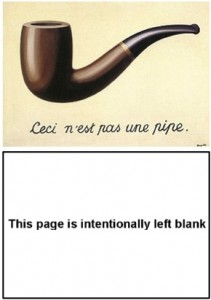
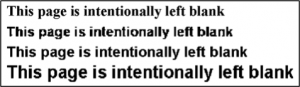
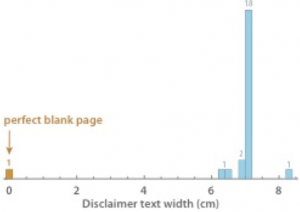
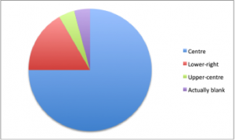

_The PDF version of this paper is available on Figshare.
Authors: _[@AcademiaObscura](https://twitter.com/AcademiaObscura), [@fxcoudert](https://twitter.com/fxcoudert), [@astonsplat](https://twitter.com/astonsplat), [@McDawg](https://twitter.com/McDawg), [@DevilleSy](https://twitter.com/DevilleSy)

**Abstract**

Common in all areas of publishing, the phrase _“This Page is Intentionally Left Blank”_ has been found in peer-reviewed academic articles costing $30 to access. To the best of our knowledge, this paper represents the first known review of Intentionally Blank Pages (IBPs). We looked at the variations in samples from the existing literature, and quantified the amount of blankness on such pages using a new metric, the “Blankness Defect Rate” (BDR). After showing that most blank pages are defective, we suggest a number of alternatives, factually correct or less ambiguous. Finally, we offer some possible explanations for this phenomenon, including “editor’s block”, a creative impairment similar to the well-known “writer’s block”, and identify avenues for future research on this critical topic.

---

**1. Context**

The phrase “This Page is Intentionally Left Blank” is ubiquitous in the world of printed text, appearing most notably in instruction manuals and exam papers. It is generally accepted that its purpose is to indicate that the page on which it appears is purposely bereft of content. Yet the very inclusion of this phrase nullifies its intent: the page is no longer blank. Indeed, it is now intentionally* not* blank. By virtue of self-reference, the phrase denies its own existence, despite the fact that we know it is there. This is, essentially, a rather banal, academic version of René Magritte’s surrealist work, _The Treachery of Images_ (Figure 1).

The US Code of Regulations (1984) actually mandates that blank pages in certain books and pamphlets must be marked as such.[1. The Code of Federal Regulations of the United States of America (1984), Section 47, §61.93.] As such, they are especially common in technical works. This has lead to a large number of people attempting to solve the philosophical conundrum such non-blank blank pages create, often through online fora and crowdsourcing platforms. The Office of the General Counsel at the US General Accounting Office, acutely aware of the distress caused, purported in 2001 to have resolved the conundrum in its _Principles of Federal Appropriations Law_ (Second Edition, Volume IV).[2. Here: [)] Text on page ii, which is otherwise blank, reads *“This page is intended to be blank. Please do not read it.” *However, this appears to have only further entrenched the philosophical contradictions, and the subsequent Third Edition contained no such text on its blank page.

It was recently discovered via social media that a number of peer-reviewed academic ‘articles’, costing $30 to access, consist solely of one blank page (Figure 2).[3. Tweet dated 13 Oct 2014, @fxcoudert: [https://twitter.com/fxcoudert/status/521675319322112000](https://twitter.com/fxcoudert/status/521675319322112000)] In order to determine what value was being added to these pages by the peer review process that they have undergone, we set out to investigate their blankness. To the best of our knowledge, this is the first systematic study of intentionally blank pages (IBP) in the academic literature.

**2. Methodology**

A total of 56 individual IBPs were found on the online ScienceDirect platform, 24 of which were immediately available for purchase and study. These appear to be a cross-disciplinary selection, so it is felt that this will give a good indication of the treatment of IBPs over a wide range of subjects. It is notable that these IBPs are largely from books. It appears that journals generally do not leave blank pages, intentionally.

**3. Analysis**

Out of 24 PDFs, only one was truly blank. This was checked by rendering of its contents at high resolution (600 dpi) followed by a search for non-white pixels. The remainder were manually examined, showing some variety in their style (Figure 3). One used a sans-serif font, although the majority (22 out of 24) used a rasterized sans serif font in varying sizes and positioning.

**3.1. Blankness**

Despite their claim to have been ‘intentionally left blank’, our analysis shows that almost none of the IBPs have, in actual fact, been left blank: all but one of them contain the text _“This Page is Intentionally Left Blank”_. The exception is an IBP from _Parallel Computational Fluid Dynamics 2000_ (2001). The reason for the omission of the informative text on this page remains wholly unclear.

The prevalence of text on these ‘blank pages’ will either disappoint readers that have paid $30 for a product that was falsely advertised, or raise existential questions such as, “what _is_ a blank page?” and “why did I choose a career in academia?”

The amount of blankness varies, which can be quantified using a factor we have named the “blankness defect rate” (BDR). The BDR can be defined as the amount of space on the page that is in fact not blank, primarily caused by the presence of text. Automated determination of the BDR was undertaken using custom _Mathematica_ scripts. The primary factor affecting the BDR was the size of the informative text (Figure 4), with larger text leading to a higher BDR. The font used may also affect the BDR, whereby fonts with serifs cause higher BDRs, due to their occupying more space. Additional interference effects may also be present.

The average BDR of the sampled IBPs is 0.163% (±0.04%), while the average amount of non-blank space (i.e. ink) is 0.830 cm2 (±0.204).

**3.2. File Size**

The total size of the 24 IBPs is 237 kB, averaging almost 10kb per page. Individual IBPs varied from 7 kB to an impressive 19 kB, as can be seen in Appendix 1. By contrast, our control has a size of merely 365 bytes. Even the peer-reviewed genuinely blank IBP was 8.2 kB in size. To put this into perspective, only 144 average IBPs provided by journals can be stored on one standard floppy disk; our control allows for the storage of 3945 IBPs. Printing these would certainly provide enough blank pages for most practical purposes.

**3.3. Positioning of Text**

Visual observation shows that most pages have their text placed centrally, both horizontally and vertically. There is some variation, however, most commonly horizontal displacement of the text to the right and downwards vertical displacement. This distribution can be seen in Figure 5.

The pages are all designed to be viewed in portrait mode, with no line-breaks being used. What is intended to occur if pages are purchased for use in landscape orientation is unclear, but the text will be misaligned in such situations, causing readers to have to turn either their heads or their reading material in order to confirm that the page is indeed blank.

Being the only truly blank IBP sampled, the IBP from _Parallel Computational Fluid Dynamics 2000_ (2001) has no predetermined orientation or alignment. In fact, it may be rotated and/or reversed at will, maintaining its original character at all times.

**3.4. Cost**

The publisher-provided IBPs furnish 31 characters to the reader for $30 (Figure 2), a cost of approximately $1.33 per character. Our control was created in a matter of minutes, for free, using a simple text editor. Considering the current pressure on research funding, and to ensure no unnecessary spending of taxpayer money is undertaken, we recommend the use of our control IBP in future. We have therefore placed it under the Creative Commons CC0 license, and made it available online (DOI: 10.5281/zenodo.12593).

At $30 per PDF, anecdotally a common price point for ‘scientific’ papers, readers pay an average of $33.58 per square centimetre of ink (cm–2). There is some variability in this price, owing to variations in the BDR. The most expensive blank page costs $46.35/cm2 (page 16 of _Joe Grand’s Best of Hardware: Wireless and Game Console Hacking_); the least expensive is a mere $23.21/cm2 (We couldn't quite bring ourselves to say “the cheapest”).

Given that the publisher's cost are partly linked to the size of files hosted on their web servers, a further perspective to consider is the price per MB. These PDF copies of the sample IBPs are sold at $3,331.85 per MB (± $640.97). We note that publishers could substantially increase profit margins by selling truly blank IBPs. Our defect-free IBP, fully compliant with PDF 1.1 and later standards, is a mere 365 bytes (0.000365 MB). If sold at the same nominal price of $30, that would represent $86,184 per MB. Alternatively, if sold at the same price per MB as the sampled IBPs, a true IBP need cost only $1.16. This would greatly alleviate the heavy financial burden borne by academic institutions that frequently require blank pages.

**4. Possible explanations**

One possible explanation for the inclusion of text in the IBPs is that the stock phrase used in the majority of the sampled papers is, in fact, intended as a kōan, i.e. a statement used in Zen practice to provoke the "great doubt" and test a student's progress. If this were to be true, the absence of any philosophy or religious texts from the sample is surprising. Such a hypothesis would suggest that the readers of publications such as *Frontiers in Dusty Plasmas *and _Asymptotic Methods in Probability and Statistics_ are well ahead on the Zen-curve, an unlikely conclusion.

Our preferred hypothesis is that the blank PDFs provided by journals have a higher file size and cost due to their ‘added value’. This value has been added through a rigorous process of peer-review and professional copyediting, and usually takes the form of the added text. By contrast, our control IBP lacks this additional text and has not been peer-reviewed according to normal procedures. The publisher supplied pages are therefore less confusing to most readers, who would otherwise be left to infer for themselves that the pages are, in fact, blank. We are considering the addition of similar text to all blank pages in our possession, and printers.

There is nevertheless an alternative, intriguing explanation. As all writers are well aware, the _writer’s block_ is well-established phenomenon among both professional and amateur writers. Could this be the first reported case of _editor’s block_? The presence of blank pages in multiple domains may imply that several editors have fallen to this creative impairment. Indeed, given the volume of published academic texts, it is unlikely that just one editor would be responsible for this series of blank pages. Unfortunately, it is not a standard practice to report the name of the editor associated with each IBP and it is therefore impossible to draw a firm conclusion. We hope that this work might instigate interest from social and behavioural specialists to further investigate this intriguing possibility.

**5. Alternatives**

Our analysis suggests the intentionally blank pages are flawed in a number of ways. Here we suggest some alternatives, the use of which will vary depending on the desired outcome.

Where the intention is to reassure the reader that they have come to the end of the current text, some syntactically meaningless symbols at the end of said text can indicate that it was not left blank accidentally. ‘Dingbats’ (❈♥❉♦♣ etc.) have been successfully used for this purpose. We propose that the dingbats method may now be modernised through the use of ‘emojis’. Emojis may provide a novel method of conveying to the reader that the text has ended (e.g.  - finish).

Otherwise, the traditional blank page paradigm may be maintained with some alteration to the current standard phrase. *“There are only eight words on this page" *provides a neat solution, or the text may be more comprehensively reformulated thus:

> _The page on which this statement has been printed has been intentionally left devoid of substantive content, such that the present statement is the only text printed thereon._

If using typesetting software, such as LaTeX, it may also be possible to automatically state exactly how much blank space is present on a page. This would render a message such as “_This Page Intentionally Left 99.855% Blank_”. A proof of concept was developed (see additional resources), by calculating the BDR in an iterative manner, meaning that this could (in theory) be applied to all intentionally blank pages. This method both eliminates the usual existential questions posed by self-reference, and is satisfyingly accurate.

If the primary intention is indeed to provide the reader with a blank page, all text should be omitted. _Parallel Computational Fluid Dynamics 2000_ (2001) and the control page from this study provides an example that may be replicated in other contexts.

It should be noted that a number of interesting alternatives are found outside the traditional scientific literature. Andy Griffiths' book, _Just Stupid!_, begins with a cartoon snail saying: _"This page would be blank if I were not here telling you that this page would be blank if I were not here telling you that..."_ on an endless loop. Don Novello's, _The Lazlo Letters_ (1977), ends with several pages marked "FREE PAPER!" Iranian novelist Reza Amirkhani's book, _Man-e-oo_ (‘His Ego’), reportedly contains an entire chapter consisting of blank pages. However, we have been unable to verify whether the pages remain blank when translated into English from the original Persian.

**6.Directions for Future Research**

In light of the significance of these new findings, we suggest that this paper represents the dawning of brave new era beginning in the field of bibliometrics. In addition to their prevalence in English, we suspect that IBPs are found in other languages. Whether these are present in the scientific literature is unknown, since the scientific community largely uses English as a lingua Franca. Regardless, further investigation may reveal further insights and as such, should be examined in much more detail.

[Personal communication](https://twitter.com/sciencedirect/status/529619657129725953) from ScienceDirect indicates their intention to remove these pages. This would hamper future efforts to analyse IBPs. However, blankness itself may be an interesting topic of further study, and prevalence of blankness in other areas remains unclear at this juncture. Further avenues of research that may prove fruitful include the blankness of: the digital world, such as websites and [tweets](https://twitter.com/AcademiaObscura/status/529713557022461952); the physical world, such as walls and signs; and other aspects of academic publishing, such as footnotes,[5. This footnote is intentionally left blank.] and even entire academic articles.

**7. Conclusion**

We recommend the use of our blank control page for situations where a truly blank page is desired, or where a landscape orientation is required, since publishers have not allowed for their blank pages to be used in such situations. Alternatively, the blank page from _Parallel Computational Fluid Dynamics 2000_ (2001) provides a peer-reviewed alternative for high-quality applications. Where there is a need to maintain the functionality of the additional text, any of the options proposed in this paper are appropriate. Indeed, different options are suitable for different applications, depending particularly on the need for brevity, accuracy, and humour in each unique case.

---

**Afterword**

It has subsequently come to our attention that ScienceDirect has taken the drastic step of removing all IBPs from its search results. In response to this development, we have taken the decision make these papers publicly available to ensure that these important contributions to science are not lost to future generations of researchers.

While we are aware that this action is in violation of copyright laws, we urge ScienceDirect, and the publishers of the IBPs, not to seek legal redress.

**Additional Resources**

    - Intentionally blank pages: [)
    - Accurate intentionally blank page: [)
    - Minimal-size perfectly blank PDF page: [)
