We recently managed to get the hashtag #AcademicsInHats doing the rounds on twitter.

**Best In Show**

The Prize[1. Please note, there is no actual prize.] for Best In Show at the **1st Annual Academia Obscura Academics in Hats Awards** goes to Dr. Matt Lodder. His lovely hat, combined with a fantastic moustache and custom artwork makes him simply irresistible. Matt is an Art historian and the Director of US Studies at the University of Essex. He is currently Writing a history of tattoos as art.

Congratulations, Matt!

[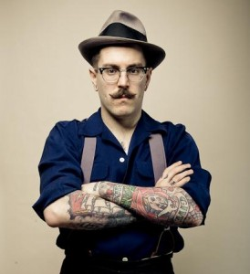](../assets/img/posts/141203_The_First_Annual_Academics_In_Hats_Awards_12.jpg)

**Best Photography**

The award for Best Photography goes to [Camilla Ulleland Hoel](https://twitter.com/Camilla_hoel), a Norweigan academic into Victorian/20th-21st c. literature. Her beautiful photo evokes the very essence of academia - head in a book, tweed waistcoat, and a glass of what we can only assume is whisky. An all round beautiful photo.

[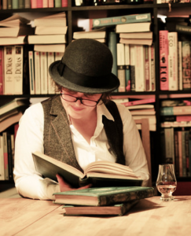](../assets/img/posts/141203_The_First_Annual_Academics_In_Hats_Awards_11.png)

**Best Couple**

We simply could not choose only one winner for the couples category, so we decided to jointly award the two following pairs for their sterling efforts.

, PhD student in cancer biology and self-professed lover of science and tea, and [Jon Tennant](blogs.egu.eu/palaeoblog/), PhD student in palaeontology.](../assets/img/posts/141203_The_First_Annual_Academics_In_Hats_Awards_07.jpg)

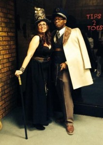

**Most Hats**

The prestigious award for Most Hats goes to Jason Davies, an interdisciplinary academic at University College London. Jason's specialities evidently include wearing multiple hats, as he manages an astounding 7 in this photo. Extra points for the Christmas cheer!

[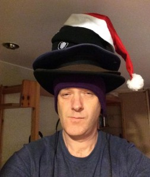](../assets/img/posts/141203_The_First_Annual_Academics_In_Hats_Awards_14.jpg)

**Most Hats - Runner Up**

Dieter Hochuli, an ecologist at Sydney University, deserves a special mention in the Most Hats category. Although our expert hat counters only spotted 6 hats, Dieter ingeniously links his hat wearing to his discipline, noting his resemblance to an Australian moth colloquially known as the 'Mad Hatterpillar' for its unusual exoskeleton.

[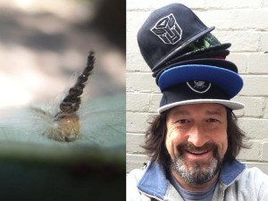](../assets/img/posts/141203_The_First_Annual_Academics_In_Hats_Awards_22.jpg)

**Best Accompanying Facial Expression**

The Best Facial Expression While Wearing a Hat award goes to Northern Bloke [Stephen Etheridge](https://hud.academia.edu/StephenEtheridge). As well as researching brass bands, the working class and the north, he can also pull one hell of a grumpy face!

**Best Photoshop**

By far the best photoshop effort is the result of a cross-channel collaboration between French researcher [François-Xavier Coudert](https://www.chimie-paristech.fr/molsim/staff/Coudert/) (pictured) and Scottish researcher [Graham Shaw](https://twitter.com/McDawg). While the pirate hat is original, the addition of a parrot and the atmospheric B&W are the result of some world-class photo manipulation skills.

[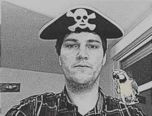](../assets/img/posts/141203_The_First_Annual_Academics_In_Hats_Awards_06.jpg)

**Best Impersonation**

The award for Best Impersonation goes to French researcher Sylvain Deville who, whether he intended to or not, bears more than a passing resemblance to Woody from Toy Story:

[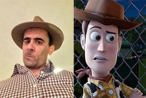](../assets/img/posts/141203_The_First_Annual_Academics_In_Hats_Awards_18.jpg)

**Best Animal Hat**

Sarah V Melton, a PhD candidate at Emory University, fought off some stiff competition to win the Animal Hats category, which proved particular popular. Though it was very difficult to choose a winner, Sarah's entry shone through by continuing the academic tradition of being unhealthily interested in penguins.

[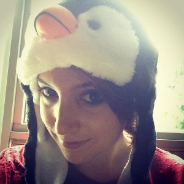](../assets/img/posts/141203_The_First_Annual_Academics_In_Hats_Awards_05.jpg)

**Not a Hat**

Jessica Sage and David Webster came close to wearing hats, but our esteemed panel of judges[2. Really just me.] deemed that, in fact, bike helmets don't really count. As a compromise, they have been jointly awarded the 'Not a Hat' prize.

[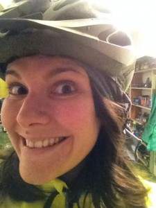](../assets/img/posts/141203_The_First_Annual_Academics_In_Hats_Awards_21.jpg)

[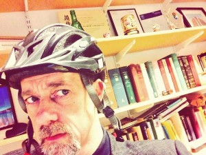](../assets/img/posts/141203_The_First_Annual_Academics_In_Hats_Awards_13.jpg)

**Also Ran**

Last, and perhaps also least, we have the 'also rans'.

Andres Guadamuz tried to pass off this llama as an academic in a hat:

[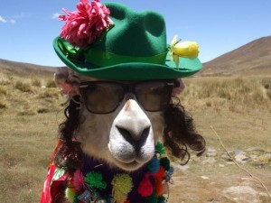](../assets/img/posts/141203_The_First_Annual_Academics_In_Hats_Awards_23.jpg)

Julia Largent didn't have a hat to hand so she photoshopped one into her twitter profile picture:

[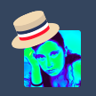](../assets/img/posts/141203_The_First_Annual_Academics_In_Hats_Awards_15.png)

And finally, this kid wore a mortarboard with a giant chicken wing on it to graduation.

[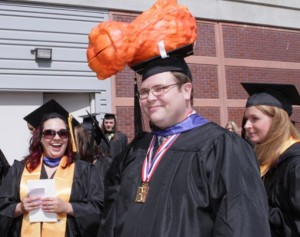](../assets/img/posts/141203_The_First_Annual_Academics_In_Hats_Awards_02.jpg)

Pleas do not despair if you were not awarded a prize this time around. Come back next year with your best hat and have another go. Or, given the unlikelihood of this ever happening again, continue to contribute your photos on twitter to [#AcademicsWithHats](https://twitter.com/hashtag/AcademicsInHats?src=hash), and we'll update his prestigious list as we see fit.

Thanks to all those that took part!