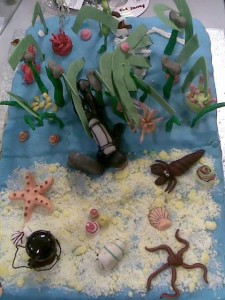

_This is a slightly edited version of a post that originally appeared on the Guardian Higher Education blog._

Whether you like it or not, the festive season is approaching. Soon, we will be eating all sorts of delicious things that are really bad for us, and drinking in quantities that would be considered problematic at any other time of the year. But this week we shall settle for some tasty morsels from academia’s pantry of nonsense.

Christmas may be a time for indulgence, but most PhD students are broke and survive on a diet of junk food. If you find yourself with only half a bag of stale crisps in your office – as I have on many occasions – there is a simple way to turn them into an appealing snack. Play crisp noises while you eat and you can trick your brain into believing that they are fresh, crisp, and delicious. Yum.

Admittedly this requires some effort, and you would be well advised to make the most of the abundant opportunities for free food in academia instead. The Refreshments Will be Provided blog will give you a good overview of what’s on offer.

**Studying soup bowls**

I hope that in the future, office canteens will be equipped with the bowls used in this study, which investigated the effect that eating soup from a self-replenishing bowl has on your appetite.

The bowls quietly refilled themselves over a 20-minute period and researchers measured whether participants ate more.

I plan to patent a network of self-replenishing ramen bowls for PhD offices. Ramen noodles, incidentally, are serious business: this kid was awarded a place in a top US university because they were so impressed with his admissions essay on the subject.

**Medical literature: food-related incidents**

Now for the disgusting bit. As you might imagine, medical literature is rife with accounts of unusual food-related incidents. Perhaps the worst I’ve seen is the case of a Korean woman who experienced a tingling sensation in her mouth after eating squid. Imagine her horror when she was told that this was caused by “parasite-like sperm bags” that had attached themselves to the inside of her cheeks. Lovely.

And remember when your parents told you not to play with your food? There was good reason for this. One report documents the case of a man with “lipoid pneumonia”, caused by injecting olive oil into places he shouldn’t have, while another demonstrates that even a salami can be dangerous in the wrong hands. “Rectal salami” may be the most evocative paper title ever.

Should you find yourself in the midst of a life-threatening nosebleed at Christmas dinner, however, do feel free to unwrap your pigs from their blankets and fashion a “nasal tampon” to stem the bleeding.

Particularly odd is the rich literature on the swallowing of whole live fish. You’d think we’d have figured out the difference between live fish and dead fish (also known as seafood) by now, yet I found at least four reports of this error. One is entitled _Return of the Killer Fish_, and I can’t help but think that this is more a case of stupid human than killer fish.

To finish up on the subject of food, I bring you two of my favourite happy coincidences. The first is a study on the chemical composition of the flavour of popcorn. The lead author is one Mr Ron Buttery. The second is a paper on the fungi used in cheese making, written by none other than Mr Kevin Cheeseman. You couldn’t make this stuff up.

**Best PhD-themed cake I’ve seen this week**

[This cake](https://witness.theguardian.com/assignment/542542cce4b0d4b1d5b66fee/1186359), made for a marine biology and ecology student, shows all of the organisms she discovered while snorkelling and collecting samples during her PhD.

