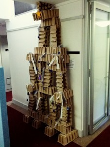

*This post originally appeared on my Guardian Higher Education blog.*

Merry Christmas (REF is over). Hopefully you can breathe a sigh of relief and ease into a nice relaxing Christmas break. Or, if like me you have a long list of papers to finish, I hope this post will at least bring you a little bit of holiday cheer.

One of my favourite ways to get into the holiday mood is to bake something Christmassy; there is nothing quite like the smell of nutmeg, cinnamon and cloves filling your house. As well as reminding you of Christmases past, it turns out that these spices produce chemicals similar to amphetamines when baked, potentially acting as a natural mood enhancer.

Once you are high on Lebkuchen, you are ready to put your feet up and sink into some Christmas-themed research. Highlights include *[Will climate change kill Santa Claus?](https://www.academia.edu/1170607/Will_climate_change_kill_Santa_Claus_The_potential_impacts_of_climate_change_on_place_competition)*, on the potential decline of Santa-themed tourism, and a rigorous analysis of 344 letters to Santa. Though kids ask for an average of seven gifts per letter, the jury is still out on whether or not gift giving is ultimately welfare enhancing.

While kids may love his gift-giving powers, this study shows that they are pretty ambivalent about actually meeting Santa in person. The facial expressions of children queuing to see Santa in a shopping centre were compared with a scale used to measure pain in medical settings. Of 300 children assessed, 247 were deemed “indifferent” to the prospect of meeting the mythical bearded man, while 47 were “hesitant”. By contrast, most of the accompanying adults wore “exhilarated” expressions, perhaps as a result of overenthusiastic attempts to get the kids to give a damn.

The author of the study suggests that Santa “may not be an important hero figure and might even be considered a stranger” to the children. However a survey conducted in Denmark counters that people perceive Santa as being as trustworthy as a doctor, and more friendly, despite his nonexistence.

The Canadian Medical Association, concerned about occupational health risks, has published a doctor’s referral for Mr Claus. Potential ailments include obesity and hypertension, respiratory problems caused by repeated exposure to ash in chimneys, and obsessive-compulsive disorder (he’s always making lists and checking them twice).

Rudolph may also have some health problems. I always assumed that his red nose was the result of a severe cold, however one academic argues that Rudolph is in fact suffering from a parasitic infection of his respiratory system.

Speaking of Rudolph, the chemists may be interested to learn of two chemicals, rudolphomycin and rednose. The paper detailing these chemicals was submitted to the journal on December 21st (1978). While the journal allowed the silly name to stand, the chemist was rebuked by his boss for not taking his job seriously enough.

An excellent contribution to the Christmas literature came this year from Laura Birg and Anna Goeddeke. Their comprehensive review of Christmas economics highlights some interesting trends: the US stock market surges in the pre-holiday period, though this effect is decreasing over time (in New Zealand the effect is increasing); alcohol consumption and related accidents and deaths spike during the holidays, though suicides decrease; and the number of people dying of cardiovascular diseases increases markedly, though the exact reasons for this are unclear.

Women do most of the Christmas shopping, men are happier, and more kids are conceived – no causal link has been established between these three observations.
## The week on Twitter
The academic Twittersphere has been particularly full of Christmas cheer this week. The hashtag #XmasSongPapers is being used to reframe famous Christmas song titles as academic papers:

> MacGowan & MacColl (1987) 'Alcohol in domestic disputes: an ethnography of Irish migrants in New York' MT [@sadieboniface](https://twitter.com/sadieboniface) [#XmasSongPapers](https://twitter.com/hashtag/XmasSongPapers?src=hash)

— Academia Obscura (@AcademiaObscura) [December 16, 2014](https://twitter.com/AcademiaObscura/status/544945139563909120)

> [#XmasSongPapers](https://twitter.com/hashtag/XmasSongPapers?src=hash) 'While Shepherds Watched Their Flocks By Night' : Investigating Sleep Depravation in Agricultural Workers. [@AcademiaObscura](https://twitter.com/AcademiaObscura)

— Stephen Etheridge (@Gtrombone) [December 18, 2014](https://twitter.com/Gtrombone/status/545629064682541056)

> 
Geldof et al (1984) Awareness of Christian celebrations in the context of food shortages on the African continent [#XmasSongPapers](https://twitter.com/hashtag/XmasSongPapers?src=hash)

— John Canning (@johngcanning) [December 16, 2014](https://twitter.com/johngcanning/status/544978206952943616)

Meanwhile, a handful of creative academics have been converting their left over draft manuscripts into office decorations:

> My first [#draftflakes](https://twitter.com/hashtag/draftflakes?src=hash) for [@ICP_MCrusafont](https://twitter.com/ICP_MCrusafont) Xmas party :) [@AcademiaObscura](https://twitter.com/AcademiaObscura) [@curatorpolly](https://twitter.com/CuratorPolly) [#academicXmas](https://twitter.com/hashtag/academicXmas?src=hash) pic.twitter.com/5CIfWYC8nS

— Hanneke Meijer (@DrHanneke) [December 9, 2014](https://twitter.com/DrHanneke/status/542293855547453440)

> 
[@AcademiaObscura](https://twitter.com/AcademiaObscura) Library [#draftflakes](https://twitter.com/hashtag/draftflakes?src=hash) tree version pic.twitter.com/6jKinznn21

— Katie T (@bookslinger) [December 15, 2014](https://twitter.com/bookslinger/status/544633346618585088)

Finally, while I was doing my PhD, we created this beautiful Christmas tree from old boxes left over from an IT delivery:

Have a go at some [#XmasSongPapers](https://twitter.com/search?f=realtime&q=%23XmasSongPapers&src=typd) or [#DraftFlakes](https://twitter.com/hashtag/draftflakes?src=hash), and let me know what your[#AcademicXmas](https://twitter.com/search?f=realtime&q=%23AcademicXmas&src=typd) plans are – [@AcademiaObscura](https://twitter.com/academiaobscura).