The internet is approximately 85% cats. Lots and lots of academics have cats and they have been rushing in their hundreds to proclaim as much with the [#AcademicsWithCats](https://twitter.com/search?f=realtime&q=%23AcademicsWithCats) hashtag. So, we decided to hold the First Annual Academics with Cats Awards. Voting closed yesterday and we shall now wade through the votes, announcing the results on Friday 16 January.

To keep you amused as you await the results with bated breath, we bring you our guide to the academic life, illustrated with cats. Enjoy!

1. Wake up nice and early.

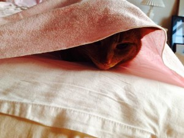

2. Stretch...

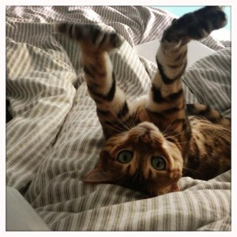

3. Have a wash...

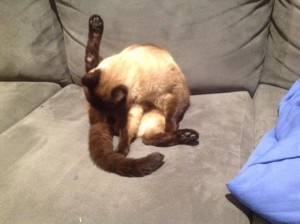

4. Then start the day with a hearty breakfast...

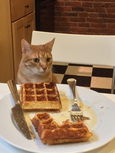

5. ...and grab a cup of tea or coffee.

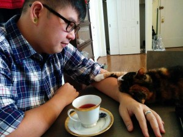

6. Make sure your desk is setup nicely, ready for a morning writing session.

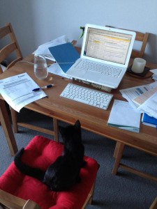

7. Get out the laptop…

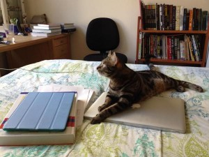

8. …plug it in…

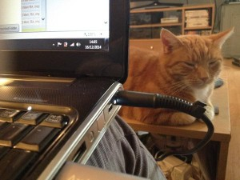

9. …and get writing!

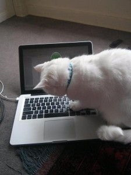

10. Always look at everything from all possible angles!

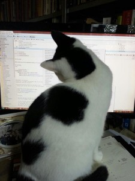

11. Then some reading - don’t forget your library card!

[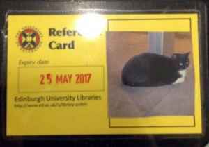](../assets/img/posts/150110_A_Day_in_the_Life_of_an_Academic_with_cats_30.jpg)

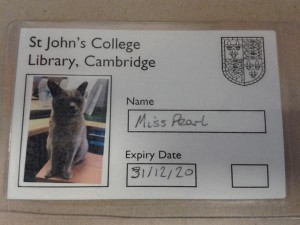

12. Take out a pile of books

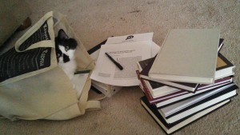

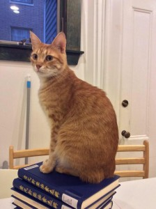

13. Get reading.

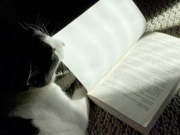

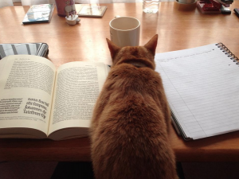

14. Maybe an article or two

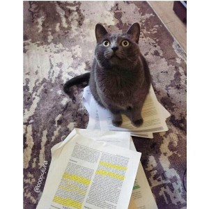

15. Make sure you take good notes!

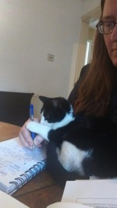

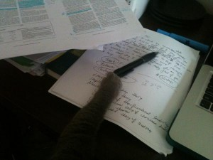

16. Feeling tired?

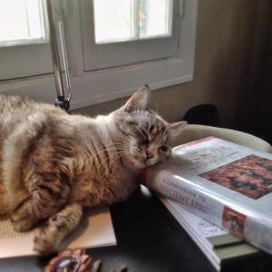

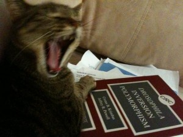

17. Take a nap…ZZzzz...

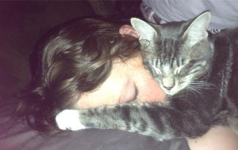

18. ...and awake full of energy for the afternoon!

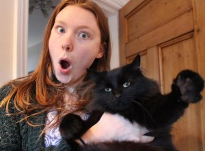

19. Catch up on your online lectures

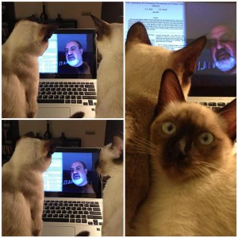

20. Get on top of your admin.

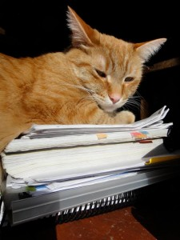

21. Organise yourself.

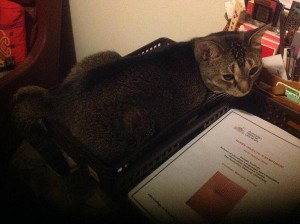

22. Conference call.

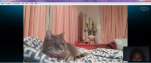

23. Do some marking.

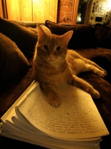

24. Tidy up your office.

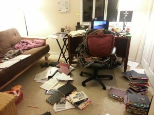

25. Be sure to unwind. Play some music…

26. …hang out with friends…

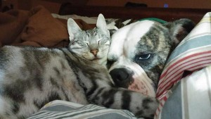

27. …then sleep. You've earned it!

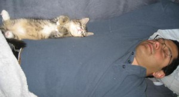

Prefer hats to cats? Click here!
