[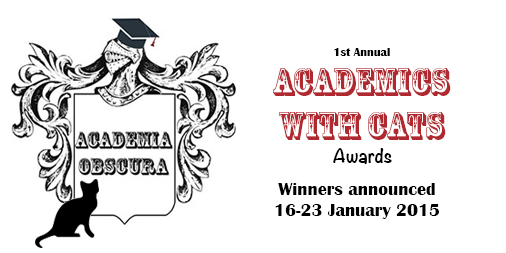](../assets/img/posts/150115_Academics_with_Cats_Awards_the_results_are_in_14.png)

Over 1000 people voted in the **First Annual Academics with Cats Awards** and the results are in!

We will be announcing the winners and runners up from **Friday 16 January 2015** - one category will be announced daily, culminating in the grand finale, Cats and their Academics on **Friday 23 January 2015**.

In case you have already forgotten their furry little faces, you can [see all the nominees here](https://storify.com/AcademiaObscura/academicwithcats-awards-shortlist).

Winners will be announced as follows:

	- Friday 16 January: **Cats with Computers**
	- Saturday 17 January: **Cats with Books**
	- Sunday 18 January: **Cats with Papers**
	- Monday 19 January: **Unhelpful Office Buddies**
	- Tuesday 20 January: **Special Mentions**
	- Wednesday 21 January: **Scholarly Cats**
	- Thursday 22 January: **Best Photography**
	- Friday 23 January: **Cats and Their Academics**

The winners will be announced first via [Twitter](https://twitter.com/AcademiaObscura), then posted below.

[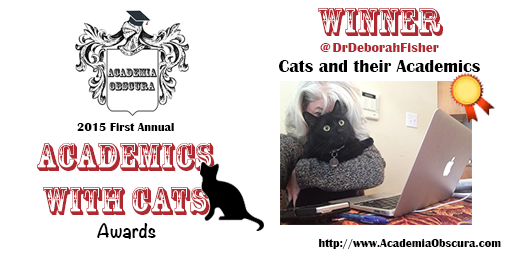](../assets/img/posts/150115_Academics_with_Cats_Awards_the_results_are_in_06.png)[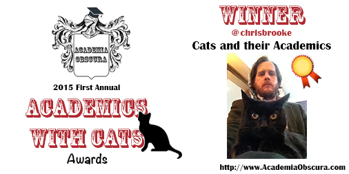](../assets/img/posts/150115_Academics_with_Cats_Awards_the_results_are_in_11.png) [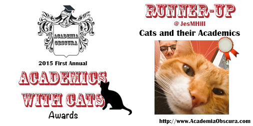](../assets/img/posts/150115_Academics_with_Cats_Awards_the_results_are_in_08.png)[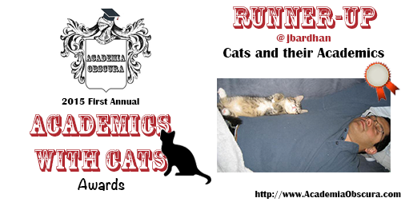](../assets/img/posts/150115_Academics_with_Cats_Awards_the_results_are_in_01.png)

[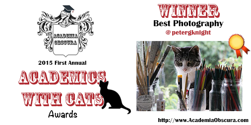](../assets/img/posts/150115_Academics_with_Cats_Awards_the_results_are_in_03.png)

[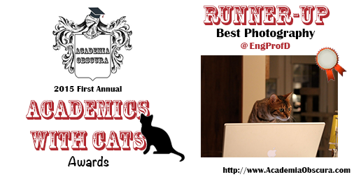](../assets/img/posts/150115_Academics_with_Cats_Awards_the_results_are_in_15.png)

[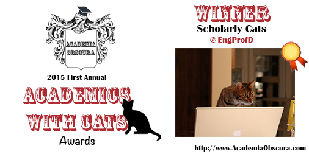](../assets/img/posts/150115_Academics_with_Cats_Awards_the_results_are_in_02.png)

[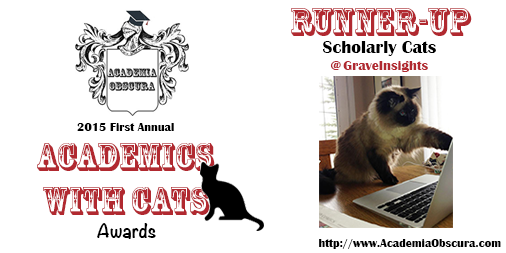](../assets/img/posts/150115_Academics_with_Cats_Awards_the_results_are_in_09.png)
[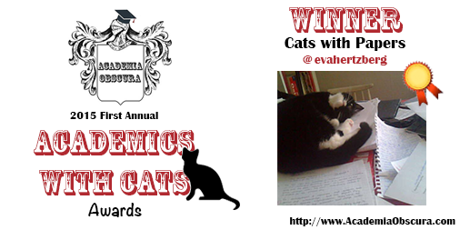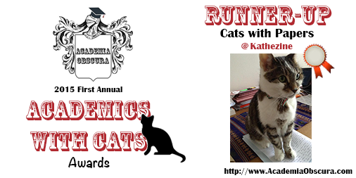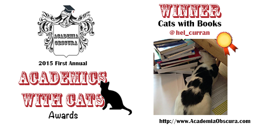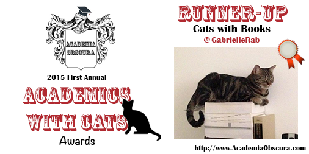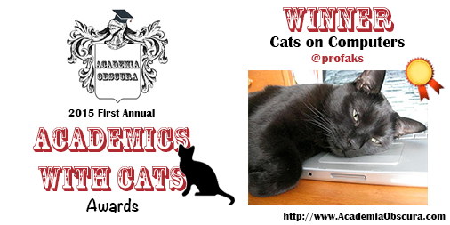](../assets/img/posts/150115_Academics_with_Cats_Awards_the_results_are_in_13.png)

[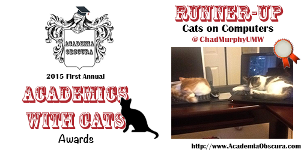](../assets/img/posts/150115_Academics_with_Cats_Awards_the_results_are_in_10.png)