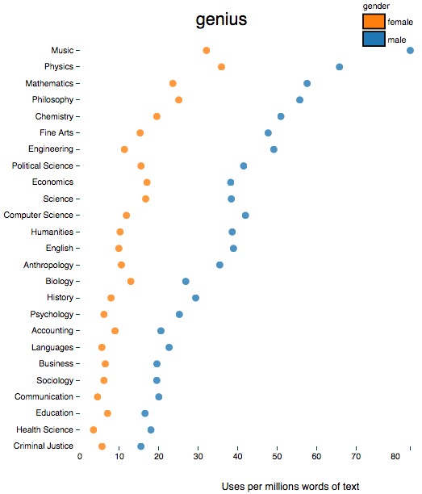
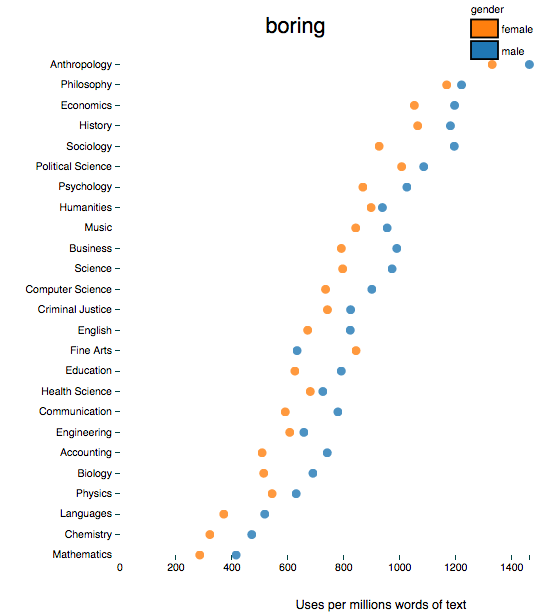
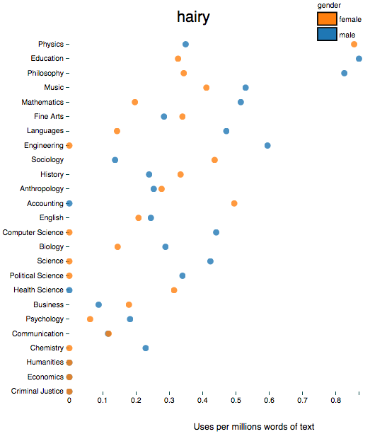
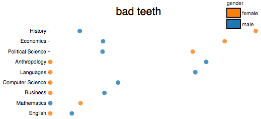
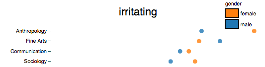
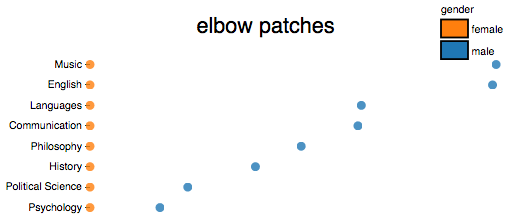
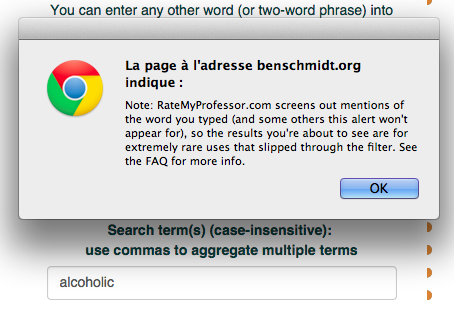

I love data visualisation, and every now and then a gem comes along that blows my mind. Last week I came across Ben Schmidt’s tool for analysing gendered language in teaching evaluations. The tool allows you to plug in any word (or two-word phrase) and see how much that phrase is used in 14 million RateMyProfessor.com reviews. You can see usage is split across gender and discipline. While intended to show gender differences, it turns out the tool is excellent for revealing all sorts of weird and wonderful trends.

**1. There are predictable and problematic gender differences.
**The words ‘smart’ and ‘intellect’ are more likely to be used to review male professors, and ‘genius’ is more likely to describe a male professor in every single discipline for. By contrast, words such as 'awful', 'terrible', and 'incompetent' are used much more in relation to females. More on this [here](https://www.insidehighered.com/news/2015/02/09/new-analysis-rate-my-professors-finds-patterns-words-used-describe-men-and-women).

**2. There are also some less predictable gender differences
**Female professors are more likely to be called ‘mad’ and ‘crazy’, while the males are more likely to be ‘strange’. Males are simultaneously more likely to be reviewed as ‘funny’ and ‘boring’.

**3. All professors can be 'dumb' and 'stupid'
**These two words remain satisfyingly gender neutral (with the exception of in engineering).

**4. Men are idiots
**By contrast, the word 'idiot' seems to be reserved for males.

**5. Hair grows in unusual places
**A search for ‘hairy’ ranks physics top of the class, due to an unexplained preponderance of hairy females. The hairiest men are overwhelmingly in education and philosophy.

**6. ****Some disciplines have poor dental hygiene
**A search for 'bad teeth' reveals that male anthropologists and female historians and apparently have problems going to the dentist.

**7. Anthropology professors are irritating
**As are those in Fine Arts and, ironically, communication.

**8. Criminal Justice professors are awesome
**As are psychology professors.

**9. Music teachers have no dress sense
**I personally love elbow patches and tweed, but if you subscribe to the view that they are outmoded attire for the modern academic, you best steer clear of music.

**10. You aren't allowed to claim that your prof is an alcoholic
**Yet I couldn't find any other prohibited phrases. Believe me, I tried all the taboos I could think of.

**11. Weird stuff goes on in classrooms.
**Even the most unlikely words will have been used in a review somewhere. 'Tea bag', 'sand castle', and 'baby food' all appear, for some reason. Find some solace in the fact that neither ‘naked twister’ or ‘strip poker’ appear in any.