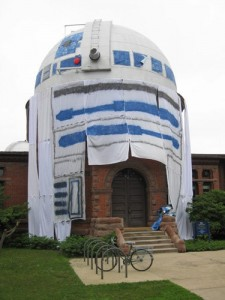
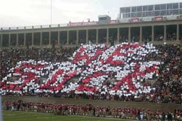
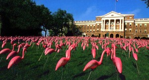

**1) Spruced up statues**

Many university campuses have statues of mascots or key figures from the institution’s history – and dressing them up has become a longstanding tradition the world over. One dramatic failed attempt to dress up a campus statue is particularly worth highlighting. In 1958, a group of students at the University of California, Los Angeles, thought it would be a good idea to coat the Tommy Trojan statue on rival University of Southern California campus in manure. Incredibly, the students rented a helicopter to dump their cargo, but the manure got sucked up into the helicopter’s rotor blades, spraying the students with a taste of their own medicine. Poor Tommy has been the subject of so many pranks (including having his sword repositioned in a rather uncomfortable manner) that the school has installed a live webcam to deter further assaults on his integrity.

**2) Remodeled campus buildings**

Not content with desecrating statues, a few enterprising students at Carleton College remodelled a whole building, transforming the [university’s observatory into a huge replica of R2D2](https://apps.carleton.edu/campus/observatory/news/r2d2/). The swivelling of the telescope makes it the perfect medium, and the likeness even comes complete with all the robotic beeps of the original. Check out the YouTube video.

**3) Cars hoisted onto university buildings**

All the way back in 1958, Peter Davey of Cambridge University started the trend of sticking a car on the roof of a campus building. The Austin Seven he chose made the 70ft climb to the top of the Senate House after months of planning, reams of calculations, and help from students who volunteered to surreptitiously erect scaffolding. It took a week to get the car down afterwards. In 1994 some MIT students followed suit, this time hoisting a (fake) campus security car atop Building 10 and issuing it with a parking ticket.

**4) Angered football fans**

This one really only works in the US, where college football games attract thousands of spectators. The 1961 Rosebowl was watched by 100,000 and millions more who tuned in on TV. All were shocked when fans held up cards which, taken together, read “CALTECH”. Tiny Caltech is not known for its sporting prowess, and were not on the pitch. Apparently, some crafty Caltech students had managed to fool a cheerleader that they were journalists, break into the cheerleaders’ hotel rooms, and switch the cards and instructions.

No doubt inspired by this stunt, in 2004 two Yale seniors and 20 of their friends dressed as the fictional “Harvard Pep Squad”, walked into Harvard’s football stadium and convinced almost 2,000 unsuspecting fans to [unwittingly spell out the words “WE SUCK”](https://www.youtube.com/watch?v=T4kai4FL0MQ).

**5) Fake students**

One of the earliest university pranksters was Georgia tech student William Edgar Smith. He received an extra enrolment form when he signed up for his studies in 1927 and filled one out for the imaginary George P Burdell. Smith completed coursework for his fictitious friend, earning him a very real degree. Burdell has since become the stuff of university legend, earning a number of additional degrees and being admitted as a member to many clubs. Barrack Obama even got in on the joke, saying that George was meant to introduce him but that he was nowhere to be found.

Fake students need not even be human, and matriculated animals have frequently been used to call out equally fraudulent institutions. There is a "[List of Animals with Fraudulent Diplomas](https://en.wikipedia.org/wiki/List_of_animals_with_fraudulent_diplomas)" maintained on Wikipedia.

**6) Silly school traditions**

In the town of Göttingen in Germany, recently minted doctoral graduates rush off to kiss a statue of Lizzy, aka “Goose Girl” (Gänseliesel) at a fountain in front of the mediaeval town hall. In Wisconsin, students have been placing plastic pink flamingos on the main lawn at graduation since 1978.

Does your university have a history of foolish pranks? Have you hung a giant bra from a balcony or stolen a priceless George III cannon and welded a brass rat to it? Share your story @AcademiaObscura.

*This post originally appeared on the Guardian Higher Education Network.*