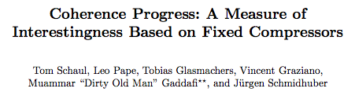
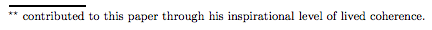
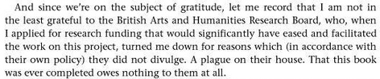

You’d expect the likes of Google to be hiding Easter Eggs) in their pages, originating as they do in old school video games (just search ‘[do a barrel roll](https://www.google.com/search?q=do+a+barrel+roll)’), but you might not think the practice would catch on in the stuffy ranks of academia. Though not exactly widespread, academics have been known to amuse themselves by discreetly burying little jokes in their journal papers.

The most obvious are the cringeworthy paper titles we’re all familiar with: plays on words, remixed film titles, awful Dad jokes. There is even a study examining whether such titles affect citation numbers. I particularly approve of the five Swedish scientists that have been sneaking Bob Dylan lyrics into paper titles for the past 15 years, having made a bet to see who can reference Bobby D the most before retirement. This is how a paper on intestinal gasses got the title*, ‘Nitric oxide and inflammation: The answer is blowing in the wind’*.

By far the most fertile ground for academic Easter Eggs is on the first page of journal articles, hidden in plain sight in author lists and acknowledgements. ‘Muammar “Dirty Old Man” Gaddafi’ has contributed to a paper through his “inspirational level of lived coherence”, while Italian pornstar Rocco Siffredi provides “constant support” for research on cystic fibrosis (he’s all heart). Some researchers get divine inspiration from famed cargo cult deity John Frum, while others credit the heavy metal band Slayer for their academic output.

 

Sometimes certain language skills are required to decipher the jokes. Italian speakers noticing _Stronzo Bestiale_ on a paper would likely raise an eyebrow (it means “total asshole”), while speakers of Catalan would realize that _Visca el Barça_ is a football chant, not an author. When one journal decided to provide for transliteration of author names, they probably didn’t expect that [韦小宝](../assets/img/posts/150404_Academic_Easter_Eggs_05.jpg) would be writing for them: he is a well-known character in Chinese stories, being a prodigal son of a prostitute and a demi-Emperor with 8 wives.

Then there’s cats. If [#AcademicsWithCats](https://twitter.com/hashtag/academicswithcats) has taught us anything, it is that academics, like everyone else on the internet, have a bewildering love of cats. It is no surprise then to find that one academic cat, F.D.C. Willard, is the sole author of a paper on high temperature physics. Written in French, no less. Elsewhere in the animal kingdom, Nobel Prize winner Andre Geim co-authored a paper with his hamster, and Galadriel Mirkwood, immunobiology expert, is actually a dog.

Perhaps it should be graduate students that carry the torch in this emerging field, given that they are not (yet) concerned with tenure and the like. The sadly defunct website _PhD Challenge_ aimed to capitalize on this by encouraging students to slip a silly phrase into a published paper. The insertion of “I smoke crackrocks” into a paper whose methodology involved receiving phone calls from all-comers in the wee small hours of the morning seems a bit like cheating, but I like the idea nonetheless. One step down from grad students and the possibilities are endless – one of my favorites is [an essay](https://twitter.com/AcademiaObscura/status/566258891823251456), which deftly weaves the infamous lyrics of Rick Astley’s *Never Gonna Give You Up *into its first page (an internet phenomenon known as ‘Rickrolling’, for the uninitiated).

I personally love this small injection of humor into the dusty barrenness of academic literature, but you’d be well advised to proceed with caution. Polly Matzinger's tenure committee saw the funny side of including a dog as an author, noting that the dog had likely contributed more than many other so-called co-authors. But naming cancer-causing genes after Sonic the Hedgehog, publicly calling out a reviewer for their “useless and very mean comments”, or wishing a plague on the house of a research body that refused to fund your research may not be such a good idea.

If you are going to slip in an Easter Egg or two, it is probably best to hide it well or make sure it is understood by only a select few (experts on Chinese literature or fans of heavy metal, for example). Happy Easter!

_Seen an academic Easter Egg? Tweet me **@AcademiaObscura**._
