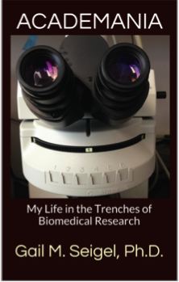
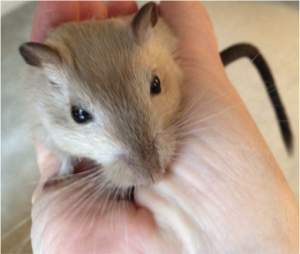
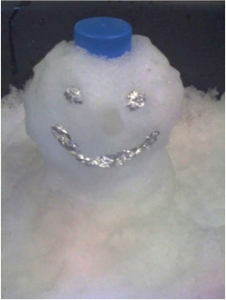

*This week we have a guest post from Dr. Gail M. Seigel. I recently bought Gail’s book, ‘Academania: My Life in the Trenches of Biomedical Research’, which recounts some of her experiences from her 25+ year research career. You can buy it here. Gail’s book happens to have an entire chapter about having fun in the lab, so I asked her to do a guest post and start a conversation about having fun in the lab! Follow Gail on Twitter @eyedoc333.*

I am thrilled to be an invited guest blogger this week for Academia Obscura. As a matter of professional introduction, I am a retinal cell biologist at SUNY Buffalo with 25+ years experience in biomedical research. I am a firm believer in working hard, but having as much fun as possible while doing so. With all of the bad news these days of funding cuts, low wages and poor job security, we all need to lighten up sometimes and have a good laugh.

When Academia Obscura asked for photos of “Academics with Cats” on Twitter, I was the one who posted a photo of “Academics with Gerbils” just to be contrary. That’s how I roll.

Here is an excerpt from the book, from the chapter entitled “Lab Hijinks”:

> *Sometimes we scientists need a break from the serious work of the lab, especially during the challenges of graduate school. The long hours and delayed gratification of long-term experiments can inspire us to do silly things to break up the tedium and I am no exception.*

*It was April Fools’ Day and there were two large goldfish swimming in our lab’s 10-liter buffer dialysis tank. My thesis advisor had once joked that although the dialysis tank was empty at the time, one day there would be fish swimming in it. I made sure that his prediction would come true. Not to worry, though. Once the prank was over, I brought the goldfish home as pets and named them Src and Myc, two oncogenes that I was studying at the time. Src and Myc went on to live happy goldfish lives and the dialysis tank was used for experiments once again.*

*Many people wonder what it’s like to work in a lab on a day-to-day basis. Sometimes, it can be very serious. At other times, it can resemble a comedy sketch. Imagine bright yellow masking tape with the word “radioactive” in red lettering. It is normally used as a warning label for experiments that involve radiation. But if the tape is cut in half, the word “radio” becomes evident, ready to stick on the portable stereo system used for background music in the lab.*

I think being able to laugh at ourselves can help get us through some of the darkest times. My happiest memories of graduate school are not of the exams, but of the lightheartedness and human-ness of the people around me. I may have forgotten fermentation pathways, but I’ll always remember the bacterial plate streaked in the pattern of a good-natured farewell: “GO AWAY, LARRY” and presented to a fellow student upon graduation. I’ve also forgotten the Krebs cycle but I still remember a lab’s proud display of plasticware that had been accidentally melted into contorted modern sculptures by the intense heat of the autoclave cycle.

The funniest things can happen without even a conscious effort on anyone’s part. I’m still amused by the thought of proof-reading a student’s thesis before the age of auto-correct and finding the phrase “picnic acid” instead of “picric acid”. Another time, while scheduling a meeting with a visiting scientist named Dr. Fu, I had to spell the scientist’s name on the phone. I became red-faced and apologetic as I told the caller, “F-U”. It doesn’t take much to find humor in the nooks and crannies of every day life, academic or otherwise.

I will leave you with a visual prank. This one is a snowman made from lab ice, a conical tube and aluminum foil. When a co-worker dumped ice into the lab sink and declared, “Someone should make a snowman out of this!” How could I not?

You must have your own stories of academic tomfoolery, pranks and silliness: we would love to read all about them! Tweet using the hashtag #LabLaughs and share your stories. And remember: Have fun, but be safe!

*If you want more about lab hijinks, as well as stories of plagiarism, sabotage and academic mayhem, check out Gail’s book, ‘Academania: My Life in the Trenches of Biomedical Research'.*