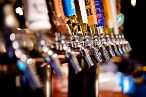

_I love beer. So does Elena Milani ([@biomug](https://twitter.com/biomug)). When the Italian Neuroscientist and SciComm expert realised that no hashtag yet existed for academic beer-lovers, she set about creating one. This is her call to arms! _

The Internet and social media are plenty of cute fluffy cats, because kittens sell, especially among academics. Everybody knows that!

But what about beer? I love craft beer (and kittens, of course), and in Twitter I've found many hashtags on beers such as #beer #craftbeer #beerbods #beertography #breweries #beerselfie and so on.

However, there isn't a hashtag for academics who love beer, as me, and I was curious if beer could help me to engage others scholars in Twitter. So, I started "an experiment" launching #academicswithbeer with the help of Cristina Rigutto.

> .[@cristinarigutto](https://twitter.com/cristinarigutto) and I are pleased to announce a new academic hashtag: [#academicswithbeer](https://twitter.com/hashtag/academicswithbeer?src=hash) pic.twitter.com/irGXv2IeF3

— Elena Milani (@biomug) [June 23, 2015](https://twitter.com/biomug/status/613423456944844800)

A lot of people replied, retweeted and favorited this tweet! And you are invited to join the conversation too!

You can tweet:

    - Quotes
    - Selfies
    - Sketches
    - Sketchnotes or mind maps
    - Other pics or texts

But you must include beer in your pic/text/tweet!

Now, join the #academicswithbeer stream ;)

_This post originally appeared at Elena's blog, SciCommLab._
