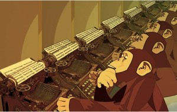

*Jan Klimas is a scientist, artist, thinker and writer who's interested in communicating with the public and using art to blend boundaries between the two disciplines. Check out his blog, and follow him on twitter [@janklimas](https://twitter.com/janklimas).*

> In dance, I call it Survival of the Bitterest. The choreographers who stick around are often the ones most comfortable feeling bitter and resentful. My artistic mentors were brilliant artists. But I do not want to live the lives they led.

Andrew Simonet

What do dance and science have in common? What makes a successful choreographer or scientist? In this post, I speculate about the bitterness of the academic dance for survival. The academic competition is cruel and uneven. The fittest may not survive, but the bitterest thrive.

Before we dive deep into the murky academic waters, let’s define our objectives. Is survival worth the fight? Is it really a fight, or just a game? Survival is “a natural process resulting in the evolution of organisms best adapted to the environment” - academics would give anything to be the most evolved and the best adapted.

We strive to get tenure. Other occupations call it a permanent job. Few make it and most have to fulfill harsh criteria to keep their tenure, bringing in a lot of research funding, or taking on a heavy teaching load.

Papers are the currency of our world. The one who has the most is the richest. Because money follows money, the more articles an academic co-authors, the higher her chances of getting more money (i.e., more research grants). Like tokens of appreciation, authorships on papers are gifts that some scientists give to each other as a gesture of appreciation, friendship or a promise of a future token. Agencies give grants to people with most of these tokens. Journal editors publish their friends’ work.

In such a system, the most published may not be the best; instead they are the most popular or they know how to play the system. In such a system, novice scientists’ willingness to park their writing integrity is challenged. Some may find refuge in writing non-academic literature, but for most, the peer-reviewed “romance” pays the mortgage.

Some big research centres are like fiction factories. They pay people to write articles; the purpose of those articles is to bring in more cash. Fiction factories operate like famous brands, where the name of a famous academic becomes a brand instead of signifying who wrote the paper. James Patterson, for example, “heralded as the world’s best paid writer, is the world’s most successful fiction factory,” writes Michelle Demers. Just like Patterson, the chief scientist comes at the end of writing, puts a few finishing touches and their names on the final product.

The road to tenure is paved with the PhD students that an academic supervises. This inflates the need for scientifically-trained workforce whereas the sole purpose of taking on a PhD student is, in many cases, to get the professor closer to the tenure. We don’t need so many PhDs. “PhD ‘overproduction’ is not new and faculty retirements won’t solve it,” writes Melonie Fullick in her speculative diction at University Affairs, “Yet somehow no matter how many PhDs enroll and graduate, academic careers are the goal.”

Overproduction-dependent career progression and dubious writing practices are only two of the many symptoms of a sick system. The best way to navigate such an unhealthy organised science is to bring both passion and dispassion to the task. Build up a dispassionate, bulletproof shield of resilience, unless you are willing to get sick yourself.

Some are born resilient. But for most, it takes years to become hardy. Much like Erickson’s stages of psychosocial development, resilience grows in stages. A crisis happens at each stage of development. A developmental task must be fulfilled for progress into the next stage. The infant learns hope by resolving the trust vs. mistrust crisis. A young adult breaks through the isolation, discovers intimacy and acquires love.

My own anecdotal evidence suggests the following developmental stages of early academic career: i) solitude, ii) despair, iii) good science/bad science, iv) fear and loathing, and v) workaholism. Getting through these stages takes you pretty far on the bitter road, but get ready to be the bitterest if you want to stick around.

**Stages of development**

	- **Solitude**: For the extroverts, this stage is excruciating. As they focus on the work, their social networks suffer. The computer becomes their best friend. Introverts find working alone easier, but it can be hard at the start. The junior scientist embraces loneliness in exchange for better concentration.

	- **Despair**: Some come into academia with genuine prosocial intentions. When they hit the brick wall of loneliness and parked integrity, they collapse. Too much science is done only for the sake of science and for personal interest. Finding the right balance between the need for helping others and promoting oneself moves the young scientist to the next stage.

	- **Good science vs. bad science**: OK, so if I can’t change the world through science, let’s just do it right so that the bad guys don’t win. Unlike fairy tales, the good scientists don’t always win. Bad science informs policy. Bad science receives funding. The fight for good science is endless. New researchers must decide which side of the battle they join.

	- **Fear and loathing**: power and control, greed and envy are common in academia. Fear is a natural reaction of junior scientists towards the loathsome deeds of some senior scientists. Scientists are humans too. They err. Some err too much and don’t acknowledge their mistakes. It is up to the junior scientists then to stay or to leave the kitchen if they can’t stand the heat. Learning to detach resolves this developmental conflict.

	- **Workaholism**: The balance is not static. It changes all the time. Latch on to the dynamic, forget about the static. The early-career scholar’s task is to make a healthy lifestyle their number one work tool.

The path to academic success is rough and bitter. Bitterness is the key to survival, but happiness lies in enjoying the journey, rather than focusing on the bitter end.