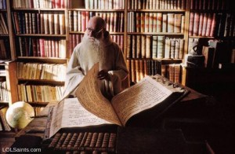

_By Alice Violett. Alice is doing a PhD at the University of Essex on the public perceptions and personal experiences of only children in Britain between 1850 and 1950, and blogs at Alice in Academia. Alice likes reading, music, and cats.  You can follow Alice on Twitter [@pokesqueak](https://twitter.com/pokesqueak)._

My PhD, which is partly about the experiences of only children between 1850 and 1950, has lead to me reading many, many autobiographies. Many are pretty dull (male politicians who skimmed over their childhood years, I’m looking at you!), while others were quite interesting, keeping me reading long after the useful information had been extracted.

Now and again I would come across a funny or odd anecdote that served no useful purpose for my thesis but seemed worth saving. So I did. Upon reflection, I realise I’ve essentially collected an allegory for the academic experience.

**1. When the book you *need *to read is unnecessarily dense**

Gay rights campaigner Antony Wright’s uncle, aunt and cousins moved to South Africa in 1933, prompting a wave of creative writing:

> _I wrote several stories about my cousins’ adventures in the African bush ... One vivid phrase I remember (because it caused the grown-ups so much amusement) described how, hearing a loud noise, Bobbie turned and ‘beheld a lion clearing its throat’. Fiction has never been my strong point, and I suspect such purple prose might make even a Barbara Cartland blush. [1. A E G Wright (Antony Grey), Personal Tapestry, (London, 2008), p. 13.]_

**2. When you’ll do anything to get a research assistant**

As a child, artist W. Graham Robertson happened upon a spellbook with instructions on ‘how to raise a Fairy’:

> _“Take the blood of a white hen.” – How could I take the blood of any hen, let alone that the hen would be my uncle’s, and I felt sure he would not care for its blood to be taken? Would the Fairy object to the hen’s being cooked, as, if not, I could save some gravy from dinner?_

_I gave up on my study of Conjuration, which in most cases seemed to require a little private abattoir of one’s own, for want of proper professional guidance...[2. W. Graham Robertson, Time Was, (London, 1931), p. 20.]_

](../assets/img/posts/150722_7_Academic_Struggles_Predicted_by_Late_19th_and_Ea_06.png)

**3. When reviewer three questions your knowledge of your own work**

Fuller-Maitland liked to play with the boys next door:

> _One day, as we were all playing in their garden, my nurse hung her head out of a side-window and shouted, “Master John, jest you come in, and don’t let them little Nickles teach you any more bad words!” ... To me personally it was galling to be considered as the humble learner in the branch of study indicated. [4. J. A. Fuller-Maitland, A Door-Keeper of Music,_ (London, 1929), pp. 16-17.]

**4. When colleagues competitively compare workloads**

Music critic John Fuller-Maitland’s aunts moved to Brighton for their health:

> _One was heard to say, “I hear that Anne calls herself the queen of invalids; and everybody in Brighton knows that I am the queen of invalids”. [3. J. A. Fuller-Maitland, A Door-keeper of Music_, (London, 1929), p. 8.]

!Your colleague's conference is here. Probably one of [these.](../assets/img/posts/150722_7_Academic_Struggles_Predicted_by_Late_19th_and_Ea_02.jpg)

**5. When your colleagues conferences are in more exotic climes than yours**

Sociologist and historian Alan Fox, as an impartial outsider, was often called upon to judge which of his better-off friends had it best:

> *Which did I think was better; ten days on the Belgian coast or three weeks at Dovercourt?[5. *Alan Fox, _A Very Late Development: An Autobiography_, (Coventry, 1990), p. 20._] _

_NB: Dovercourt was a popular English seaside resort in the 1920s and 1930s, but is much less glamorous these days!_

**6. When the conference food options are puzzling**

Fuller-Maitland’s parents were worried about his health:

> _I had to consume a sponge-cake and a glass of port in the middle of the morning for no special reason that I can recall. I have no doubt that this habit sowed the seeds of gout, from which I suffered a good deal at an unusually early age.[6. J. A. Fuller-Maitland, A Door-Keeper of Music,_ (London, 1929), p. 17.]

**7. When you need to impress an important potential contact**

As a young boy, politician Sir George Leveson Gower was instructed by his uncle how to present a bouquet to the Empress Eugenie at a garden party:

> _When the Empress came the next day, I got confused, made my bow to my uncle, and as I presented my back to her and was dressed in a short white petticoat, the effect was unconventional.[7. Sir George Leveson Gower, Years of Content, 1858-1886_, (London, 1940), p. 2.]

Some of the autobiographies I’ve read hadn’t been borrowed from the library in years, and it seemed like a shame to send them back without noting down some of their less relevant content.

Resurrect an old book from the storeroom today!
