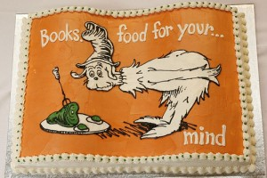
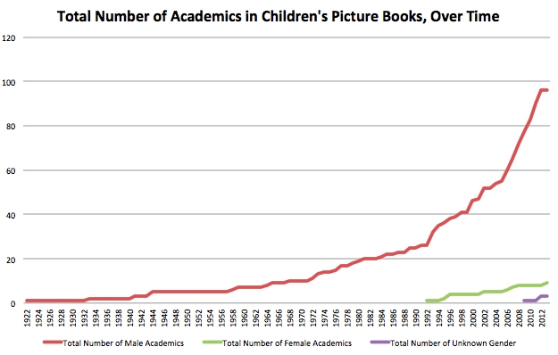
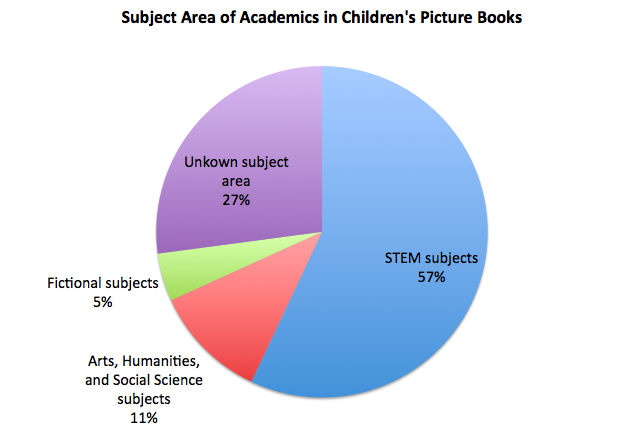
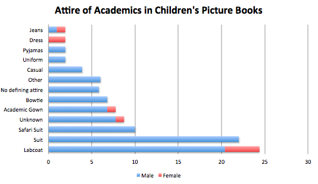

*[*](../assets/img/posts/150724_Male_Mad_and_Muddleheaded_The_portrayal_of_academi_02.jpg)Melissa Terras is Director of the Centre for Digital Humanities and a Professor of Digital Humanities at University College London (UCL). **She is also an expert on the portrayal of academics in kids’ books, having meticulously analysed over 200 titles. **You can check out the project here, and follow Melissa on twitter [@melissaterras](https://twitter.com/melissaterras). **Check out the interview with Melissa here.*

Like many academics, I love books. Like many book-loving parents, I’m keen to share that love with my young children. Two years ago, I chanced upon two different professors in children’s books, in quick succession. Wouldn’t it be a fun project, I thought, to see how academics, and universities, appear in children’s illustrated books? This would function both as an excuse to buy more books (we do live in a golden age of second hand books, cheaply delivered to your front door) and to explain to my kids – now five and a half, and twins of three – what Mummy Actually Does.

It turns out it’s hard to search just for children’s books, and picture books, in library catalogues, but I combed through various electronic library resources, as well as Amazon, eBay, LibraryThing, and Abe, to dig up source material. I began to obsessively search the bookshelves of kids books in friend’s houses, and doctors and dentist and hospital waiting rooms, whilst also keeping on the look out on our regular visits to our local library: often academics appear in books without being named in the title, so don't turn up easily via electronic searches.

Parking my finds on a devoted Tumblr which was shared on social media, friends, family members, and total strangers tweeted, facebooked, and emailed me to suggest additions. People sidled up to me after invited guest lectures to whisper “I have a good professor for you…” Two years on, I’ve no doubt still not found all of the possible candidates, but new finds in my source material are becoming less frequent. 101 books (or individual books from a series*) and 108 academics, and a few specific mentions of university architecture and systems later, its time to look at the results from a survey of the representation of academics and academia in children’s picture books.

**What are academics in children’s books like?**

The 108 academics found consist of 76 Professors, 21 Academic Doctors, 2 Students, 2 Lecturers, 1 Assistant Professor, 1 Child, 1 Astronomer, 1 Geographer, 1 Medical Doctor who undertakes research, 1 researcher, and 1 lab assistant. In general, the Academic Doctors tend to be crazy mad evil egotists (“It’s Dr Frankensteiner – the maddest mad scientist on mercury!”), whilst the Professors tend to be kindly, but baffled, obsessive egg-heads who dont quite function normally.

The academics are mostly (old, white) males. Out of the 108 found, only 9 are female: 90% of the identified academics are male, 8% are female, and 2% have no identifiable gender (there are therefore much fewer women in this cohort than in reality, where it is estimated that one third of senior research posts are occupied by women).  They are also nearly all caucasian: only two of those identified are people of colour: one Professor, and one child who is so smart he is called The Prof: both are male: this is scarily close to the recent statistic that only 0.4% of the UK professoriat are black. 43% of those found in this corpus are are elderly men, 33% are middle aged (comprising of 27% male and 6% female, there are no elderly female professors, as they are all middle age or younger). The women are so lacking that the denoument of one whodunnit/ solve the mystery/ choose your own adventure book for slightly older children is that the professor they have been talking about was actually a woman, and you didn’t see that coming, did you? Ha!

The earliest published academic in a children’s book found was in 1922 (although its probable that the real craze for featuring baffled old men came after the success of Professor Branestawm, which was a major international bestseller, first published in 1933, and not out of print since). The first woman Professor found is the amazing Professor Puffendorf – billed as “the world’s greatest scientist” -,  published in 1992, 70 years after the first male professor appears in a children’s book. 70 years (although it is frustrating that the book really isn’t about her, but what her jealous, male lab assistant gets up to in her lab when she goes off to a conference. More Puffendorf next time, please).

There is also a more recent phenomenon of using a Professor as a framing device to suggest some gravitas to a book’s subject, but the professor themselves does not appear in any way within the text, so its impossible to say if they are male or female.  Male Professors in children’s books have appeared much more frequently over the past ten years: women not so much.

What areas do these fictional academics work in? (There is an entirely different genre of children’s books covering the lives of real academics – but that’s for another obsessive compulsive mini research project). Here we identify the subject areas of the 108 academics:

Most of the identified academics work in science, engineering and technology subjects. 31% work in some area of generic “science”, 10% work in biology, a few in maths, paleontology, geography, and zoology, and lone academics in rocket science, veterinary science, astronomy, computing, medical research and oceanography. There is one prof who is a homeopath, and I wasnt sure whether to put them in STEM or Fiction, so I plumped for STEM as they seemed to be trying to see if homeopathy worked (I like to presume all the academics here have proper qualifications, but who knows if fictional characters can buy professorships online these days). Subjects classed as Fictional were serpentology, dragonology, and magic. Arts, Humanities and Social Science subjects identified are archaeology (6% of the total), and linguistics, psychology, arts and theatre.

27% of those with an academic title make no reference to what type of area they supposed to work in: they are generally just trying to take over the world. Just out of interest, the female academics identify their subject areas as serpentology, maths, paleontology, ecology, and three generic scientists (with two further unknown subjects), so its not as is the women are doing the “soft” subjects in children’s books, when they actually appear.

Not all of these academics featured are humans: 74% are human, 19% are animals, 4% are aliens, 2% are unknown, and 1% are vegetable.  There are no discernible trends regarding animals that are chosen to represent wisdom – its not like they are all owls – with three mice, three dogs, two toads, a kingfisher, a gorilla, a woodpecker, a pig, a crow, an owl, a dumbo octopus, a mole, a bumble bee, a shark, a cockroach, and a wooden bird. If you spot any defining similarities there, let me know.

There are some other fun trends to note. 46% of those humans featured are bald (higher than the average percentage?) – no women are bald. 35% had very big, messy hair, and it seems to be that if you are in academia, you should be a bit disheveled, in general. 45% have white hair – but none of the women have white hair. 13% had ginger hair (higher than the average percentage?). 37% had moustaches, and 16% had beards (higher than the average percentage?) – but no women had facial hair.  What they wore is also interesting:

Labcoats, suits (but not if you are female!) or safari suits (but not if you are female!) are the academic uniform du jour*.

The names given to the academics are telling, with the majority being less than complimentary: Professor Dinglebat, Professor P. Brain, Professor Blabbermouth, Professor Bumblebrain, ProfessorMuddlehead, Professor Hogwash, Professor Bumble, Professor Dumkopf, Professor Nutter, and two different Professor Potts. There is the odd professor with a name that alludes to intelligence: Professor I.Q, Professor Inkling, Professor Wiseman, but those are in the minority.

What types of book are they featured in? 82% of the 101 books are fiction stories, and the theme of the stories tends to be “academic is out of touch with how the world works, with hilarious consequences” in the case of professors, or “is evil and wants to take over the world, but is thwarted by our plucky hero (never heroine)” in the case of doctors. 7% of the books are factual, using a fictional academic to explain how science or experiments work, and 1% are cookbooks.

The remainder, 10%, are a curious genre I have called “tall tales” – where the fictional academic character is brought in to bring gravitas and explain something, but the explanations are either fictional or bordering on fiction. Its a curious blend of science and fiction: they are not traditional stories, but work in a way which subverts the traditional children’s science books, injecting fiction into the process (not very succesfully, in most cases).

What can we draw from this? If you are going to be a fictional human academic in a children’s book, you are most likely to be an elderly, old man, with big white hair, who wears a lab coat, has facial hair, works in science, and is called Professor SomethingDumb or Dr CrazyPants, featuring in a story about how you bumble around causing some type of chaos. Close your eyes and think of a Professor. Is this what you see? Or this?  (One wonders how much well-circulated images of Einstein have perculated into the subconscious of writers and publishers to emerge as the obvious representation of an academic in children’s illustrated books).

**Universities in Children’s Picture Books**

What about the universities themselves? They dont feature as often as the academics associated with them – the focus of children’s books is seldom about such an institution that will have an effect so far in the future of the reader, although some characters plan well ahead in advance. Lectures, when depicted, are obviously very boring and impenetrable. University buildings are like castle schools for grown ups or  the site of secret underground lairs or the best holiday park ever. There are a couple of sweet kids books from the USA that attempt to describe the university campus and rituals of specific actual colleges – Baylor University and Boston College.  But in general, the children’s books revolve around the characters, rather than the fact they are in a university, per se.

**Why is this relevant?**

Obviously, this has been a bit of a fun project. Given the lengths gone to to gather this corpus of children’s books, it is unlikely that any individual child would happen across all of the books noted. It’s actually interesting to think how few children’s picture or illustrated books feature academics or academia (at time of writing, Amazon lists 1.3 million books in its children’s section, and 101* different books (or books series) were identified in this project). While no doubt there are other books out there not on the list, this has been a darn good crack at finding as many as possible, not only in the English Language. Professors and academic Doctors in children’s books are a useful device on occasion, but really are not terribly frequent in the scheme of things.

That said, the difference in gender, and how women and men are represented, and the underepresentation of those who are anything but white in children’s books about academia, is shocking, especially given that almost all scientific fields are still dominated by men, and women are frequently discriminated against and although 46% of all PhD graduates in the EU are female, only 1/3 of senior research posts are occupied by women.

At a time when researchers are asking if available toys can influence later career choice, can the same be said about books? At a time when it is becoming the parents’ job to encourage girls into science and technology – and to educate all children about science and engineering careers – does the lack of anything but white, old men as academics in children’s books reinforce the impossibility of anyone other than those making a contribution? At a time when the leaky pipe of academia shows that women are leaving in droves at every level of the academic ladder, should we be worried that there are no female academics in children’s books above middle age?

Laugh at this analysis if you will, but sociological analysis of other children’s books has shown that

> there is a hidden language or code inscribed in children’s books, which teaches kids to view inequalities within the division of labor as a “natural” fact of life  – that is, as a reflection of the inherent characteristics of the workers themselves.  Young readers learn (without realizing it, of course) that some… are simply better equipped to hold manual or service jobs, while other[s]… ought to be professionals. Once this code is acquired by pre-school children… it becomes exceedingly difficult to unlearn.  As adults, then, we are already predisposed to accept the hierarchical, caste-based system of labor that characterizes the… workplace. [link]

Another analysis of 6000 children’s books published between 1900 and 2000 suggests the gender disparity, and the lack of women characters, sends children a message that “women and girls occupy a less important role in society than men or boys”:

> The messages conveyed through representation of males and females in books contribute to children’s ideas of what it means to be a boy, girl, man, or woman. The disparities we find point to the symbolic annihilation of women and girls, and particularly female animals, in 20th-century children’s literature, suggesting to children that these characters are less important than their male counterparts… The disproportionate numbers of males in central roles may encourage children to accept the invisibility of women and girls and to believe they are less important than men and boys, thereby reinforcing the gender system. [link]

As for the diversity issue – in general, children’s books have been shown to be stubbornly white, even though “children of all ethnicities and races need role models of all ethnicities and races. That breeds normalcy and acceptance, and it’s good for everybody. [link]” What we are seeing here in this corpus, then, is a microcosm of what is happening in children’s literature in general, although played out alongside an ongoing debate about the involvement of women and minorities in the academy. That doesn’t make it ok, mind.

There are wider nuances, though, that don’t just involve headcounts of men and women, black and white. Children’s perceptions of scientists have been shown to be based on various stereotypes, and the stereotypes of academics presented and promulgated in these books is the product of writers and publishers who, taken together, quite clearly *don’t think academics are much cop*, which will percolate back to those who read the books, or have the books read to them. Academics are routinely shown as individuals obsessed with one topic who are either baffled and harmless and ineffectual, or malicious, vindictive and psychotic, and although these can be affectionate sketches (“bless! look at the clueless/psychopathic genius!”) academics routinely come across as out of touch weirdos – and what is that teaching kids about universities?

In this age of proving academic “impact”, it might be not so bad for us to be able to show we were relevant to society? That there is more to academia than science? Or for the kids books I show my kids to have more positive and integrated representations of professors and academics? Perhaps this is not the role of kids books though, and I should just be telling my kids my own tales of academic derring-do.

I mean, who would spend two years gathering a corpus of kids lit for fun, and then count how many beards the people in the books had. Weirdos. Weirdos, the lot of them.

*This post originally appeared on LSE's Impact of Social Sciences blog and is reposted with minor formatting/spacing modifications under the Creative Commons Attribution 3.0 Unported License (and with permission of the author).*