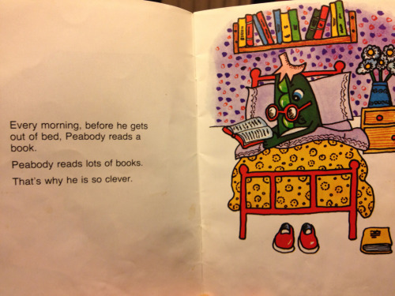
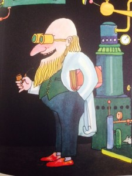
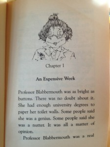

_Melissa Terras is Director of the Centre for Digital Humanities and a Professor of Digital Humanities at University College London (UCL). **She is also an expert on the portrayal of academics in kids’ books, having meticulously analysed over 200 titles. **Melissa took some time to chat with me about her fascinating project. \*\*You can check it out here, and follow Melissa on twitter [@melissaterras](https://twitter.com/melissaterras)._

"I have a son, aged 7, and twins, aged 4. We buy, and read, a lot of books”, Melissa tells me when I ask how this all started. “One week I spotted a couple of profs in books, so I tweeted about it and posted pictures on a tumblr blog".

!One of the original cohort, Dr. de Breeze. Dr Seuss, Did I Ever Tell You How Lucky You Are? Random House Books for Young Readers, 1973.

This on-a-whim posting ultimately turned into a full-blown research project spanning four years and costing somewhere in the region of £2,000. Melissa has amassed a library of books, containing 281 academic characters. Each character is meticulously logged, along with various attributes, in a big spreadsheet.

The earliest appearance of an academic in a kids book goes all the way back to 1860, a time when the world had far fewer higher education institutions. Indeed, given the exponential growth of universities and the publication of 1.6m English language kids books in the intervening 150 years, 281 academics seems disappointingly low.

Also disappointing is the unrepresentative picture that the books paint. "There are some truly lovely books", Melissa says, "but there is also a lot of lazy stereotyping". Academics tend to be either crazy evil egotists (like Dr Frankensteiner, the “maddest mad scientist on mercury!”), whilst the Professors tend to be kindly, but baffled, obsessive egg-heads who don’t quite function normally.\* \*

Across all the books, there are a mere 13 women and 3 minorities represented. Only one character is both - Professor Wiseman from Curious George, is a described as “American, likely with Indian ancestry”. There is some surprising variety though - Professor Peabody is a vegetable.

"I am often searching for new finds in the little bits of spare time I get throughout the day, dipping into library catalogues during quiet moments or introductory presentations at conferences". Fortunately she hasn't always had to do the digging herself, as librarians from all over the world have been contacting her to help expand the search.

The project hasn’t only been a source of enjoyment, but also a welcome slice of solitude: "I am used to working on projects with 15 people, so it is a treat to be doing something that is truly mine."

The project has had surprising benefits for Melissa's work: "By searching catalogues for these very specific items I have learned a lot about library systems architecture". One example, which links back to Melissa’s core research on library and archive digitisation, is on-demand digitisation - she found that you can pay a small fee to have works from certain libraries digitised for you.

I ask Melissa if she has any favourite characters, and her passion really shines through as she recalls the eccentric Professor Blabbermouth (she’s “as bright as buttons” with “enough university degrees to paper her toilet walls”!) and Dr. Hatchett, who, having failed to find an academic job after her English Literature PhD, now teaches primary school pirates. Boffin Boy, a book written for older kids that are struggling with reading, has proven consistently popular with the whole family.

Like all great academic projects, the work here is unlikely to ever be finished. So what’s next? Melissa is currently working on a paper setting out her findings, but after that there is the entire non-Anglophone world. Melissa has already found 50 or so books in Dutch (which she can speak a little), and thinks it likely that a treasure trove of characters awaits in other languages.

The research clearly demonstrates the need for some more representative characters, and I suggest that Melissa could make her own foray into the world of children's books. "I would love to do it", she says without hesitation, "but I can't draw and I've never written for kids! What I'd need is a partner". Hopefully a future step for the project will be a book that academics would be comfortable happy to read as their children’s bedtime story

Until then, we will have to make do with male, mad, and muddleheaded.
