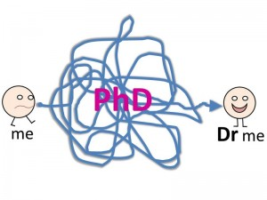
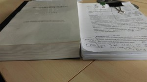
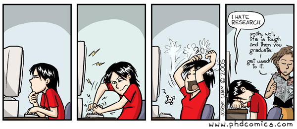

_Mairi Young is a PhD student at the University of Glasgow, researching why people are scared of the dentist (sort of). She is also a foodie and self-confessed junk food lover, blogging over at The Weegie Kitchen._

When you’re studying for a PhD, you will be perpetually presented with two semi-rhetorical questions:

    - Wow, you must be really smart?
    - Wow, so you’re gonna be a Doctor!?

Regardless of how tedious these become, you better get used to it because it’s all any non-PhD-student really understands about it. We minions in the lower echelons of academia know it’s a different story altogether.

Whether you’re embarking on a PhD, you know someone studying a PhD and you want to understand their life a little better, or if you’re doing a PhD and just procrastinating today (I’m not here to judge, man) I’ll share what PhD life is really like.

## We’re old, and a student

PhD students are generally older than your average Undergrad or Masters student. We have (considerably) less money than anyone else our age, we shop at Lidl and Aldi, and a night out/celebration are limited to:

    - **Student clubs at the weekend** – We can have a night out and taxi home for less than £20 but this involves warm syrupy cranberry juice mixed with paint stripper vodka in a plastic cup surrounded by girls wearing shorts/heels/crop tops and boys who resemble our baby brothers; or
    - **Fancier pubs during the week** – There are fewer crowds, so you can actually chat to your pals, cocktails come in REAL glasses and are often half price during the week. The problem is you can only really go out with your PhD pals because everyone else *has* to be in the office for 9am.

## What’s your PhD about anyway?

Let me tell you right now, 90% of people who ask this question aren’t interested in what your PhD is about at all. The other 10% is made up of:

    - **Your Supervisors** – You take up a lot of their time so naturally they are interested but this interest is VERY low down in their list of priorities;

    - **People at a conference who are researching something similar** – These people are the tiny percentage of people who actually understand your research and who are genuinely interested. Believe me, this is rare.

So how do you deal with this question from the other 90% of people who don’t care and are asking out of politeness? Well, you reel off a small catchy sums-it-up-sentence people can relate to

For example:

> I’m researching why people are scared of attending the dentist.

People love this, and it generates a discussion that most people can join in with. Is it what my research is about? No.

My research evaluates the efficacy of interventions by oral health support workers trying to engage hard to reach families, typically people with a fear of attending the dentist, regarding oral health behaviours. My working title is:

> Optimising the role of the Dental Health Support Worker in Childsmile Practice: A qualitative case study approach.

You see the distinction?

## The Doctor thing

Most people who know me, and my journey to get here, get excited about the whole ‘becoming a Doctor’ thing. I appreciate their support but I can’t share the enthusiasm because the shiny appeal of being Dr Mairi Young is well and truly lost.

Let me take you on a journey:

    - 3-6months into a PhD you’re worried about being found out as a fraud to even consider being awarded the doctorate. You’re convinced the University has made a mistake and will call you any day now to kick you out.
    - 1st year you have no idea what to do, so you wing it.
    - 2nd year you worry whether you’ve got enough time to do all your research and writing.
    - 3rd year you panic because you don’t think you’ve done enough to even put together a thesis.
    - By 4th year you’re worrying about PostDocs, Viva’s and the sheer cost of binding the thesis.

By the time your graduation comes around, you’re in the gown and you’re being handed the piece of paper which allows you to call yourself Doctor, you’re already in a Post Doc post and that journey has started all over again.

Forgive us if we aren’t all that excited about being called Doctor. It can feel like something of a consolation prize.

## Endless corrections

The one thing I miss about undergrad life was handing in an essay and never seeing it again. You’d receive a mark and that was it: a pure and beautiful cycle of hard work and reward.

This doesn’t happen at PhD level.

In a PhD you will spend weeks, if not months, tirelessly working on a chapter to make it perfect. You will submit to your supervisors and wait. And wait. And wait. Then you get corrections back.

That beautiful piece of work you worked yourself to the bone for returns covered in incomprehensible scribbles. Deciphering these scribbles will become a skill fit for your CV. Once you’ve deciphered and amended the chapter to perfection, submitted the chapter and waited, and waited and waited…. You get corrections back again.

Thus it continues until the day the thesis is bound and submitted. It’s thoroughly de-motivating and an exhaustive task.

## Endnote (or Zotero/Mendeley etc.)

If I could give PhD students one piece of advice for the future, it would be this: learn how to use Endnote.

I’m 2 years and 10 months into a 4 year PhD and I still don’t really know how to work EndNote.

Supposedly it makes your life easier because you can ‘cite while you write’ and compile your references at the click of a button. Yet as I still don’t really know how to work Endnote chances are I (and a couple other PhD’ers I know) will be typing ours out manually.

Please know I’m not lazy, and I’ve not been avoiding the issue. I simply never fully appreciated the time I had on my hands in the first 6 months of my PhD. Back then, I had all the time in the world to spend learning the detailed intricacies of useful software. 3 years in, I don’t have this luxury anymore.

## Council Tax

Quite possibly the saving grace of the whole PhD malarkey: No Council Tax.

I did my Undergraduate degree, MSc and PhD back to back which means I’ve been studying for 9 years (with a year to go _weeps_). I have not paid council tax at all during this time. I truly believe Glasgow City Council has a ‘Mairi Young Is At It / Must Investigate’ file because after 10 years at 3 different universities, they must be thinking “Surely she’s scamming us?”

Even though I receive a tax free stipend (which FYI is an absolute joy to explain to the Inland Revenue) it is a measly amount, so the saving I make not paying Council Tax means I can afford to live on my own, a luxury I never want to give up.

## Undergrads

Contrary to popular opinion, PhD students don’t dislike Undergrads, we’re just jealous of them. Undergrads have it easy and they don’t even know it.

At that age you don’t mind living in a tiny single bedroom and sharing a kitchen with 7 other people so long as it’s within walking distance to class and the student union. You don’t mind living off 9p noodles, cereal and toast. You can sleep during the day between classes, be told exactly what to study to pass the module, submit an essay and never see it again, and you have a whole summer each year in which to relax and enjoy yourself.

PhD students don’t have such luxuries.

We’re too accustomed to the finer things in life: expensive complicated cocktails, antipasti and fresh flowers every weekend. We also read journal papers in bed to catch up with reading, which throws a downer on any romantic relationship, and we stress out over how to afford a suitable outfit for a conference on a measly PhD stipend.

If you’re an undergrad and you see a PhD student tutting at you in the library for browsing Asos rather than working, please know we don’t hate you, we’re just green with envy that our lives are no longer like that. I’m sure you can empathise. By the time you end up doing a PhD, you’ll feel the same, I promise.
