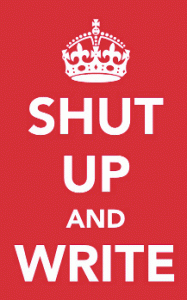

Just over a year ago I began tweeting as [@AcademiaObscura](https://twitter.com/AcademiaObscura), and in that time I have converted from a twitter sceptic to a fervent advocate. Twitter, and other social media tools, can be invaluable for connecting with others in your field, disseminating your work, and keeping up-to-date with the latest research and news. Indeed, once you are past the hump, Twitter becomes useful for all sorts of things. If you are new to Twitter I highly recommend the Thesis Whisperer's explanation here (scroll down a little to the *using twitter *section) and LSE's guide.

Hashtags are a great way to follow specific discussions, and a number have become staples of the academic twittersphere (side note: I use Tweetdeck to follow numerous hashtags simultaneously - [intro here](https://www.youtube.com/watch?v=6YysKcsDjt0)). This list is an attempt to introduce the essentials. Special thanks to [Raul Pacheco-Vega](https://twitter.com/raulpacheco), whose extremely useful post provided the basis and inspiration for this.

**1. [#PhDchat
](https://twitter.com/hashtag/phdchat)**The hashtag for all things PhD, PhDchat is a staple of academic Twitter, having been initially started all the way back in December 2009 by Nasima Riazat ([@NSRiazat](https://twitter.com/nsriazat)). A great place to discuss your research progress, get tips and tricks, share experiences etc. Structured sessions are also hosted:

    - UK/Europe: Wednesday nights, 7.30pm-8.30pm GMT (hosted by Nasima herself)
    - Australia: usually the first Wednesday each month, 7pm-8pm Sydney time (hosted by Inger Mewburn - [@thesiswhisperer](https://twitter.com/thesiswhisperer))

_More: There is a satisfyingly geeky analysis of the #PhDchat community [here](https://www.academia.edu/8100605/_The_Structure_and_Characteristics_of_PhDChat_an_Emergent_Online_Social_Network_)._

**2. [#ECRchat](https://twitter.com/hashtag/ecrchat)/[#AdjunctChat](https://twitter.com/hashtag/adjunctchat)**
As above, but specifically for 'Early Career Researchers' (ECR) and adjuncts.

**3. [#AltAc](https://twitter.com/hashtag/altac)/[#PostAc](https://twitter.com/hashtag/altac)/[#WithAPhD](https://twitter.com/hashtag/withaphd)**
A trio of useful hashtags for those trying to find alternative academic paths, get out of academia altogether, or figure out what to do with a PhD. Jennifer Polk ([@FromPhDToLife](https://twitter.com/fromphdtolife)) is your go-to person on all of these!

**4. [#shutupandwrite
](https://twitter.com/hashtag/shutupandwrite)**'Shut Up and Write', aside from being a great mantra in general, is the name for informal writing groups convened the world over. I guarantee that attending such a group will be the best decision you ever make in terms of writing productivity. But if there isn't a group near you (and you don't have the inclination to start one) you can join one virtually through twitter! They take place on the 1st & 3rd Tuesday each month (#suwtues):

    - UK/Europe ([@SUWTUK](https://twitter.com/SUWTUK)): 10am BST (GMT+1) (hosted by Rebecca Jefferson - [@DrRJefferson](https://twitter.com/DrRJefferson))
    - North America ([@SUWTNA](https://twitter.com/suwtna)): 10am CDT (UTC -5) (hosted by [@EtudesOnline](https://twitter.com/EtudesOnline))
    - Australasia: ([@SUWTues](https://twitter.com/SUWTues)): 10am AEST (UTC+10) (hosted by Siobhan O'Dwyer - [@Siobhan_ODwyer](https://twitter.com/Siobhan_ODwyer))

**5. [#AcWri
](https://twitter.com/hashtag/AcWri)**AcWri, short for 'academic writing' is a great place to find helpful tips, motivational tidbits, and articles about the writing process itself.

**6. #ICanHazPdf
**Have you ever gone to download that crucial paper you need only to find that it is behind a paywall? If your institutional subscriptions don’t cover what you are looking for, simply tweet the details of the paper along with the hashtag and an email address. Usually someone will come through with the paper pretty quickly. Don’t forget to delete your tweet after!

_More: Check out some interesting analysis of #ICanHazPdf here and here, and critical discussions [here](https://labandfield.wordpress.com/2013/10/05/how-icanhazpdf-can-hurt-our-academic-libraries/) and here._

**7. [#ScholarSunday](https://twitter.com/hashtag/AcaDowntime)**
There is a tradition on Twitter of doing #FollowFriday (or #ff) for short - sending a tweet with a few names of people you recommend to others. [Raul Pacheco-Vega](https://twitter.com/raulpacheco) created Scholar Sunday to go a step further, calling on academics to share not only who they recommend, but also why.

_More: discussion from the hashtags creator._

**8. [#AcaDowntime
](https://twitter.com/hashtag/AcaDowntime)**Amongst all the writing, teaching, and general stress of academic life, it is more important than ever to set aside for rest and relaxation. [#AcaDowntime](https://twitter.com/hashtag/AcaDowntime) calls for academics to share what fun things they are up to on their weekends and in their free time. Hopefully we can foster a culture of work-life balance and encourage us all to take time for ourselves.

> Workaholism isn't a job requirement. This weekend, take some time for yourself. [#AcaDowntime](https://twitter.com/hashtag/AcaDowntime?src=hash) ) [pic.twitter.com/AqJgAxPBJ9

— Academia Obscura (@AcademiaObscura) [July 24, 2015](https://twitter.com/AcademiaObscura/status/624581342668324865)

_More: I asked academics what they do in their 'free' time. Here's what they said. Also read "The Workaholic and Academia: in defense of #AcaDowntime"_

**9. Whatever is used in your field**
There are many subject-specific hashtags: [#twitterstorians](https://twitter.com/hashtag/twitterstorians), [#realtimechem](https://twitter.com/hashtag/realtimechem), [#TrilobyteTuesday](https://twitter.com/hashtag/trilobytetuesday), [#archaeology](https://twitter.com/search?q=%23archaeology), [#gistribe](https://twitter.com/search?q=%23gistribe), [#runology](https://twitter.com/hashtag/runology) (for the study of runes, not running)... Poke around a bit and you are bound to find something to take your fancy!

(**Just for fun)**

**10. [#AcademicsWithCats](https://twitter.com/hashtag/academicswithcats)** Are you an academic? Do you have a cat? Then this hashtag is for you. All the cute cats and kittens you could ever need, often in academic settings.

> CALLING ACADEMICS WHO OWN A CAT: we need YOU to post a pic to [#AcademicsWithCats](https://twitter.com/hashtag/AcademicsWithCats?src=hash). You know it makes sense! pic.twitter.com/Z8c8pR7Uuh — Academia Obscura (@AcademiaObscura) [December 11, 2014](https://twitter.com/AcademiaObscura/status/542902366370922496)

_More: A day in the life of an academic, with cats; The first annual Academics with Cats Awards._

**11. #[AcademicsWithBeer](https://twitter.com/hashtag/academicswithbeer)** If you don’t have a cat but you do love beer, this one’s for you! We have Elena Milani ([@biomug](https://twitter.com/biomug)) to thank for this recent edition.

> .[@cristinarigutto](https://twitter.com/cristinarigutto) and I are pleased to announce a new academic hashtag: [#academicswithbeer](https://twitter.com/hashtag/academicswithbeer?src=hash) pic.twitter.com/irGXv2IeF3

— Elena Milani (@biomug) [June 23, 2015](https://twitter.com/biomug/status/613423456944844800)

_More: Read the call to arms (The King's Arms, that is)._

Did I miss anything? What are your favorites? Please post a comment or tweet me [@AcademiaObscura](https://twitter.com/AcademiaObscura). Happy tweeting!
