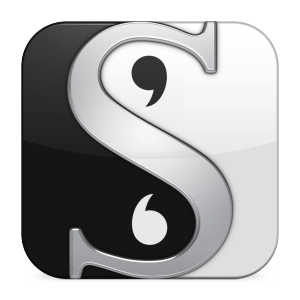
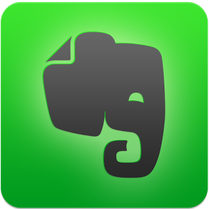
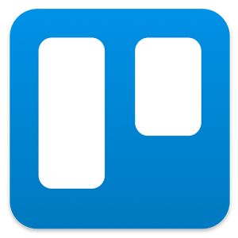
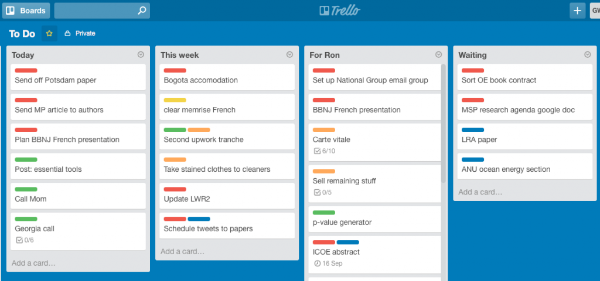
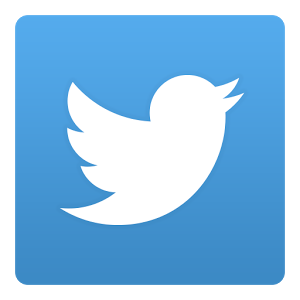
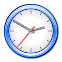
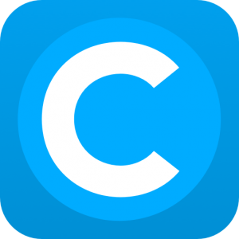

Gone are the days of type-written papers and literature reviews built on index cards. In the age of information overload and email overwhelm, we need all the help we can get to stay sane and productive. I rely heavily on the 10 tools described here, and I hope that they might lighten your load a little too. 

Many of these tools require an initial time investment and/or steep learning curve before you realise their full potential, so I don't recommend trying to integrate them into your workflow all at once. Start with one or two that you think might be most helpful: if you are about to begin a PhD, get friendly with a citation manager; if you have 8 post-its permanently affixed to your monitor, get your shit sorted with Trello. 

**1. Citation manager**
If I could give only one piece of advice for those starting out in academia, it would be this: ***use a citation manager**!* I use Mendeley, and get along reasonably well with it, but I recommend [fiddling around with a few](https://en.wikipedia.org/wiki/Comparison_of_reference_management_software) before settling (try Zotero, Papers, Endonte). Ultimately, the particular platform matters much less than the absolute necessity of integrating some sort of citation management software into your workflow. It may seem like a chore at first,[1. Does footnoting ever not seem like a chore?] but you'll be glad you put the effort in.

**********2. Scrivener**
Whereas Word and its ilk are digital extensions of the typewriters of old, [Scrivener](https://www.literatureandlatte.com/scrivener.php) is a word processor built from the ground up to redefine the way we write on computers. Scrivener is at once simple and versatile, and flexible enough to complement the way you think and work when writing, whatever your style. I put snippets of writing onto virtual note cards and organise them by theme. The cards are easily edited and reorganised by dragging and dropping, while the powerful export function turns it all into a formatted and ready-to-go doc file.

 	- *Read: 5 Reasons I Switched to Scrivener for all my Writing*

**3. Evernote**
The Chinese word for computer literally translates as "electric brain", and this is exactly how I would describe Evernote. I use [Evernote](https://evernote.com/) as my second brain, a giant electronic notebook brimming with everything from research-related news stories to recipes. You can [clip direct from the web](https://evernote.com/webclipper/), add photos from your phone, or [email notes](https://blog.evernote.com/blog/2012/04/20/quick-tip-friday-emailing-into-your-evernote-account/) directly to your account. It is available online and syncs across all devices, so you can access your stuff wherever you are.

 	- *More: I've Been Using Evernote All Wrong. Here's Why It's Actually Amazing*
 	- *More: 12 Surprising Ways to Use Evernote...*

**4. Trello**
[Trello](https://trello.com/) is a sort of virtual pin board. Pre-Trello, I would have at least 3 to-do lists on the go at any given time and would waste an inordinate amount of time faffing around with them. Now, together with my calendar, I use Trello to organise my entire life. I have changed the way I use the app a few times based on my needs at the time, so I recommend experimenting until you find what works best for you. Currently I have four main columns: One Big Thing (i.e. my primary task for the today); "Three Smaller Things", in case I get my one big thing done; "Later" (for everything else); and "Done".[1. When a task is done I drag it here - I could just delete it, but I find dropping something into the done list seriously gratifying] I also colour code, because why not.

Gloriously simple, and incredibly effective.

 	- *Read: How to Use Trello to Organise Your Entire Life*

 5. Unroll.me**
If you want to reach the holy grail of inbox zero, Unroll.me is going to help you get there. It "rolls up" all of your regular email subscriptions and newsletters 1. To distinguish this from unsolicited emails, i.e. spam, the tech community [coined the term "Bacn" to describe "email you want but not right now"] into one neat bundle and sends it to you daily/weekly at a time of your choosing (I receive mine every day at 4pm, the time that I am usually started to either fall asleep or look at cats on the internet anyway). This reserves your inbox for priority emails and stops you getting distracted by junk during the day. Unroll.me detects new mailing lists and allows you to leave the messages in your inbox, add them to your rollup, or unsubscribe [2. Be careful though: it doesn't actually unsubscribe you, it just funnels the messages away from your inbox, never to be seen again. This could be problematic if you stop using Unroll.me later and find a sudden influx of all this junk you thought you were rid of. *Caveat emptor* my friends.] This nifty little app has spared me the distracting allure of 12,000 emails in the two years since I started using it.

**6. Twitter**
Academics are notoriously sceptical of the merits of [Twitter](https://twitter.com/). Despite initially sharing in this somewhat understandable reluctance, I am now a full convert. I use Twitter to keep up to date with news and developments in my field, request articles that I can't access, and chat with other researchers. As long as you are vigilant not to let tweeting take up too much of your time, Twitter can be incredibly useful.

 	- *[Twitter for Academics and Researchers](https://prezi.com/9zyvkzuijvdo/twitter-for-academics-researchers/) (free prezi)*
 	- *11 Essential Hashtags for Academics*

**7. Freedom/****Anti-Social**
While studies show that looking at pictures of kittens increases your productivity, wasting your day on the internet probably doesn't. Freedom will lock you out of the internet for a designated period of time.[3. Yes, it is a damning indictment of our culture that 'Freedom' means turning off the internet so you can get more work done. Don't hate the player...] The only way to get your connection back is to reset your computer, which is enough of a pain in the arse that you probably won't do it. If you *really* do need the internet (e.g. for research) you can use [Anti-Social ](https://anti-social.cc/)instead, which only locks you out of particularly distracting sites. 

**8. Coach.me**
Coach.Me is a motivation app for building good habits. You set up a checklist of things you want to do on a regular basis, and tick them off daily. I used it to get over my lifelong habit of biting my nails, to start brushing my teeth after lunch at work, and, during writing periods, to commit myself to X [pomodoros](https://en.wikipedia.org/wiki/Pomodoro_Technique) a day. Not especially sexy, but eminently practical.

**9. A clipboard manager
**Modern academic writing involves as much copying and pasting as it does scribbling or typing, yet most of us still make do with the one-shot copy and paste feature built into our computers. I do not say this lightly, but a clipboard manager will change your life. The main advantage is the ability to copy more than one item for pasting later (if you've ever copied something only to forget to paste it and remember an hour later, you will understand the importance of this simple extension), but most of them have other handy features too. I swear by Copy'em Paste - while the $15 price tag might seem steep, it is pretty reasonable for an app that I use unthinkingly hundreds of times per day. 

**10. An external hard drive/Dropbox/Drive/Crashplan**
Computers die, so you should back up ~~regularlymore or less constantly~~***as if your life depends on it***. Invest in a decent external hard drive and make use of the backup software on your computer. Hard drives also die, so sign up for an online file storage service and put an extra copy your most important files in there too. I use Apple's Time Machine to back up everything to an external drive (a recurring task in Trello nudges me to do this weekly), and I copy all my essential documents to dropbox as well. Better safe than sorry.

*Already using these tools? What has your experience been? Did I miss something? Comment below or tweet [@AcademiaObscura](https://twitter.com/academiaobscura).*