1. University is free in Germany, but elsewhere it's just business. It is also [like riding a bike](../assets/img/posts/150918_12_Things_I_Learned_About_Academia_from_Google_Sug_07.jpg).

[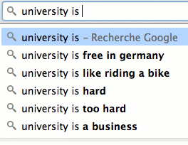](../assets/img/posts/150918_12_Things_I_Learned_About_Academia_from_Google_Sug_21.png)

2. Academia is a pointless, broken cult.

[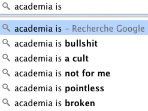](../assets/img/posts/150918_12_Things_I_Learned_About_Academia_from_Google_Sug_15.png)

3. There are many misconceptions about us academics. We are [often happy](https://twitter.com/hashtag/acadowntime), but not always. We are rarely important, and never well paid!

[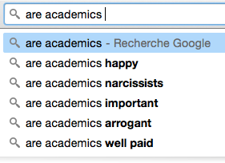](../assets/img/posts/150918_12_Things_I_Learned_About_Academia_from_Google_Sug_14.png)

4. We are many things:

[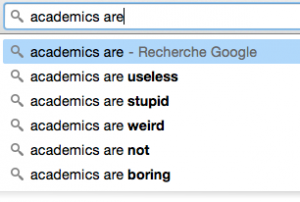](../assets/img/posts/150918_12_Things_I_Learned_About_Academia_from_Google_Sug_01.png)

5. We are not the problem...

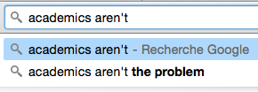

6. ...but we aren't everything either.

[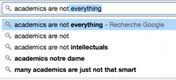](../assets/img/posts/150918_12_Things_I_Learned_About_Academia_from_Google_Sug_03.png)

7. Economics students are promiscuous and selfish.

[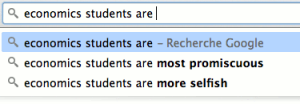](../assets/img/posts/150918_12_Things_I_Learned_About_Academia_from_Google_Sug_18.png)

8. History students are just promiscuous.

9. As for law students, well...

[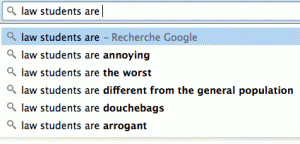](../assets/img/posts/150918_12_Things_I_Learned_About_Academia_from_Google_Sug_06.gif)

10. A PhD can be problematic, unless it is in dance.

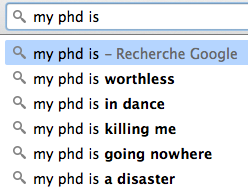

11. Don't expect to much help from your professor...

[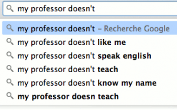](../assets/img/posts/150918_12_Things_I_Learned_About_Academia_from_Google_Sug_05.png)

12. ...nor from the hot-but-lazy TA.

[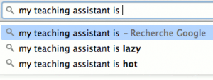](../assets/img/posts/150918_12_Things_I_Learned_About_Academia_from_Google_Sug_12.png)

Many questions remain.

[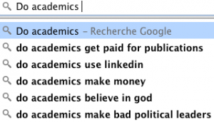](../assets/img/posts/150918_12_Things_I_Learned_About_Academia_from_Google_Sug_11.png)

*What does Google suggestions say where you are? Tweet your screenshots to [@AcademiaObscura](https://twitter.com/AcademiaObscura) with the hashtag #GoogleAcademia.*