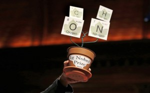
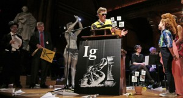
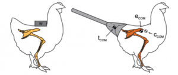

Summer is, sadly, over. Freshers week is, thankfully, also over. And yet another academic year kicked off with that most amusing of academic traditions: the Ig Nobel Prizes.

This year the Ig Nobels, which recognise research that “first makes people laugh then makes them think”, celebrated its 25th *first** *annual award ceremony.

In case you’ve never heard of the Ig Nobels, they are described by singer Amanda Palmer, herself a little off-the-wall, as “a collection of, like, actual Nobel Prize winners giving away prizes to real scientists for doing f’d-up things...”

For a quarter-century, the Igs have been dishing out prizes for unusual research, ranging from the infamous case study of homosexual necrophilia in ducks, to the 2001 patent issued for a “circular transportation facilitation device” (i.e. a wheel).

The award ceremony takes place in Harvard’s largest theatre and resembles something akin to the Oscars crossed with the Rocky Horror Show. The lucky winners, drawn from a field of 9,000 hopefuls, are indeed presented their prize by a one of a “group of genuine, genuinely bemused Nobel Laureates”.

In 2010, one scientist became the first to win both an Ig and a real Nobel: Sir Andre Geim was awarded the former for his work on graphene, and the latter for levitating a frog with super strong magnets (Geim also co-authored a paper with his pet hamster, Tisha).

By the far the most bizarre this year is a study in which chickens were fitted with prosthetic tails to see if their modified gait could provide clues as to how dinosaurs walked (yes, there is a [video](https://www.youtube.com/watch?v=1VlgZGg9FTo)).

Other gems this year include:

	- A chemical recipe to partially un-boil an egg.
	- A paper answering the question: “Is ‘Huh’ A Universal World?”
	- A series of studies looking at the biomedical benefits, and consequences, of intense kissing.

If you are looking for a bit of distraction after the whirlwind of the first weeks of term, you can watch the whole ceremony [online](https://www.youtube.com/watch?t=5275&v=MqVCl2VoZqU), or explore all the prizes to date with this [neat data viz tool](https://ig-nobel.silk.co/).

As is now the norm, the whole thing was also live-tweeted (#IgNobel). In fact, the Igs employ an “official observer” to linger on stage, head buried in smartphone, for this purpose.

Elsewhere on Twitter this week, I discovered:

	- That animated gifs make for great academic metaphors:

> 
I don't always co-author papers, but when I do... pic.twitter.com/0xFP9Se3PV

— Academia Obscura (@AcademiaObscura) [September 25, 2015](https://twitter.com/AcademiaObscura/status/647436679125405696)

	- That the resident penguin at the University of Portsmouth library has its own account:

> 
[@BucksLib](https://twitter.com/BucksLib) scanny scan scan... I like a good card scanning turnstile! pic.twitter.com/PZzwXRNzIr

— UoPLibrary Penguin (@uoppenguin) [September 23, 2015](https://twitter.com/uoppenguin/status/646645325902520320)

	- That National Punctuation Day is a thing:

> 
This [#NationalPunctuationDay](https://twitter.com/hashtag/NationalPunctuationDay?src=hash), spare a thought for your friend, the Oxford Comma.

— Oxford Comma (@IAmOxfordComma) [September 24, 2015](https://twitter.com/IAmOxfordComma/status/646971622491058176)