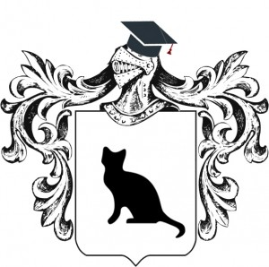
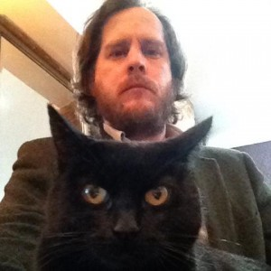
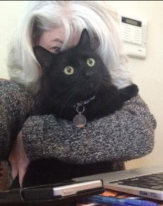
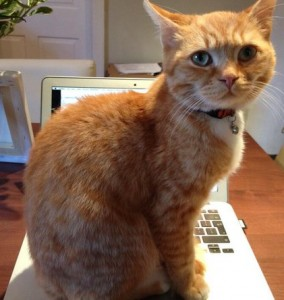
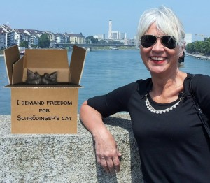
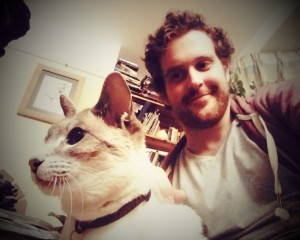

You asked for it, and here it is! The Second Academics with Cats Awards launches today!

## How to enter
Simple! Check out the categories below and tweet your finest cat pics (with caption) to #AcademicsWithCats. We'll collate them and our expert panel will shortlist the best. Public voting will open on 25 November 2015.

## CATegories
This year there are 5 categories. Get creative!

	- Academics and their Cats: you and your feline friend
	- Writing
	- Outreach
	- Impact
	- Teaching

## Prizes
**Best in Show**
Your cat will receive a professorship certificate, mortar board, and collar tag, and will become the Mice Chancellor of Academia Obscura ([@MiceChancellor](https://twitter.com/micechancellor)). Your cat will also be entered into the Academic Cats Hall of Fame. You will receive a signed copy of the forthcoming [Academia Obscura book](https://unbound.co.uk/books/academia-obscura).

**Category Winners**
Your cat will feature in a series of demotivational academic posters (if they so wish!). You will receive a signed copy of the forthcoming [Academia Obscura book](https://unbound.co.uk/books/academia-obscura).

**Runners-up
**You will receive a free ebook version of the forthcoming [Academia Obscura book](https://unbound.co.uk/books/academia-obscura).**
**

## Dates

	- Tuesday 3 November: Launch!
	- Friday 20 November: Entries close
	- 20-25 November: Shortlisting
	- 25 November: Voting opens
	- 15 December: Voting closes
	- 16-18 December: Winner announcements

## The shortlisting panel
The shortlist will be diligently put together by the following panel of experts.

**Chris Brooke**
@chrisbrooke
Chris is a Lecturer at Cambridge and co-winner in the first Academics with Cats Awards.

**Deborah Fisher**
@DrDeborahFisher
Deborah is an Associate Professor of Medicine at Duke University and co-winner of the first Academics with Cats Awards.
**Nadine Muller
**@Nadine_Muller
Nadine is a Senior Lecturer in English Literature, a BBC Radio 3 New Generation Thinker, and an academic with both cats and dogs.

******Cristina Rigutto
**[@cristinarigutto
](https://twitter.com/cristinarigutto)Cristina is an avid golfer, Sci Comm expert, and tweeter. Her cat tweets @academichashcat.

**Glen Wright**
[@AcademiaObscura](https://twitter.com/AcademiaObscura)
Glen is the founder of Academia Obscura. A catless academic, he started [#AcademicsWithCats](https://twitter.com/hashtag/academicswithcats) to fill the void.