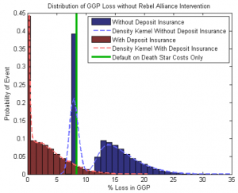
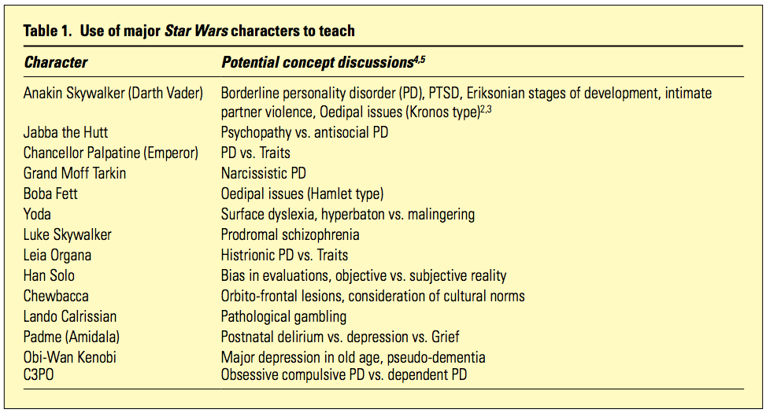
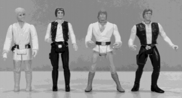
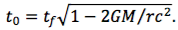

## 
## 1. It’s a Trap: Emperor Palpatine’s Poison Pill 
Abstract: *"In this paper we study the financial repercussions of the destruction of two fully armed and*
*operational moon-sized battle stations (“Death Stars”) in a 4-year period and the dissolution of*
*the galactic government in Star Wars." *

Highlights: The whole thing is excellent. Estimating a "$193 QUINTILLION cost for the Death Star (including R&D)". Concluding that "the Rebel Alliance would need to prepare a bailout of at least 15%, and likely at least 20%, of GGP[1. Gross Galactic Product] in order to mitigate the systemic risks and the sudden and catastrophic economic collapse".

## 2. Using Star Wars' supporting characters to teach about psychopathology 
Abstract: *"The pop culture phenomenon of Star Wars has been underutilised as a vehicle to teach about psychiatry... The purpose of this article is to illustrate psychopathology and psychiatric themes demonstrated by supporting characters, and ways they can be used to teach concepts in a hypothetical yet memorable way... Characters can be used to approach teaching about ADHD, anxiety, kleptomania and paedophilia."*

Highlights: Stating that Jar Jar Binks is the "low-hanging fruit of psychopathology, serving as an easily identifiable example of attention deficit hyperactivity disorder (ADHD)". Overanalysis of Luke's familial relations.

## **3. Evolving Ideals of Male Body Image as Seen Through Action Toys **
Abstract: *"We hypothesized that the physiques of male action toys...  would provide some index of evolving American cultural ideals of male body image... We obtained examples of the most popular American action toys manufactured over the last 30 years. We then measured the waist, chest, and bicep circumference of each figure and scaled these measurements using classical allometry to the height of an actual man (1.78 m)... We found that the figures have grown much more muscular over time..."*

Highlights: The accompanying image showing how buff Luke and Anakin became between 1978-1998. "Luke and Hans have both acquired the physiques of bodybuilders over the last 20 years, with particularly impressive gains in the shoulder and chest areas"

## 4. Darth Vader Made Me Do It! Anakin Skywalker’s Avoidance of Responsibility and the Gray Areas of Hegemonic Masculinity in the Star Wars Universe 
Abstract:* "In this essay, we examined the interactions of Anakin Skywalker during moral dilemmas in the Star Wars narrative in order to demonstrate the avoidance of responsibility as a characteristic of hegemonic masculinity. Past research on sexual harassment has demonstrated a ‘‘gray area’’ that shields sexual harassers from responsibility. We explored how such a gray area functions as a characteristic of hegemonic masculinity by shielding one male, Anakin Skywalker, from responsibility for his immoral and often violent actions. Through our investigation, we found three themes integral for the construction of a gray area that helped Anakin avoid responsibility: phantom altruism, a clone-like will, and the guise of the Sith."*

Highlights: "Other characters within contemporary popular culture—such as Rambo and Jason Bourne—all avoid responsibility for any crimes or violent actions they take when confronted by moral dilemmas within their respective narrative because they all demonstrate themes similar to the three that arose in our analysis of Anakin Skywalker: (a) an altruistic past, (b) threats and deceptions that rob them of their autonomy, and (c) a dark guise that can be blamed for their most egregious actions"
## 5. The Skywalker Twins Drift Apart 
Abstract: *"The twin paradox states that twins travelling relativistically appear to age differently to one*
*another due to time dilation. In the 1980 film Star Wars Episode V: The Empire Strikes Back, twins*
*Luke and Leia Skywalker travel very large distances at “lightspeed.” This paper uses two scenarios to*
*attempt to explore the theoretical effects of the twin paradox on the two protagonists."*

Highlights:  Luke is calculated to be 638.2 days younger than Leia.