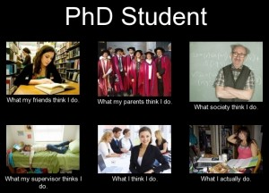

***Mairi Young** is a PhD student at the University of Glasgow, researching why people are scared of the dentist (sort of). She is also a foodie and self-confessed junk food lover, blogging over at The Weegie Kitchen.*

	- Having to explain to your Mum, for the fiftieth time, no you’re not writing an essay.
	- Having to explain to your Mum, yet again, that a Viva is not just an exam.
	- Having to explain to your Mum a PhD *is* a *real job.*
	- Asking your Mum to just stop asking about your PhD.
	- Sneaking out Leaving the office at 6pm and feeling guilty.
	- That twinge of guilt over the sheer amount of paper you print on a weekly basis.
	- Feeling sad that you’ve single-handedly destroyed a rainforest by doing a Systematic Literature Review.
	- Bringing your laptop and papers home for the weekend/holidays/trip abroad (tick all that apply) but never actually opening the bag and feeling its judgmental glare the entire time so you can’t fully relax.

!Source: [PHD comics](../assets/img/posts/160723_25_PhD_Feels_All_Doctoral_Students_Have_02.gif)
	- Batch cooking on a Sunday for the week ahead and feeling like you have won at life because you’re so organised.
	- Eating microwaved lasagne for lunch and dinner for the 4th day running and wondering why you ever thought batching cooking was a good idea.
	- Quietly loathing the postdocs who can afford fancy ready meals for lunch.
	- Hating compulsory seminars.
	- Attending compulsory seminars because offer free sandwiches and it’s an escape from microwaved lasagne for the 5th day running.
	- Stocking up on free sandwiches at free seminars.

!Source: [PHD Comics](../assets/img/posts/160723_25_PhD_Feels_All_Doctoral_Students_Have_01.jpg)
	- Feeling flush when you buy prosecco from Aldi.
	- Eating crisps in the office by placing each crisp on your tongue and patiently waiting for it to dissolve because you don’t wanna be that person.
	- Feeling super smart when you use words like epistemology and ontology.
	- Feeling like a dunce when you have to explain the meaning of these words.
	- Writing your acknowledgements page and wiping away a tear because it’s very Gwyneth Paltrow at the Oscars circa 1999.
	- Watching as your office uniform goes from suit jacket to hoodies swiftly in the final six months (or the first six weeks).
	- Its 3 months till completion and you can’t remember the last time you ate a vegetable.

	- Applying for post-doc positions with a 37.5-hour working week and realising (very soon) you will no longer have to work an 80-hour week.
	- Daydreaming about all the productive things you’ll do with these extra 40 hours a week.
	- Realising you’ll probably just use it to catch up on sleep and your laundry pile.
	- Realising that postdocs work an 80-hour week too.