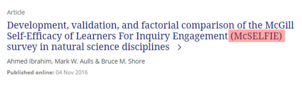
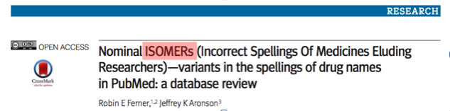
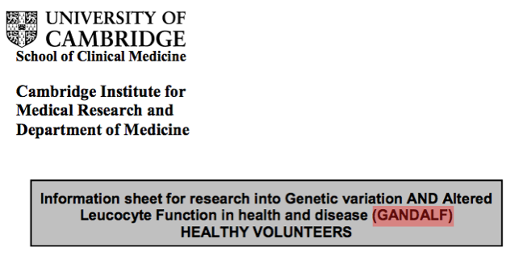
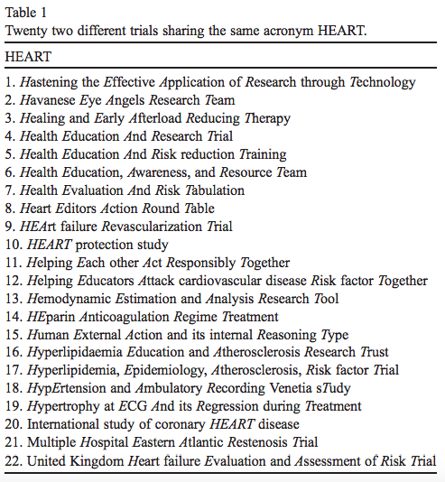
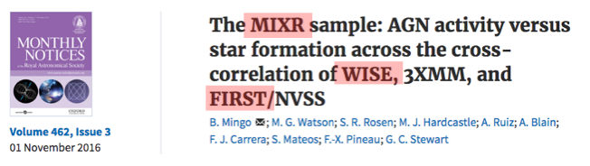
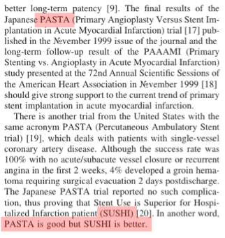
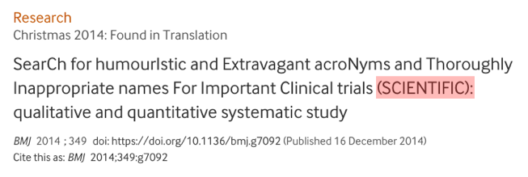

[caption id="attachment_1329" align="aligncenter" width="471"] Source[/caption]

](../assets/img/posts/170204_6_Examples_of_Whimsical_Acronyms_in_Scientific_Pap_01.png)

](../assets/img/posts/170204_6_Examples_of_Whimsical_Acronyms_in_Scientific_Pap_02.png)

](../assets/img/posts/170204_6_Examples_of_Whimsical_Acronyms_in_Scientific_Pap_03.png)

](../assets/img/posts/170204_6_Examples_of_Whimsical_Acronyms_in_Scientific_Pap_04.png)

[caption id="attachment_1347" align="aligncenter" width="370"] Source[/caption]

[caption id="attachment_1349" align="aligncenter" width="489"] [Source](https://academic.oup.com/mnras/article-abstract/462/3/2631/2589691/The-MIXR-sample-AGN-activity-versus-star-formation?redirectedFrom=PDF)[/caption]

[caption id="attachment_1348" align="aligncenter" width="322"] Source1522-726X(200004)49:4%3C478::AID-CCD29%3E3.0.CO;2-P/epdf)[/caption]

[caption id="attachment_1350" align="aligncenter" width="483"] Source[/caption]
