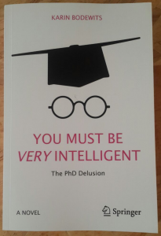

Most academics are so passionate about their work that it is a struggle to separate work from life. I have long resisted this urge, trying my best to keep the inbox off over the weekends and taking proper holidays (i.e. non-academic books only). This reluctance extended to banning anything vaguely academic from my personal world, including academic novels and films depicting campus life. 

*[The Groves of Academe](https://www.amazon.com/gp/product/0156027879/ref=as_li_tl?ie=UTF8&tag=cademiabscura-20&camp=1789&creative=9325&linkCode=as2&creativeASIN=0156027879&linkId=f112c1fff21631a7421c791b1ac01e51)*, Mary McCarthy's deliciously scathing commentary on liberal arts schools, was the first to change my mind, and just in time. The [rise of the academic novel](https://academic.oup.com/alh/article-abstract/24/3/561/103335/The-Rise-of-the-Academic-Novel?redirectedFrom=fulltext) in recent years has seen the publication of many truly unmissable books that beg to be read, from *[The Secret History](https://www.amazon.com/gp/product/1400031702/ref=as_li_tl?ie=UTF8&tag=cademiabscura-20&camp=1789&creative=9325&linkCode=as2&creativeASIN=1400031702&linkId=ea8e9544a72a6932737f7c931ff39ec8)*, Donna Tartt's ambitious and intellectual murder not-so mystery, to *[Lab Girl](https://www.amazon.com/gp/product/1101873728/ref=as_li_tl?ie=UTF8&tag=cademiabscura-20&camp=1789&creative=9325&linkCode=as2&creativeASIN=1101873728&linkId=6633e6909e59aeab27f9a96c04f87edb), *Hope Jahren's quirky memoir and ode to friendship, plants, and the tenacity of the unsung women of science.

A new addition to my growing collection of academic novels recently landed on my desk - Karin Bodewits new book *[You Must Be Very Intelligent: The PhD Delusion](https://www.amazon.com/gp/product/331959320X/ref=as_li_tl?ie=UTF8&tag=cademiabscura-20&camp=1789&creative=9325&linkCode=as2&creativeASIN=331959320X&linkId=1c991ff2a056f3554a2e3057ed53bbba). **You Must Be Very Intelligent *promises a "witty, warts-and-all account of post-grad life" featuring "success and failure, passion and pathos, insight, farce and warm-hearted disillusionment."

As Karin puts it:

> Ever since I finished my PhD, I knew I had to write this book. While it isn't a diary of my time as a PhD student, it isn't quite a work of fiction either. If it were, I would probably have described some secretive, unethical research taking place in dank basements beneath cloisters, proving that scientists are amoral psychopaths (I did meet some people I could imagine creating a three-headed sheep for shits and giggles but I never actually saw anyone trying it).

I nonetheless saw stuff that was dramatically dark, barking mad and hilariously ridiculous, but in an everyday way. I saw the monsters beneath the meniscus of human nature surfacing in a supposedly sedate world; of frustrated egos the size of Africa, where competition is pathological, volcanic rages seethe and tin pot dictators are drunk on oh-such petty power. It’s a world where glory is the goal and desperation is the order of the day; a world where young adults are forced into roles that make Lord of the Flies look like Enid Blyton.

  

    It was an education. And it taught me to be wary of education.

Karin kindly agreed to share a couple of chapters, including the all-important [Chapter One](..../assets/img/posts/170807_You_Must_Be_Very_Intelligent_-_The_PhD_Delusion_01.pdf), and [Chapter 35](..../assets/img/posts/170807_You_Must_Be_Very_Intelligent_-_The_PhD_Delusion_03.pdf) (look out for the surprisingly saucy illustration of academic ''collaboration"!).

**Karin Bodewits** has a PhD in Biology from the University of Edinburgh. In 2012, she co-founded the company NaturalScience.Careers. She published her first book, a career guide for female natural scientists, in 2015, and just won the Science Slam in Munich. She writes short stories, career columns and opinion pieces for magazines like Chemistry World and Naturejobs.

*Full disclosure: I didn't get paid for this post, but I did get a free copy of the book. I do have a fledgling Amazon affiliate account, which means that if you buy the book after clicking on a link here, I get 3 cents or something.*