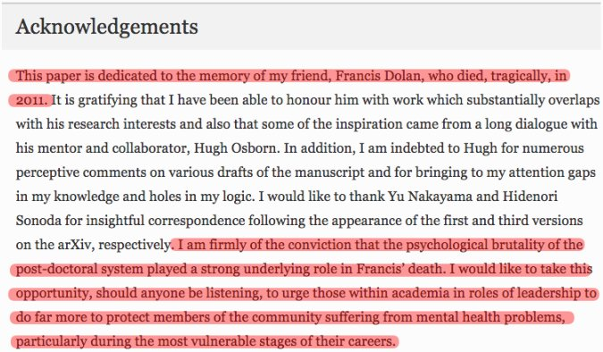

_This post discusses mental health and suicide. If these issues affect you, or somebody you know, you can [contact the Samaritans](https://www.samaritans.org/how-we-can-help-you). Whatever you're going through, [the Samaritans are available by free phone call 24/7](https://www.samaritans.org/how-we-can-help-you). _

A few weeks ago, I came across a moving tribute to a lost friend in the unlikeliest of places: the acknowledgements section of an [academic paper](https://link.springer.com/article/10.1140/epjc/s10052-017-5049-5).

I reached out to the author, Oliver Rosten, to ask him about his motivation for penning the acknowledgement and how it came to be published.

**Can you tell me a bit about Francis and the circumstances that led to this tragedy?**

Francis and I met in 2006 at the Dublin Institute for Advanced Studies (DIAS), where we had both just started two-year research fellowships. We instantly hit it off, having a shared sense of humour and similar outlook on the absurdity of existence. I soon learnt that Francis suffered from depression. Over the years I knew him, I tried to support him as much as I could.

Both of us felt under pressure at DIAS. Two-year fellowships are short and, in our particular field, that gives you a little over a year to produce something in time for the next application deadline. Francis also had to deal with being in a different country from his partner.

After DIAS, I moved to Sussex and Francis got a position in Amsterdam. He was extremely isolated there and also frustrated at the lack of recognition his work was getting. (Since his death, it has become highly regarded.) After Amsterdam he secured a position in Crete but, around the time he was due to start, he returned to the UK and died by suicide.

**What gave you the idea to include this acknowledgement?**

As soon as I started the paper - which I did after leaving academia in 2011 - I knew I wanted to dedicate it to Francis. I can't remember when the exact words of the acknowledgement crystalised but I knew that this was something I had to say.

**Did you have any difficulty getting it published?**

I had considerable difficulty getting it published!

I first posted the paper on arXiv in late 2014. Then, after making some corrections, I submitted to the _Journal of High Energy Physics _(JHEP) early 2015. The paper was accepted by the referee, but the acknowledgements were flagged for editorial review. The editor asked that I remove them. I refused and gave my reasons, and the editor responded:

> The required corrections concern the last paragraph of the acknowledgements. We would remove it completely. I think the first phrase is too much: I guess there were more basic problems in Dolan's life than the pressure put by physics work. Certainly people, say in business, behave more brutally than in academia. The second phrase could be OK but a bit out of place: in a scientific paper we discuss about science, not about life.

If you will have a chance to write a history paper or even some special proceedings about him, you can put descriptions of his life and commentaries, but they are out of place in JHEP.

I objected and it was taken up by the scientific director, who came down on the side of the editor. I withdrew the paper and submitted it to* Physical Review D*. It was seen by 3 referees, one of whom provided some very useful scientific feedback. Ultimately we ended up at loggerheads over certain changes demanded by the referee, so the paper was rejected.

Two referees for _Journal of Physics A_ then accepted the paper with glowing reports, but the editor asked for me to remove the second paragraph of the acknowledgements. I again refused and ended up withdrawing the paper

I changed my strategy and tried emailing journal editors directly to ask whether, if the paper were accepted for scientific content, it could be published with the acknowledgements intact. *The European Physical Journal C* responded in the affirmative - they were actually very supportive. After making some minor changes following peer review, the paper was accepted, almost 3 years after it first appeared on arXiv.

**In your view, what are the main causes of the 'psychological brutality' of the postdoc system?**

- Short term positions;
- Low salaries. I've personally known postdocs trying to live on a pittance;
- People are frequently separated from their partner;
- In some fields it is hard to work on your own ideas and, if you do, there can be a lot of pressure to do more mainstream work;
- For people with medical issues, there is the prospect of no continuity of care. I think this can be a severe problem for those with mental health issues (compounded by the fact that your local support network evaporates every few years).
- The cliff edge: What happens if you don't get another job? Every few years, this comes around and I think, generally, each time it gets more stressful as there is more at stake: Am I too old to retrain? Can I support my family? But if I give up now is all my research for nothing?

**What can university leaders do to change this?**

Regarding the post-doctoral system, I've given this a lot of though over the years and have the following suggestions. The first two are important but perhaps not as radical as the last two.

- Postdoctoral positions should be for a minimum of 3 years. For my (old) field - theoretical high-energy physics - there is a distinct application season: generally job applications must all be done by the end of any particular year (I assume things are as they were when I Ieft academia in 2011). When starting a new position (typically September), this generally means that postdocs have a little over one year in which they must produce new work. The pressure of this can be almost unbearable. I know that there are some institutions which (as far as I know) only offer 3 or 5-year positions, which should be applauded.
- Postdoctoral positions should be well paid. When low salary impacts quality of life there may be a commensurate impact on mental health. I've always been fortunate that my wife and I have travelled together and she's always been able to work - this has made a big difference. Indeed, during my time in Dublin she earned much more than me which enabled us to live far more comfortably than we'd have otherwise been able to do.
- Every institution should have members of staff, ideally with training in mental health issues, whose sole job is to support the postdoctoral community. I envisage this a a key part of institutions taking true responsibility for the gifted and dedicated people they hire on temporary academic contracts. This would have a number of facets:

For those with known mental health issues, the staff would help to ensure continuity of care when someone moves institutions. This is a vital point in my opinion because postdocs find themselves, every few years, in a situation where their entire local support network disappears. For those with mental health issues this can be extremely damaging, not least because one may have no familiarity whatsoever with the mental health care provision that exists in a potentially new area or country. - When postdocs come to the point where none of their applications have been successful or they otherwise decide to leave academia, these staff would be there to provide emotional support and also to offer advice on how to transition into industry.

- Institutions should, for postdocs who have reached the end of their academic careers, offer a period of paid retraining. The cliff-edge that many post-docs experience can be incredibly stressful - this was certainly the case for me. Institutions prepared to hire incredibly talented and dedicated people on temporary contracts have (or should have) a duty to make sure these people have the best and smoothest transition to whatever it is they go on to do. While I can see a gut reaction that this may overburden academic institutions, I think there is real scope to make this positive and beneficial for all involved, particularly if local industries are involved in the process. And, of course, it would not be the case that institutions would have to do this for every postdoc; plenty will remain in academia.

**What can we do as a community to make sure such tragedies are not repeated?**

As a community, I think we must try to engage those in positions to implement change in a dialog. Optimistically, perhaps it may be possible to draw up a 'charter for postdocs' to which institutes can subscribe to, which would guarantee that they agree to certain standards of treatment for postdocs.

_If these issues affect you, or somebody you know, you can [contact the Samaritans](https://www.samaritans.org/how-we-can-help-you), free, 24/7._
