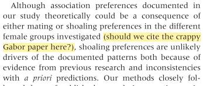

Finding typos in a paper post-publication is dismaying, if inevitable. This isn’t usually fatal and will generally go unnoticed. Even after sinking hours of labour into it there are bound to be some miner errors.

References to ‘screwed data’ and a ‘screwed distribution’ have not stopped a [2004 paper](https://www.nature.com/ijo/journal/v28/n10/pdf/0802767a.pdf?origin=publication_detail&foxtrotcallback=true) in the *International Journal of Obesity *from garnering over 300 citations. Likewise, a group of Japanese researchers concluded: _‘There were no signific**u**nt differences in the IAA content of shoots or roots between mycorrhizal and non-mycorrhizal plants’_. The paper has racked up 22 citations in spite of the significunt slipup.

An unintentionally honest method appears in [another paper](https://archive.org/details/pubmed-PMC3287572), where the authors state: _‘In this study, we have used **(insert statistical method here)** to compile unique DNA methylation signatures.’_

A couple of cringeworthy blunders have drawn the attention of the academic community in recent years. The Gabor scandal started when an internal author note was accidentally included in the final published version of an ecology paper:

> _Although association preferences documented in our study theoretically could be a consequence of either mating or shoaling **preferences in the different female groups investigated **(should we cite the crappy Gabor paper here?)\*\*, shoaling preferences are unlikely drivers of the documented patterns..._

The comment was added following peer review during the revision process and unfortunately slipped through the cracks in subsequent rounds of editing.

A similar mix-up [shook the chemistry world](https://cen.acs.org/articles/91/web/2013/08/Insert-Data-Make-First.html) in 2014, when an internal note was published that apparently asked an author to fake some data:

> _Emma, please insert NMR data here! where are they? and for this compound, just make up an elemental analysis…_

Elemental analyses are readily fabricated and are easy to slip into a paper if the journal does not ask for a copy of the independent laboratory report (in this case, however, the journal ultimately found no evidence of falsified analyses).

Rest assured that it is not only researchers who make mistakes. The London School of Economics once sent an email to around 200 students to confirm that they had accepted their place at the university, but due to an administrative error the email was addressed to Kung Fu Panda. This error caused some concern in a school where 25% of students are Asian, but apparently the choice of name merely reflected one staff member’s fondness for the film.

Other names in the test database included Piglet, Paddington, Homer, Bob and Tinkerbell.

