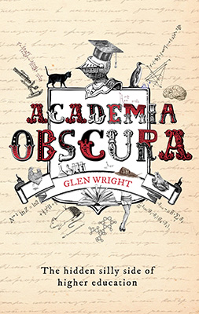

The book is finally here! Like all good academic publications, it is way over the deadline, with excessive footnotes, and petty comments from Reviewer 2. (I just hope more than 3 people read it).
If you've ever been bored to tears at a conference or meeting, driven to the brink of insanity by your co-authors, or wanted to see a rat in underpants, I think you will love the book!

*Academia Obscura is an irreverent glimpse inside the ivory tower, exposing the eccentric and slightly unhinged world of university life. Take a trip through the spectrum of academic oddities and unearth the Easter eggs buried in peer reviewed papers, the weird and wonderful world of scholarly social media, and rats in underpants.*

*Procrastinating PhD student Glen Wright invites you to peruse his cabinet of curiosities and discover what academics get up to when no one's looking. Welcome to the hidden silly side of higher education.*

You can read the first chapter [here](../assets/img/posts/171116_Academia_Obscura_book_-_out_now_02.pdf). The book is available in all the usual places, like Amazon and [Book Depository](https://www.bookdepository.com/Academia-Obscura/9781783523412). There's also still a few special first edition copies (with shiny cover and in-built bookmark) available at [Unbound](https://unbound.co.uk/books/academia-obscura).