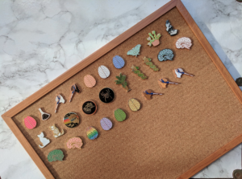
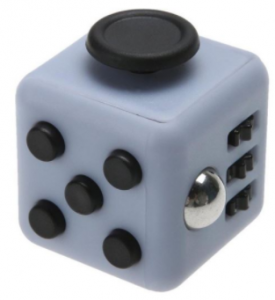
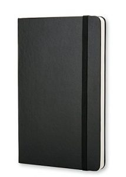
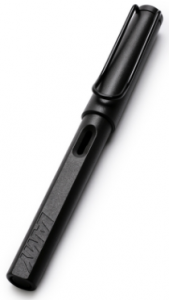
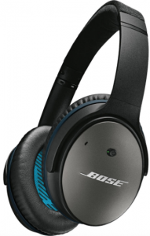
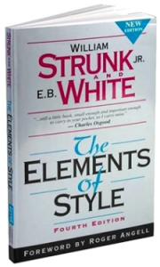
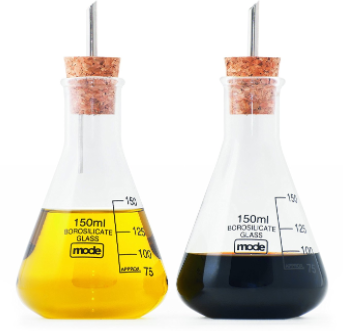
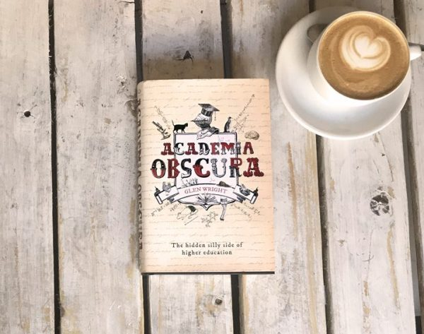

It's hard enough to understand what PhD students and professors actually *do*, let alone find them that perfect gift. While I dislike the rampant consumerism of the festive season, I nonetheless had fun putting together this list, and I hope it will help you find a unique and/or useful gift to bring some festive cheer to the academic in your life.
## 1. SciArt
There's a bunch of super creative researchers making beautiful and quirky stuff as a sideline to their science (great list [here](https://medium.com/@michellebarbozaramirez/holiday-gift-guide-scientist-side-hustles-1168c648893c)). My favourites:

 	- Pin badges by [Two Photon Art](https://www.etsy.com/shop/TwoPhotonArt)
 	- Illustrations by [RedPen/BlackPen](https://www.redbubble.com/people/redpenblackpen/)
 	- Paintings and scarfs by [Artologica](https://www.etsy.com/shop/artologica)
 	- Comics and science-themed cards by [Errant Science](https://www.redbubble.com/people/errantscience) 

## 2. A cool desk toy
As an incorrigible fidgeter, I am always on the lookout for interesting office toys. Current favorites include the [Rubik's cube](https://www.amazon.com/Hasbro-A9312-Rubiks-Cube-Game/dp/B00YBWOMRA/ref=sr_1_4?s=toys-and-games&ie=UTF8&qid=1512806258&tag=cademiabscura-20&sr=1-4&keywords=rubiks+cube), [fidget cube](https://www.amazon.com/gp/search/ref=sr_so_4?rh=n%3A165793011%2Ck%3Aantsy+labs+fidget+cube%2Cp_89%3AAntsy+Labs&keywords=antsy+labs+fidget+cube&ie=UTF8&tag=cademiabscura-20&qid=1512806363), and [fidget spinner](https://www.amazon.com/Maxboost-Tri-Spinner-Spinner-Reducer-Premium/dp/B06XDK684S/ref=sr_1_11?s=toys-and-games&tag=cademiabscura-20&ie=UTF8&qid=1512806444&sr=1-11&keywords=fidget+spinner&refinements=p_72%3A1248963011) (don't judge!). These [spinning tops](https://foreverspin.com/cart) are high on my wish list, but are well out of the postdoc price range.
## 3. A nice notebook
Since discovering [Moleskine](https://www.amazon.com/Moleskine-2-Pack-Classic-Black-Notebooks/dp/B073XXKND2/ref=pd_sbs_229_3?_encoding=UTF8&pd_rd_i=B073XXKND2&pd_rd_r=KJMMNRA5H7X0YAHYJYKK&pd_rd_w=jcd6e&pd_rd_wg=XidDq&psc=1&tag=cademiabscura-20&refRID=KJMMNRA5H7X0YAHYJYKK) notebooks last year, I have refused to write in anything else. They look great, the quality is tangible, and writing on the silky pages is nothing short of joyous. Each one ages in a subtly different way, taking on a distinct character as you fill the pages. I am so enamoured with them that I don't even feel slightly apologetic about how pretentious this paragraph must sound.
## 4. A posh pen
A nice notebook without a posh pen is like an academic talk without refreshments - mostly empty. I swear by my [Lamy pen](https://www.amazon.com/Lamy-Safari-Fountain-Umber-Cartridges/dp/B00V55F1RG/ref=sr_1_4?s=aht&ie=UTF8&tag=cademiabscura-20&qid=1512805971&sr=8-4&keywords=lamy+pen) - inexpensive, writes beautifully, has that understated angular German design aesthetic.[1. Lamy's website promises that their pens will "turn customers into personalities" - and you thought my Moleskine proselytising was pretentious!] I've nonetheless occasionally considered [upgrading](https://www.amazon.com/VISCONTI-Extase-Fountain-Diamond-Royal/dp/B01NAOQUWD/ref=sr_1_1?s=office-products&ie=UTF8&qid=1512806198&sr=1-1&tag=cademiabscura-20&refinements=p_36%3A1253554011).
## 5. A non-academic book
Remind them that they can also read for pleasure! Here are some of my favourite non-academic non-fiction books. If the prospect of choosing is too daunting, a book voucher is always appreciated. A digital alternative is a subscription to something like Audible (I recently started trialling this, mostly so I could listen to Esther Perel's fantastic podcast, but I've found listening to books to be a lovely way to relax at the end of a long day).
## 6. Lab Wars
A highly entertaining [card game](https://www.amazon.com/Alley-Cat-Games-Lab-Wars/dp/B071F7G8RM/ref=sr_1_1?s=toys-and-games&tag=cademiabscura-20&ie=UTF8&qid=1512806638&sr=1-1&keywords=lab+wars) where you aim to build up your lab while sabotaging competitors.
## 7. A Cat
Because [#AcademicsWithCats](https://twitter.com/hashtag/academicswithcats).
## 8. Headphones
My PhD office was in a neglected annex building scheduled for demolition. When the scorching Australian summer rolled around and the faulty air conditioning unit fired up, my office sounded, and felt, like an industrial refrigerator. I stuck on a woolly jumper and invested in a pair of [noise-cancelling headphones](https://www.amazon.com/s/ref=sr_nr_p_72_0?fst=as%3Aoff&rh=n%3A172282%2Cn%3A172541%2Cn%3A12097479011%2Ck%3Anoise+cancelling+headphones%2Cp_n_feature_two_browse-bin%3A509318%2Cp_72%3A1248879011&keywords=noise+cancelling+headphones&ie=UTF8&tag=cademiabscura-20&qid=1512805479&rnid=1248877011), which remain one of the best purchases I've ever made. [My trusty pair](https://www.amazon.com/Bose-QuietComfort-Acoustic-Cancelling-Headphones/dp/B00YSQBRZE/ref=sr_1_5?s=electronics&ie=UTF8&&tag=cademiabscura-20qid=1512805703&sr=1-5&keywords=bose+quietcomfort+15) are still going strong after 6 years (having recently been resuscitated with a couple of inexpensive replacement parts). 
## 9. A backup plan
Being derailed by a sudden hard drive failure is a distressing rite of passage in academia, yet many continue to rely on a faith-based approach to backup. Be their saviour: get a decent external hard drive and/or a subscription to an automated online backup service ([Backblaze](https://www.backblaze.com/) and [Carbonite](https://www.carbonite.com/) both get good reviews).[3. I use CrashPlan, but they will soon discontinue their consumer product. Existing customers are being transferred to Carbonite.] 
## 10. A book about writing
Academics spend countless hours writing, "writing", and complaining about writing. Yet journals are still littered with rambling prose and obfuscating waffle. We need help. The classics remain an invaluable reference (Strunk & White; *On Writing Well*), and I regularly consult Josh Bernoff's *Writing Without Bullshit *(which both tightened up my academic writing and greatly improved my everyday emails).[5. Declaration of competing interests: Josh sent me a free copy of his book a couple of years back following some Twitter interactions. I thoroughly enjoyed it. Josh subsequently helped me with the book, kindly offering to do a last-minute panic-edit. In return, I was happy to send him a copy and share his nuggets of advice on Twitter.] There's been a slew of intriguing new books on academic writing in recent years. My friend Raul Pacheco-Vega has read [many of them](https://twitter.com/raulpacheco/status/900428711916449798); his extensive reading notes should help you find the right one.
## 11. An academic book
Every academic covets at least one prohibitively expensive magnum opus from their field (here's mine - used copies start at £371.97). Treat them to this nerdiest of pleasures and you will forever be their favourite. I advise spoiling the surprise and asking for a hint: no use getting *The History and Social Influence of the Potato *if your niece is doing her PhD on the properties of expanding universes. If in doubt, Doodling for Academics is sure to make any academic smile (some samples here).
## 12. The usual novelty nonsense
I've mostly tried to steer clear of generic novelty items here, but I couldn't resist a few: stationery (syringe highlighters and bone-shaped pens); a USB-disk surgeon; periodic table lunchbox; and lab flasks for salad dressing.
## 13. The Academia Obscura book
Shameless self-promotion, but I think the *Academia Obscura* book makes a great gift. I had the idea to write it precisely because I wished someone had given me a copy before I started my PhD - it just didn't exist yet. It probably won't help explain what we actually do, but will almost certainly bring some much-needed comic relief to the stressed academic in your life. And it's cheaper than a cat.

Happy holidays!

***Full disclosure**: Most of the links are affiliate links, i.e. if you buy stuff, Amazon tosses me a few cents. Please don't hold this against me! I have been paying the blog's running costs out of my own pocket for the last 4 years (domain name, hosting, etc.), while also living in one of the world's most expensive cities on a postdoc salary and paying off the monthly minimum on my undergraduate student loan. I wanted to write this post anyway, and I hope that readers won't begrudge me trying to recoup some of my costs.*