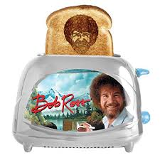

_[Dr. Hannah C. Gunderman](https://hannahcgunderman.github.io/personal-site/) is a Research Associate in human geography at The University of Tennessee, Knoxville. This piece was originally performed at an open mic poetry event. _

_Share your experiences at [#ConferenceReview2018](https://twitter.com/search?f=tweets&q=%23ConferenceReview2018&src=typd)_

I am an introvert.

Academic conferences are my kryptonite.

The fear begins at home as I pack for the trip.

Flash drive? Check. Laptop? Check.

Blazer that makes my already stringy and boyish upper body even more boyish? Check. A pencil skirt? Check.

Oh wait, I should probably shave my legs. Even though I don’t want to because honestly when you have crippling depression, body hair reminds you that you are human. Oh wait, there’s my tights. Okay. Those cover the hair up. Why do I even have to dress in these clothes? I prefer how I look and feel in men’s clothes anyway. Why did I sign up for this conference 5 months ago? I just want to be home with my partner and my dogs and cats and Seinfeld on autoplay.

The flight. The first few minutes will define your journey. The person next to me ever so slightly turns their head in my direction. Don’t acknowledge. Don’t engage. I bend down to tie my shoe, then bury my head in the SkyMall magazine.

This toaster that makes toast engraved with the shape of Bob Ross’s face looks nice, maybe I should buy it.

The person is still looking at me out of their peripheral vision. Any second, they will say: “So what brings you to [any given city]?’” I can’t falter. I can’t concede. My brow is furrowed in determination to not talk to this person. The saint in the window seat is reading a book on liturgical philosophy and shows no inclination to speak to me.

Bless you, sir. You are a gentleman and a scholar.

The flight attendant comes by with the drinks cart. I pretend to be asleep to avoid conversation about our shared desire for refreshment. I am so thirsty. I’m even dizzy because of it. I don’t drink enough water. But, as I exit the plane 2.5 hours later, I have not spoken to one person.

My friends, on this day I have been victorious.

I just presented my research. My face hurts from trying to genuinely smile. Yes, that’s a very interesting question and I’ll be exploring that in future research. No, I hadn’t thought of that, that’s a great point. Sorry, what was the third question again?

A pretentious British man in obnoxiously geometric glasses tells me about a new social theory that I should look into. I smile, but on the inside I’m wondering if we’re just all trying to make up new social theories to outshine each other and appear more socially progressive than the last person. I manage to make it through the questions, relatively unscathed.

My meter is dangerously low. People are everywhere. I need to find shelter. I make my way to an obscure hallway on the 14th floor. No one is here. It is quiet. I sit down on the floor and in that one moment everything is okay.

I have to use the bathroom. My bowels function wonderfully (being vegan has it's benefits). No issues.  And I’ll be damned if you can find an unoccupied bathroom at a conference. Sometimes, if you time your BMs right, you can find an empty bathroom while the premier social theorist of your field is giving a keynote talk. Not that I mind pooping in front of other people, but I mind that other people might mind. I find a bathroom in a corner hallway of the 5th floor. It’s vacant. I sit down, and prepare myself. I’m about to reach touchdown, and I hear the clitter clatter of heels across the floor. Damnit. She sits down. Silence. She’s waiting for me to finish so she can start pooping. I’m waiting for her to pee and leave so I can start pooping.

It’s a standoff.

I’ve never before won such a standoff, so my confidence is low. I concede, pretend I’m changing a tampon by repeatedly opening and closing the little metal container for feminine hygiene products next to the toilet paper and making a lot of rustling noise. I wash my hands for no reason, and leave.

At the hotel bar. Can I get you a drink? No, sorry, I’m an alcoholic. Oh... okay.

No one talks to me for the rest of the night.

I’m mildly offended, but it does means that I am free to retreat to my hotel (which I paid extra so I could be alone).

It’s 7pm. Everyone else is occupied by mixers and networking and dinners and after-parties, replete with “we should collaborate on a paper” and “so tell me about your research” and debates about social theories and talking up their research on poverty, neoliberalism, and anti-classism (minutes after stepping over the homeless person outside who was asking for a dollar).

The other people from my department go to a local bar to watch the game and drink. I decided to not invite myself. I’m not unpopular in my department, but I’ve also never been “cool.” Maybe that’s because I don’t really know who I am, or my depression has robbed me of my identity, so I’ve never given other folks a good reason to hang out with me. I’ve never been hipster enough for the other social justice folks in my department. I didn’t like their Bon Iver soundtracks and I found the music irritating and homogenous, and the song titles confusing and irrelevant.

Why do you suddenly earn all this cultural capital by naming a song something that has nothing to do with the lyrics?

I didn’t like how they always smoked cigarettes around me. They talked about sex positivity all the time and why we should all be in polyamorous relationships and I just couldn’t get on the same level, as a sexual assault survivor and an asexual person. I was never really good enough for them in a lot of ways. I was too square.

But that’s okay. I’m safe here.

Sitting in my hotel bed with the free Lipton tea that was next to the miniature coffee pot, absentmindedly watching a British comedy that I’ve already seen at least 50 times. I don't really watch it, rather it watches over me. It's comforting.

I’m alone, but that’s okay. That’s exactly how I want to be.

And I tell myself over and over: this is the last academic conference that I will ever go to.

